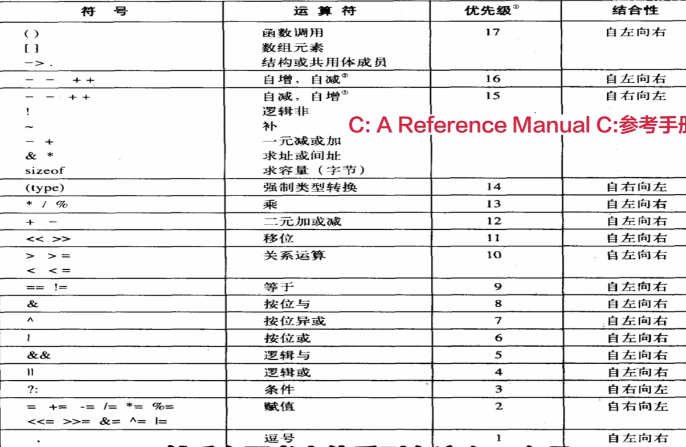

# 欢迎来到C语言世界

## 符号优先级



## 一、开C前的一些常识答疑


### 存储单位换算

1字节(Byte) = 8比特/位(Bit)
1(KB) = 1024 (Byte)
1(MB) = 1024 (KB)
......

### 1. 如何理解主程序头文件

主程序头文件是指程序的入口,也就是程序的主函数,它是程序的第一行代码,一般是`int main()`函数.

### 2.什么是UNIX系统?

UNIX系统是一种多用户、多任务、分时操作系统,它是由贝尔实验室开发的,是目前最流行的操作系统之一.

### 3.如何理解是源代码、目标代码、库代码、启动代码？

c语言中,源代码是指编写的程序的源代码,目标代码是指编译器将源代码编译成机器语言的程序,
库代码是指程序运行所需的库文件,启动代码是指程序运行的入口.
人话:把源代码比喻成中文稿子,目标代码就是编译器把中文翻译成了英文稿子,
而库代码就是把英文稿子递交给发言人所需要的一系列工具,
启动代码就是程序运行的入口,比如`main()`函数,也就是这个发言人的嘴巴.
程序员只需要关注源代码即可,其他的都由编译器和运行环境来完成.

## 二、C语言常见问题

### 1. `#include <stdio.h>`是什么？

初学者只要求知道代码开始前必须要有即可.该代码是一条C预处理器指令,
其作用为,把编译器软件包中的stdio.h文件中的所有内容,都输入到改行所在的位置,
而stdio.h文件包含了供编译器使用的输入和输出函数(如`printf`和`scanf`).
不内置输入和输出这些基本功能于语言中的原因之一是:
有些程序不会用到I/O(输入/输出)包,这有利于减轻程序所占的运行内存等.

### 2. `int`是什么?

初学者只要求知道代码开始前必须要有即可.int是用来声明其后变量的数据类型,而int是声明变量为整数类型.

### 3. `return`是什么?

初学者只要求知道代码开始前必须要有即可,可暂时理解为结束`main`函数的要求.

### 4. `main`是什么?

初学者只要求知道代码开始前必须要有即可.暂时理解为程序的入口,C程序一定是从`main`函数开始执行的,
而且`main`必须是最开始的函数.

### 5. 以下这段代码有什么作用?

``` 0
    #include <stdio.h>
    int mian()
    {
        retrun O;
    }
```

初学者只要求知道代码开始前必须要有即可.`int`表明`main()`函数返回为一个整数,`()`中包含一些传入函数的信息,`void`表明`main()`不带任何参数.

### 6. `scanf`与`scanf_s`有什么区别？

`scanf`的用法很简单但是建议观看视频理解,文字不好讲述,其作用为从键盘输入指定格式的数据.
`scanf_s`在用法上没有区别,但是会比前者多一步边界检查的步骤(暂时不用理解),会比前者更加安全,而在VS中,使用`scanf`是非法的,被弃用的.

### 7. `%d`是什么?

`%`是用来提醒程序,要在该处打印一个变量,d表面要把这个变量作为十进制整数打印.

### 8. 什么是变量?

变量是一个用来保存数据的地方,当我们需要在程序中保存数据时,就需要有一个变量来保存它.

### 9. 什么是格式化打印?

`printf`函数是一种格式化打印函数,其作用为将数据以特定格式输出.如果需要输出整数,则使用`%d`格式化符,如果需要输出浮点数,则使用`%f`格式化符.==参考第23词条==

### 10. 关于const

const用来规定常量,如``` const int AMOUNT = 100 ```
这里为AMOUNT赋值,但AMOUNT,不再是变量,而是一种常量,在后续的计算中,无法更改,如若再对AMOUNT的值进行更改,程序会出错.

### 11. `double`和`float`的区别

大致介绍:`double`是指双精度浮点类型,`float`是指单精度浮点类型,两者的区别在于,存储空间,精度,取值范围.C语言中,一般都是使用`double`.这个知识点在百度或者视频上能解释的更加明白.
在`scanf`中,`double`需要用`%lf`来输出,而`float`需要`%f`来输出

### 12. `for`循环

`for(a;b;c)`中,a是初始条件,b是循环条件,c是循环结束后的行为

### 13. 逃逸字符

|字符|意义|字符|意义|
|:---:|:---:|:---:|:---:|
|`\b`|回退一格|`\"`|双引号|
|`\t`|到下一个表格位|`\'`|单引号|
|`\n`|换行|`\\`|反斜杠本身|
|`\r`|回车|||

### 14. 超过范围的浮点数

`printf`输出`inf`表示超过范围的浮点数:±∞
`printf`输出nan表示不存在的浮点数

### 15.bool类型

bool类型是一种数据类型,其取值只有true和false,在C语言中,
bool类型是一种基本数据类型,其大小为1字节,可以用作条件表达式的运算对象.
在C语言中,bool类型的值可以用`true`或`false`表示,也可以用`0`或`1`表示.
使用bool类型之前,需要先包含头文件`#include <stdbool.h>`

### 16.逻辑运算

|运算符|描述|示例|结果|
|:---:|:---:|:---:|:---:|
|`!`|逻辑非|`!a`|如果a是true,则结果为false;如果a是false,则结果为true|
|`&&`|逻辑与|`a && b`|如果a和b都为true,则结果为true;否则,结果为false|
|`‖`|逻辑或|`a‖b`|如果a和b都为false,则结果为false;否则,结果为true|

==tips:1.上面的逻辑符不能粘贴用,只是为了规避markdown错误找的相似符号,实际的逻辑或符号为`||`
2.逻辑运算是对逻辑量进行运算,其结果只能是true或false,或者0(false)或1(true)==

#### 优先级

! 的优先级很高，比乘法运算符高，与递增运算符优先级相同，只比圆括号的优先级低。

&&的优先级比||高。

### 17. 条件运算符

条件运算符是一种三元运算符,其语法为:

```.
表达式1 ? 表达式2 : 表达式3
```

该运算符根据表达式1的真假值,选择表达式2或表达式3中的一个进行计算,并返回计算结果.
人话:如果表达式1为真,则返回表达式2的值,否则返回表达式3的值.

### 18.赋值运算符,位运算符

赋值运算符是一种运算符,其作用是将右边的值赋给左边的变量,

|运算符|描述|示例|结果|
|:---:|:---:|:---:|:---:|
|`=`|简单的赋值运算符|`a = b`|将b的值赋给a|
|`+=`|加等于|`a += b`|将b加到a的结果赋给a|
|`-=`|减等于|`a -= b`|将b减去a的结果赋给a|
|`*=`|乘等于|`a *= b`|将b乘以a的结果赋给a|
|`/=`|除等于|`a /= b`|将b除以a的结果赋给a|
|`%=`|取模等于|`a %= b`|将b除以a的余数赋给a|
|`&=`|按位与等于|`a &= b`|将b与a的按位与结果赋给a|
|`\|=`|按位或等于|`a \|= b`|将b与a的按位或结果赋给a|
|`^=`|按位异或等于|`a ^= b`|将b与a的按位异或结果赋给a|
|`<<=`|左移等于|`a <<= b`|将b左移a的结果赋给a|
|`>>=`|右移等于|`a >>= b`|将b右移a的结果赋给a|  

#### '&='、'|='、'^='详解

==很难理解，建议看视频==
'&='、'|='、'^='都是位运算符,位运算符是对二进制位进行操作的运算符,
'&'是按位与运算符,即两个位同时为1时,结果才为1,否则为0;
'|'是按位或运算符,即两个位有一个为1时,结果才为1,否则为0;
'^'是按位异或运算符,即两个位不同时为1时,结果才为1,否则为0.

'&='、'|='、'^='的作用是将右边的值与左边的变量按位运算后的值赋给左边的变量,
例如:

```.
a &= b;
```

该语句的意思是将b与a的按位与结果赋给a,即a = a & b.

'|='示例：

```.
a |= b;
```

该语句的意思是将b与a的按位或结果赋给a,即a = a | b.

'^='示例：

```.
a ^= b;
```

该语句的意思是将b与a的按位异或结果赋给a,即a = a ^ b.

### 19. 逗号运算

逗号运算符是一种运算符,其作用是将两个或多个表达式的值依次赋给左边的变量,
但是逗号运算符的优先级低于赋值运算符,
例如:

```.
int a = 3+4,6+7;

```

该语句的意思是将3+4的值赋给变量a,然后将6+7的值赋给变量a,但是由于逗号运算符的优先级低于赋值运算符,所以实际上是将6+7的值赋给变量a,然后将3+4的值赋给变量a.
即最终a的值为7.
而

```.
int a = (3+4,6+7);

```

这里面a的值就为13.
但其实以上两种写法都会报错,目前逗号运算符在C语言中已经被弃用,建议使用括号来代替.
只有在for循环中,逗号运算符才有意义,其作用是将多个表达式的值赋给多个变量,
例如:

```.
for(int i=0,j=1;i<10;i++,j*=2)
{
    //do something
}
```

该语句的意思是将i和j的值依次赋给i和j,然后执行循环体,在循环体中,i的值依次递增1,j的值依次乘以2,直到i的值大于等于10.

### 20. sizeof运算符

sizeof运算符用来计算变量或类型的大小,其语法为:

```.
sizeof(变量或类型名)
```

例如:

```.
int a = 10;
int b = 20;
int c = sizeof(a) + sizeof(b);
```

该语句的意思是计算变量a和b的大小,并将结果赋给变量c.
==siezof的输出格式为%lu==

### 21. 整数的内部表达

整数的内部表达是以补码形式存储的,也就是说,整数的正负号和数值都用二进制表示.

### 22. char类型和int类型

char类型是一种基本数据类型,其大小为1字节,可以用来存储单个字符,
其取值范围为-128~127.
int类型是一种基本数据类型,其大小为4字节,可以用来存储整数,
其取值范围为-2147483648~2147483647.
int是32位,char是8位,所以char类型可以用来存储8位的二进制数,int类型可以用来存储32位的二进制数.
不过在有些编译器中,int还可能是64位的,所以在使用int类型时,需要注意大小.

### 23. 原码补码反码和字节

#### 原码补码反码原码

原码
－定义：原码是一种简单的二进制表示形式，它用最高位表示符号位（０表示正数，１表示负数），其余位表示数值的绝对值。
－示例：
－对于十进制数＋５，若用８位二进制原码表示，因为是正数，符号位为０，数值５的二进制是０００００１０１，所以＋５的８位原码就是０００００１０１。
－对于十进制数－５，符号位为１，数值５的二进制是０００００１０１，那么－５的８位原码就是１００００１０１。
反码
－定义：
－对于正数，其反码与原码相同。
－对于负数，反码是在原码的基础上，除符号位外，其余各位按位取反（即０变１，１变０）。
－示例：
－如前面提到的＋５，其８位原码是０００００１０１，因为是正数，所以它的反码也是０００００１０１。
－对于－５，其８位原码是１００００１０１，那么它的反码就是除符号位不变外，其余位取反，得到１１１１１０１０。
补码
－定义：
－对于正数，补码与原码相同。
－对于负数，补码是在反码的基础上，末位加１。
－示例：
－＋５的８位原码、反码、补码都是０００００１０１。
－对于－５，其反码是１１１１１０１０，在此基础上末位加１，得到补码为１１１１１０１１。
作用及意义
－原码：原码表示简单直观，能直接看出数值的大小和正负，但在进行减法运算时，需要根据被减数和减数的符号来决定是做加法还是减法运算，并且还需要判断结果的符号，这使得计算机运算电路设计变得复杂。
－反码：反码在一定程度上为补码的引出做了铺垫。在早期计算机运算设计中曾有过应用，但现在主要是作为理解补码运算过程的中间环节。
－补码：补码解决了原码和反码在计算机运算中的诸多不便。使用补码，计算机可以将减法运算统一转化为加法运算，大大简化了运算电路的设计。
例如，计算５－３，在计算机中用补码可以表示为５的补码加上－３的补码，这样就只需进行加法操作即可得到正确结果。而且，补码还能很好地处理整数的溢出等问题，使得计算机在进行整数运算时更加高效、准确

#### 字节

字节是计算机中最小的存储单位,通常1字节=8位,即1个字节可以表示256个不同的二进制数.
其中00000000表示0,00000001表示1,00000010表示2,以此类推.在11111111表示255时是以纯二进制形式表示的,
而在10000000表示-128时,需要注意,因为计算机是采用补码形式存储的,所以-128的二进制表示为10000000,11111111表示-1.
char的取值范围为-128~127,所以char类型可以用来存储8位的二进制数.
==有意思的是用char声明127时,实际上是用127的二进制表示,即01111111,.所以此时`127+1`的结果为-128,而`127-1`的结果为126.==

```.
#include <stdio.h>
int main()
char a = 127;
printf("%d\n",a+1);
```

可以用上面的试一试，这就像是一个钟表一样。

### 24. 整数和浮点数的输入输出以及`%u`

浮点数的输入输出可以用`%f`和`%lf`来表示,其中float类型用`%f`,double类型用`%lf`.float需要用f或者F后缀来表示身份,double需要用l或者L后缀来表示身份.
整数的输入输出可以用`%d`来表示,其中int类型用`%d`,long类型用`%ld`,long long类型用`%lld`.char类型用`%c`,short类型用`%hd`,unsigned int类型用`%u`.

#### %u

而`%u`表示无符号整数的输入输出，比如

```.
#include <stdio.h>
int main()
{
char a = -1;
int i = -1;
printf("a=%u\n i=%u\n",a,i);
retrun 0;
}
```

输出结果为:

```.
a=4294967295
 i=4294967295
```

因为当使用%u格式说明符输出a时,发生了隐式类型转换。%u期望的是一个无符号整数,
编译器会将c的值(1 字节的11111111)提升为int类型(通常是 4 字节)。
char类型的c(原来的二进制11111111)会被扩展为11111111 11111111 11111111 11111111。
对于int类型的i,它本身是 32 位，存储-1的二进制补码是11111111 11111111 11111111 11111111。
当用%u输出时,它也被当作无符号整数来处理,这个无符号整数的值是 4294967295(因为无符号整数的范围是 0 到 4294967295,对于 32 位来说)。

### 25. 浮点数的有效数字和精度

浮点数的有效数字是指浮点数的小数点后面数字的个数,float类型和double类型都有自己的有效数字,
float类型有效数字为7,double类型有效数字为15.当超出有效数字范围时,会丢失精度.
比如:

```.

#include <stdio.h>
int main()
{
float a = 3.1415926535897932384626433832795;
double b = 3.1415926535897932384626433832795;
printf("a=%f\n b=%lf\n",a,b);
retrun 0;
}
```

输出结果为:
a=3.141593 b=3.141593==(明显的四舍五入)==

### 26. 函数参数传递

==误区：==
很多人认为函数参数传递是值传递，实际上是地址传递。
如：

```.
#include <stdio.h>
void swap(int a,int b)
{
    int temp;
    temp = a;
    a = b;
    b = temp;
    printf("a=%d b=%d\n",a,b);
}
int main()
{
    int x = 10,y = 20;
    printf("x=%d y=%d\n",x,y);
    swap(x,y);
    printf("x=%d y=%d\n",x,y);
    return 0;
}
```

你可能以为的最终输出结果是x=20 y=10,但实际上
输出结果为:

```.
x=10 y=20
a=20 b=10
x=10 y=20
```

但是当我们使用指针传递参数时,就会得到我们想要的结果:

```.
#include <stdio.h>
void swap(int *a,int *b)
{
    int temp;
    temp = *a;
    *a = *b;
    *b = temp;
    printf("a=%d b=%d\n",*a,*b);
}
int main()
{
    int x = 10,y = 20;
    printf("x=%d y=%d\n",x,y);
    swap(&x,&y);
    printf("x=%d y=%d\n",x,y);
    return 0;
}
```

输出结果为:

```.
x=10 y=20
a=20 b=10
x=20 y=10
```

这就证明了函数参数传递是地址传递,即使是值传递,也只是将值拷贝了一份到函数内部,并没有影响到原来的变量.
==指针参考30题==

### 27.本地变量

在函数内部定义的变量称为本地变量,其作用域只在函数内部,在函数调用结束后,其值将被销毁.
拿25题的swap函数为例,swap的大括号{}里面的变量temp,a,b就是本地变量,
每一个函数的大括号{}就相当于一个小房间，==在这个房间内变量所做的事情和另一个房间的变量所做的事情没有任何关系，哪怕是变量名相同.离开了这个房间以后，变量的值也就随之销毁了.==
这也就解释了25题的输出结果为什么是x=20 y=10,尽管在swap函数中,a和b的值被交换了,但在main函数中,x和y的值还是10和20,因为在main函数中,x和y的值是局部变量,在函数调用结束后,其值被销毁了,不会影响到swap函数中的变量.
以下代码帮助理解:

```.
#include <stdio.h>
int main()
{
    int x = 10,y = 20;
    {int x = 30,y = 40;
        printf("x=%d y=%d\n",x,y);}
printf("x=%d y=%d\n",x,y);
}
```

输出结果为:

```.
x=30 y=40
x=10 y=20
```

是不是很神奇?

### 28. 数组的大小

可以利用sizeof运算符来计算数组的大小,其语法为:

```.
sizeof(数组名)/sizeof(数组元素类型)
```

例如:

```.
int a[10];
int b[20];
int c = sizeof(a)/sizeof(a[0]);
int d = sizeof(b)/sizeof(b[0]);
```

该语句的意思是计算数组a和b的大小,并将结果赋给变量c和d.
这样子做最大的好处就是,一旦修改数组中的初始数据,就不需要修改遍历的代码了

### 29. 数组的赋值

数组变量本身不能直接赋值,只能通过数组下标来赋值,例如:

```.
int a[10] = {1,2,3,4,5,6,7,8,9,10};
a[0] = 0;
```

该语句的意思是将数组a的第一个元素赋值为0.
如果需要把一个数组给另一个数组赋值,只能通过遍历数组实现,例如:

```.
int a[10] = {1,2,3,4,5,6,7,8,9,10};
int b[10];
for(int i=0;i<10;i++)
{
    b[i] = a[i];
}
```

### 30. 指针

指针是一种特殊的变量,其值是一个地址,指向存储在内存中的另一个变量.
指针变量的声明语法为:

```.
数据类型 * 指针变量名;
```

例如:

```.
int a = 10;
int *p = &a;
```

该语句的意思是声明一个整型变量a,并将其地址赋值给指针变量p.
数组其实是一种特殊的指针,其声明语法为:

```.
数据类型 * 数组名[数组大小];
```

例如:

```.
int a[10] = {1,2,3,4,5,6,7,8,9,10};
int *p = a;
```

该语句的意思是声明一个整型数组a,并将其地址赋值给指针变量p.

#### 指针的应用场景

指针的应用场景主要有以下几种:

1. 作为函数参数
    函数的参数可以是指针,这样就可以在函数内部修改调用者提供的变量的值.
    例如:

    ```.
    #include <stdio.h>
    void swap(int *a,int *b)
    {
        int temp;
        temp = *a;
        *a = *b;
        *b = temp;
    }
    int main()
    {
        int x = 10,y = 20;
        printf("x=%d y=%d\n",x,y);
        swap(&x,&y);
        printf("x=%d y=%d\n",x,y);
        return 0;
    }
    ```

    该程序的输出结果为:

    ```.
    x=10 y=20
    x=20 y=10
    ```

2. 作为函数返回值
    函数的返回值也可以是指针,这样就可以在函数内部返回一个变量的地址,供调用者使用.
3. 作为数组下标
    指针也可以作为数组下标,这样就可以通过指针来访问数组中的元素.
    例如:

    ```.
    int a[10] = {1,2,3,4,5,6,7,8,9,10};
    int *p = a;
    printf("%d\n",*p); // 输出1
    printf("%d\n",*(p+1)); // 输出2
    ```

==数组其实是一种特殊的指针==
数组变量本身表达的是一段地址,所以不需要&符号来获取地址。
比如:

```.
int a[10] = {1,2,3,4,5,6,7,8,9,10};
int *p = a;
```

但是数组的单元表达的是变量,所以需要&符号来获取地址。
比如:

```.
int a[10] = {1,2,3,4,5,6,7,8,9,10};
int *p = &a[0];
```

1. 作为结构体成员
2. 作为动态内存分配

#### 指针与const

==C99!==

指针变量的类型可以是const类型,这样就可以在指针变量指向的地址上进行常量操作,例如:

```.
const int *p = &a;
```

意思为指针变量p指向的地址不能修改,但是指向的地址中的值可以修改.

数组就是一种const指针,而const数组的元素不能修改,但是数组本身可以修改.
比如:

```.
const int a[10] = {1,2,3,4,5,6,7,8,9,10};
a[0] = 0; // 错误
```

作用为保护数组a的元素不被修改,但是数组本身可以修改.

#### 指针运算

指针运算可以对指针进行各种操作,包括:

1. 指针加减：指针可以加减整数值,表示整数会和指针所指向类型的大小(以字节为单位)相乘，然后把结果与指针指向的地址相加(或用初始地址减去乘积).
例如:

2.递增/递减：指针可以递增或递减，表示指针指向的地址增加或减少一个类型大小的内存空间。

3.指针求差：指针可以与另一个指针相减，表示两个指针所指向的地址的差值。通常，求差的两个指针分别指向同一个数组的不同元素，通过求出两个元素之间的距离。差值的单位与数组类型的单位相同。

4.指针比较：指针可以与另一个指针进行比较，表示两个指针是否指向同一个地址。

### 31. 字符串

==字符串其实是一种特殊的数组,数组的每个元素都是一个字符,字符串的长度就是数组的元素个数.==
字符串是以'\0'结尾的一段内存空间,其内存空间可以存放多个字符,字符串的声明语法为:

```.
int main(int argc, char const *argv[])
```

这串代码的意思是:

- `int`表示函数的返回值类型
- `main`表示函数名
- `int argc`表示命令行参数的个数
- `char const *argv[]`表示命令行参数的数组,其中`const`表示数组元素不能修改,`*`表示数组的元素是指针.

```.
char 字符串名[] = "字符串内容";
```

例如:

```.
char str[] = "hello world";
```

该语句的意思是声明一个字符串变量str,并将字符串内容赋值为"hello world".

字符串的操作:

#### 字符串长度：字符串的长度可以通过字符串的结尾'\0'来计算,也可以通过strlen函数来计算

例如:

```.
#include <stdio.h>
#include <string.h>
int main()
{
    char str[] = "hello world";
    int len = strlen(str);
    printf("字符串长度为:%d\n",len);    
    return 0;
}
```

该程序的输出结果为:

```.
字符串长度为:11
```

#### 字符串复制:字符串的复制可以通过strcpy函数来实现

比如:

```.
#include <stdio.h>
#include <string.h>
int main()
{
    char str1[] = "hello world";
    char str2[100];
    strcpy(str2,str1);
    printf("复制后的字符串:%s\n",str2);
    return 0;
}
```

该程序的输出结果为:

```.
复制后的字符串:hello world
```

==这里`strcpy`函数的作用是将字符串`str1`的内容拷贝到`str2`中.
而·`char *str2[100]`的作用是:声明一个长度为100的字符数组`str2`,用来存放字符串.==

```.
#include <stdio.h>
#include <string.h>
char *strcpy(char *dest, const char *src){
    int i = 0;
    while(src[i] != '\0'){
        dest[i] = src[i];
        i++;
    }
    dest[i] = '\0';
    return dest;
}
int main(int argc, char const *argv[])
{
    char s1[] = "abc";
    char s2[]= "abc";
    strcpy(s1,s2);
    printf("%s\n",s1);
    return 0;
}
```

该程序的输出结果为:

```.
abc
```

这段代码中`dest`和`src`都是指针,`dest`指向的内存空间用来存放字符串,`src`指向的内存空间存放要拷贝的字符串.

#### 字符串拼接:字符串的拼接可以通过strcat函数来实现

例如:

```.
#include <stdio.h>
#include <string.h>
int main()
{
    char str1[] = "hello ";
    char str2[] = "world";
    char str3[100];
    strcpy(str3,str1);
    strcat(str3,str2);
    printf("拼接后的字符串:%s\n",str3);
    return 0;
}
```

该程序的输出结果为:

```.
拼接后的字符串:hello world
```

==这里`strcpy`函数的作用是将字符串`str1`的内容拷贝到`str3`中,`strcat`函数的作用是将字符串`str2`的内容拼接到`str3`的末尾.==

#### 字符串比较:字符串的比较可以通过strcmp函数来实现

例如:

```.
#include <stdio.h>
#include <string.h>
int main()
{
    char str1[] = "hello world";
    char str2[] = "hello";
    int cmp = strcmp(str1,str2);
    if(cmp == 0){
        printf("str1和str2相同\n");
    }else if(cmp < 0){
        printf("str1小于str2\n");
    }else{
        printf("str1大于str2\n");
    }
    return 0;
}
```

该程序的输出结果为:

```.
str1小于str2
```

==这里`strcmp`函数的作用是比较字符串`str1`和`str2`,如果相同,返回0,如果`str1`小于`str2`,返回小于0,如果`str1`大于`str2`,返回大于0.==

#### 字符串查找:字符串的查找可以通过strchr函数来实现

例如:

```.
#include <stdio.h>
#include <string.h>
int main()
 {
    char str[] = "hello world";
    char *p = strchr(str,'l');
    if(p == NULL){
        printf("没有找到'l'字符\n");
    }else{
        printf("找到'l'字符,位置为:%d\n",p-str);
    }
    return 0;
}
```

该程序的输出结果为:

```.
找到'l'字符,位置为:2
```

==这里`strchr`函数的作用是查找字符串`str`中第一个出现的字符`'l'`,如果没有找到,返回`NULL`,如果找到,返回指向`'l'`字符的指针.==

```.
#include <stdio.h>
#include <string.h>
int main(int argc, char const *argv[])
{
    char str[] = "hello world";
    char *p = strstr(str,"l");
    p = strstr(p+1,"l");
    printf("%s\n",p);
    return 0;
}
```

该程序的输出结果为:

```.
 lo world
```

## 三、C语言二周目

### 1.八进制和十六进制

八进制和十六进制技术系统在表达与计算机相关的值时很方便。如十进制数65536经常出现在16位机中，用十六进制表示刚好是10000
另外，十六进制数的每一位数恰好可以用4位二进制数表示。如，十六进制数的3用二进制数是0011，十六进制数的5用二进制数是0101，
因此十六进制35的位组合是00110101，十六进制数53的位组合是01010011.

在C语言中，用特定的前缀表示使用哪种进制。0x或0X前缀表示十六进制，所以十进制数16用十六进制数表示是0x10或0X10。0是八进制数的前缀。
例如十进制数16表示成八进制是020.

#### 显示八进制和十六进制

用八进制显示数字用%o。用十六进制显示数字使用%x。另外，如果要显示各进制数的前缀0、0x和0X应分别使用%#o、%#x和%#X。

### 2.整数类型汇总

| 类型 | 范围 | 打印格式 |
| --- | --- | --- |
| int | -32768~32767 | %d |
| short | -32768~32767 | %d |
| long | -2147483648~2147483647 | %ld |
| char | -128~127 | %c |
| short int | -32768~32767 | %d |
| long int | -2147483648~2147483647 | %ld |
| long long | -9223372036854775808~9223372036854775807 | %lld |
| unsigned long long | 0~18446744073709551615 | %llu |
| unsigned int | 0~65535 | %u |
| unsigned short | 0~65535 | %u |
| unsigned long | 0~4294967295 | %lu |
| unsigned char | 0~255 | %c |

#### 使用多种整数类型的原因

- 不同类型整数的大小不同,可以节省内存空间,提高效率.
- 不同类型整数的范围不同,可以处理更大的数值.
- 为了适应不同位数的机器,可以选择不同的类型整数.
  
### 3.转移序列

| 转移序列 | 含义 |
| --- | --- |
| \a | 警报 |
| \b | 退格 |
| \f | 换页 |
| \n | 换行 |
| \r | 回车 |
| \t | 水平制表符 |
| \v | 垂直制表符 |
| \\\ | 反斜杠(\\) |
| \\' | 单引号 |
| \\" | 双引号 |
| \\? | 问号 |
| \0oo | 八进制值 (oo必须是有效的八进制数。即每个o可以表示0~7中的一个数) |
| \xhh | 十六进制值(hh必须是有效的十六进制数，即每个h可表示0~f中的一个数) |

### 指数计数法

浮点型常量指数表示方法：有符号的数字（包括小数点），后面紧跟e或者E，这两个字母后的一个有符号数表示10的指数。
例如：1.0e3 就是 1.0*10³

### C预处理器

c语言中，常用C预处理器来创建符号常量。
如在程序顶部添加：

```.
    #define PI 3.1415
```

编译程序时，所有的PI都会被替换为3.1514;

### C语言中形如%2.2f，是什么意思

在C语言中，%2.2f 是格式化输出浮点数时的格式说明符，具体含义如下：

%f：表示输出一个浮点数。

2.2：

第一个 2：指定输出的最小宽度为2个字符。如果实际数值的字符数少于2，会在左侧填充空格。

第二个 2：指定小数点后保留2位小数。

==方便美观文本==

### `#include <string.h>`

`string.h`头文件中包含了字符串处理函数，如字符串拼接、比较、查找等。

### `getchar()`和`putchar()`

这两个函数只处理字符，相当于`scanf()`和`printf()`.如下：

```.
#include <stdio.h>
#define SPACE ' '
int main(void) {
    char ch;
    ch = getchar();
    while(ch != '\n') {
        if (ch==SPACE)
            putchar(ch);
        else
            putchar(ch+1);
        ch = getchar();
    }
    putchar(ch);
    return 0;
}
```

该程序的意思是：

1. 从标准输入设备（键盘）读取一个字符，并将其赋值给变量ch。
2. 当ch不等于换行符时，执行循环体。
3. 如果ch是空格，则将其原样输出。

### `ctyoe.h`系列的字符函数

`ctyoe.h`头文件中包含了字符处理函数，如字符大小写转换、字符编码转换等。

如:

```.
#include <stdio.h>
#include<ctype.h>

int main(){
    char ch;
    while((ch = getchar())!= '\n') {
        if(isalpha(ch))
            putchar(ch+1);
        else
            putchar(ch);
    }
    putchar(ch);
return 0;}
```

`isalpha()`函数判断一个字符是否为字母，如果是，则将其转换为大写字母。

### 备选拼写:`iso646.h`头文件

`iso646.h`头文件中包含了一些宏定义，如`and`、`or`、`not`等。
可以用这些宏来代替`&&`、`||`、`!`等。

### 重定向

存疑

### 宏

宏是一种在编译时进行文本替换的技术。

宏定义语法：

```.
#define 宏名  替换文本
```

### EOF

`EOF`是一个宏，表示文件结束符。

### 流

1. 输入流：程序从标准输入设备（键盘、鼠标等）读取数据。
2. 输出流：程序向标准输出设备（显示器、打印机等）输出数据。
3. 错误流：程序向标准错误设备（显示器、打印机等）输出错误信息。

### `strerror()`函数

`strerror()`函数用于获取错误信息。
`strerror()`函数的原型如下：

```.
#include <string.h>
char *strerror(int errnum);
```

`strerror()`函数的参数是一个整数，表示错误码。
`strerror()`函数的返回值是一个字符串，表示错误信息。

### `scanf()`函数

`scanf()`函数从标准输入流（键盘）读取数据，并将其转换为指定的数据类型。
在C语言中，scanf函数的返回值表示成功读取并赋值的输入项的数量。

1. 返回值的基本规则
   - 如果成功读取并赋值了n个输入项，则返回n。
   - 如果读取到文件结束符（EOF），则返回0。
   - 如果读取到格式错误，则返回EOF(通常为-1)。

### `*`运算符和`&`运算符

`*`运算符用来声明指针变量，`&`运算符用来获取变量的地址。

`*`后跟一个指针名或者地址时，`*`给出储存在指针指向地址上的值
示例：

```.
nurse = 22；
ptr = &nurse；//指向nurse的指针
val = *ptr；//把ptr指向的地址上的值赋值给val。
```

### 所有打印格式

1. %d：整数型
2. %f：浮点型
3. %c：字符型
4. %s：字符串型
5. %x：十六进制整数型
6. %o：八进制整数型
7. %u：无符号整数型
8. %ld：长整数型
9. %lld：长长整数型
10. %e：指数型
11. %g：自动选择浮点或指数型
12. %p：指针型  

### 指针和二维数组

指针可以指向数组的元素，也可以指向二维数组的元素。

```.
#include <stdio.h>
int main(void) {
    int zippo[4][2] = {{2,4},{6,8},{1,3},{5,7}};
    printf("zippo = %p , zippo+1 = %p\n",zippo,zippo+1);
    printf("zippo[0] = %p, zippo[0]+1 = %p\n",zippo[0],zippo[0]+1);
    printf("*zippo = %p, *zippo+1 = %p\n",*zippo,*zippo+1);
    printf("zippo[0][0] = %d\n",zippo[0][0]);
    printf("*zippo[0] = %d",*zippo[0]);
    printf("**zippo = %d\n",**zippo);
    printf("zippo[2][1] = %d\n", zippo[2][1]);
    printf("*(*(zippo+2)+1) = %d\n",*(*(zippo+2)+1));
  
    return 0;
}
```

输出结果：

```.
zippo = 00000000005ffe40 , zippo+1 = 00000000005ffe48
zippo[0] = 00000000005ffe40, zippo[0]+1 = 00000000005ffe44
*zippo = 00000000005ffe40, *zippo+1 = 00000000005ffe44
zippo[0][0] = 2
*zippo[0] = 2 **zippo = 2
zippo[2][1] = 3
*(*(zippo+2)+1) = 3
```

理解这些语句的思路：
zippo               》》二维数组的首元素地址（每个元素都是内含有两个int类型的一维数组）
zippo+2             》》二维数组的第三个元素（即一维数组）的地址
*(zippo+2)          》》二维数组的第三个元素（即一维数组）的首元素(一个int类型的值)地址
*(zippo+2)+1        》》二维数组的第三个元素（即一维数组）的第二个元素(一个int类型的值)地址
*(*(zippo+2)+1)     》》二维数组的第三个元素（即一维数组）的第二个元素(一个int类型的值)的值,即zippo`[2][1]`的值。

### 函数和指针

声明一个函数指针时，必须声明指针指向的函数类型。为了指明函数类型，要指明函数签名，即函数的返回类型和形参类型。在声明一个指向特定类型函数的指针，可以先声明一个该类型的函数，然后把函数名替换成(*pf)形式的表达式，然后，pf就成了指向该函数的指针。
==声明了函数指针后，可以把类型匹配的函数地址赋值给它。==

```.
void ToUpper(char *);
void ToLower(char *);
int round(double);
void (*pf)(char *);
pf = ToUpper; //有效，ToUpper是该类型函数的地址
pf = ToLower; //有效，ToLower是该类型函数的地址
pf = round; //错误，round与指针类型不匹配
pf = ToLower()//错误，ToLower()不是函数地址，而且ToLower()没有返回值。

```

### 函数指针数组

函数指针数组是一种数组，数组中的每个元素都是函数指针。

```.
#include <stdio.h>
void menu(void) {
    printf("****************************\n");
    printf("****1. 加法******2. 减法******\n");
    printf("****3. 乘法******4. 除法******\n");
    printf("****0. exit**********************\n");
    printf("*****************************\n");
}
int add(int a, int b) {
    return a + b;
}
int sub(int a, int b) {
    return a - b;
}
int mul(int a, int b) {
    return a * b;
}
int div(int a, int b) {
    return a / b;
}
int main(void) {
    menu();
    int input = 0;
    int ret = 0;
    int (*pfArr[5])(int,int)={0,add,sub,mul,div};
    do {
        int x = 0 ,y = 0;
        printf("请选择：\n");
        scanf_s("%d",&input);
        printf("请输入两个数:\n");
        scanf_s("%d %d",&x,&y);
        printf("%d\n",pfArr[input](x,y));
    } while (input != 0);
    return 0;
}
```

### 空指针

空指针是一个特殊的指针，它的值为0。

空指针的用途：

1. 作为函数的返回值，表示函数执行失败。
2. 作为函数的参数，表示函数不希望接收任何输入。
3. 作为数组的元素，表示数组还没有被初始化。

### `void*`指针

`void*`指针可以指向任意类型的变量，包括整型、浮点型、指针、结构体、联合体等。

```.
#include <stdio.h>
void print(void *p) {
    printf("%d\n", *(int*)p);
}
int main(void) {
    int a = 10;
    float b = 3.14;
    char c = 'a';
    void *p1 = &a;
    void *p2 = &b;
    void *p3 = &c;
    print(p1);
    print(p2);
    print(p3);
    return 0;
}
```

输出结果：

```.
10
3
97
```

但是`void*`类型的指针必须用强制类型转换才能使用。

### 指针运算符

指针运算符：

1. `*`：取指针指向的地址的值。
2. `&`：取变量的地址。
3. `++`：指向下一个元素。
4. `--`：指向前一个元素。

### 结构体

结构体是一种用户自定义的数据类型，它由若干个成员变量组成。

结构体声明语法：

```.
struct 结构体名 {
    成员变量类型 成员变量名;
    成员变量类型 成员变量名;
   ...
};
```

#### `.`运算符

`.`运算符用来访问结构体的成员变量。

示例：

```.
struct student {
    char name[20];
    int age;
    float score;
};

int main() {
    struct student s;
    s.name = "Tom";
    s.age = 20;
    s.score = 85.5;
    printf("Name: %s\n", s.name);
    printf("Age: %d\n", s.age);
    printf("Score: %f\n", s.score);
    return 0;
}
```

#### 结构体数组

结构体数组是一种数组，数组中的每个元素都是结构体。  
结构体数组声明语法：

```.
struct 结构体名 
{成员表列}
数组名[数组长度];
```

例子:

```.
#include <stdio.h>
#include <string.h>
struct Person {
    char name[20];
    int count;
}leader[3]={"Li",0,"Zhang",0,"Sun",0};
int main(void) {
    int i,j;
    char leader_name[20];
    for(i=1;i<=10;i++) {
        scanf("%s",leader_name);
        for(j=0;j<3;j++) {
            if(strcmp(leader_name,leader[j].name)==0)leader[j].count++;
        }
    }
    printf("\nResult:\n");
    for(i=0;i<3;i++)
        printf("%5s:%d\n",leader[i].name,leader[i].count);

    return 0;
}
```

#### 指针与结构体

指针可以指向结构体变量，也可以指向结构体数组的元素。

```.

#include <stdio.h>
struct student {
    char name[20];
    int age;
    float score;
};

int main() {
    struct student s1, s2;
    struct student *ps1, *ps2;
    s1.name = "Tom";
    s1.age = 20;
    s1.score = 85.5;
    s2.name = "Jerry";
    s2.age = 22;
    s2.score = 90.0;
    ps1 = &s1;
    ps2 = &s2;
    printf("s1.name = %s\n", ps1->name);
    printf("s2.age = %d\n", ps2->age);
    printf("s1.score = %f\n", ps1->score);
    return 0;
}
```

输出结果：

```.
s1.name = Tom
s2.age = 22
s1.score = 85.500000
```

#### `->`

为了使用方便和美观，C语言允许把`(*p).num`用`p->num`表示

#### 结构体嵌套

结构体可以嵌套，即一个结构体的成员变量可以是另一个结构体。

#### 匿名结构体

匿名结构体是一种没有名字的结构体，它的声明语法如下：

```.
struct {
    成员变量类型 成员变量名;
    成员变量类型 成员变量名;
   ...
};
```

作用：

- 临时使用，方便定义一个结构体变量。

### 联合体(共用体)

共用体是一种用户自定义的数据类型，它可以包含不同的数据类型。
它能在同一个内存空间中储存不同的数据类型(不是同时储存)。
联合体声明语法：

```.
union 联合体名 {
    数据类型 成员变量名;
    数据类型 成员变量名;
   ...
};
```

例如：

```.
union Data {
    int num;
    double str;
    float fnum;
};
```

编译器会分配足够的空间以便于它能储存联合声明中占用最大字节的类型，这里面占用空间最大的是double类型的数据。即最大给这个联合体分配8字节。

联合体的使用：

```.
fit.num = 10; //把10储存在fit中，占2字节
fit.str = 3.14; //把3.14储存在fit中，占8字节
fit.fnum = 2.5; //把2.5储存在fit中，占4字节
```

联合体优点：

- 节省内存空间，可以节省空间。
- 访问速度快，可以快速访问。

### 枚举

枚举是一种用户自定义的数据类型，它是一组符号常量的集合。
枚举声明语法：

```.
enum 枚举名 {
    符号常量名 = 值,
    符号常量名 = 值,
   ...
};
```

枚举常量的赋值可以省略，默认从0开始。依次递增。

### typedef

`typedef`是一种数据类型定义符，它用来给已有的数据类型定义一个新的名称。

例如：

```.
typedef int INT;
INT a = 10；
typedef char * PCHAR;
PCHAR p, q;
typedef struct  complex{
    double real;
    double imag;
    }COMPLEX;
COMPLEX c = {1.0,2.0};
```

就相当于：

```.
int a = 10；
char * p, * q;
struct complex{
    double real;
    double imag;
    }c = {1.0,2.0};
```

由此可见使用`typedef`可以为经常出现的和复杂的类型创建一个方便，容易识别的类型名。

==注意==该定义的作用域取决于typedef出现的位置，如果typedef出现在头文件中，则该定义对所有文件有效。

### `qsort()`函数

`qsort()`函数用来对数组进行排序。

```.
#include <stdio.h>
#include <stdlib.h>

int cmp(const void *a, const void *b) {
    return (*(int*)a - *(int*)b);
}

int main() {
    int arr[] = {3, 7, 1, 9, 4, 5};
    int n = sizeof(arr) / sizeof(arr[0]);
    qsort(arr, n, sizeof(arr[0]), cmp);
    for (int i = 0; i < n; i++) {
        printf("%d ", arr[i]);
    }
    return 0;
}
```

输出结果：

```.
1 3 4 5 7 9
```

1. `cmp()`函数是一个比较函数，它的作用是比较两个元素的大小。

### `memcpy`函数

1. `memcpy()`函数用来拷贝内存块。
2. `void *memcpy(void *dest, const void *src, size_t n)`
3. `dest`：目的地址。
4. `src`：源地址。
5. `n`：拷贝的字节数。

```.
#include <stdio.h>
#include <string.h>

int main() {
    char str1[] = "hello";
    char str2[10];
    int n = strlen(str1);
    memcpy(str2, str1, n);
    printf("str1 = %s\n", str1);
    printf("str2 = %s\n", str2);
    return 0;
}
```

输出结果：

```.
str1 = hello
str2 = hello
```

==注意==：`memcpy()`函数的源地址和目的地址不能重叠。
如果源地址和目的地址重叠，可以使用下面的`memmove()`函数。

### `memmove`函数

`memmove()`函数用来移动内存块。

```.
#include <stdio.h>
#include <string.h>

int main() {
    char str1[] = "hello";
    char str2[10];
    int n = strlen(str1);
    memmove(str2, str1, n);
    printf("str1 = %s\n", str1);
    printf("str2 = %s\n", str2);
    return 0;
}
```

1. `memmove()`函数的源地址和目的地址可以重叠。
2. `void *memmove(void *dest, const void *src, size_t n)`
3. `dest`：目的地址。
4. `src`：源地址。
5. `n`：拷贝的字节数。

输出结果：

```.
str1 = 
str2 = hello
```

### `memcmp`函数

`memcmp()`函数用来比较两个内存块是否相同。

```.
#include <stdio.h>
#include <string.h>

int main() {
    char str1[] = "hello";
    char str2[] = "hello";
    int n = strlen(str1);
    int cmp = memcmp(str1, str2, n);
    if (cmp == 0) {
        printf("str1 and str2 are the same.\n");
    } else {
        printf("str1 and str2 are different.\n");
    }
    return 0;
}
```

1. `memcmp()`函数的源地址和目的地址不能重叠。
2. `int memcmp(const void *s1, const void *s2, size_t n)`
3. `s1`：第一个内存块。
4. `s2`：第二个内存块。
5. `n`：比较的字节数。

输出结果：

```.
str1 and str2 are the same.
```

### `memset`函数

`memset()`函数用来设置内存块中的字节。

```.
#include <stdio.h>
#include <string.h>

int main() {
    char str[10] = {0};
    int n = strlen(str);
    memset(str, 'a', n);
    printf("str = %s\n", str);
    return 0;
}
```

1. `memset()`函数的源地址和目的地址不能重叠。
2. `void *memset(void *s, int c, size_t n)`
3. `s`：内存块。
4. `c`：要设置的字节。
5. `n`：设置的字节数。

输出结果：  

```.
str = aaaaaaaaaa
```

### `assert`宏

`assert()`宏用来检查表达式是否为真，如果为假，则打印错误信息并终止程序。

```.
#include <stdio.h>
#include <assert.h>

int main() {
    int a = 10;
    int b = 20;
    assert(a < b);
    return 0;
}
```

1. `assert()`宏的表达式必须为真，否则程序会终止。
2. `void assert(int expression)`
3. `expression`：表达式。

### 动态内存分配

动态内存分配是指程序运行时根据需要分配和释放内存。
==内存泄露==是指程序运行过程中分配的内存不能够及时释放，导致系统内存资源的不足。导致的后果是系统运行缓慢，甚至系统崩溃。

#### C语言的内存分配方式

C程序编译后，会有三种形式使用内存：

1. 静态/全局内存：
静态声明的变量和全局变量使用这部分内存，程序运行时分配，程序结束时释放。
2. 自动内存（栈内存）
函数内部声明的变量使用这部分内存，在函数被调用的时候才创建
3. 动态内存（堆内存）

根据编写代码动态分配内存

动态内存分配的优点：

1. 灵活性：程序运行时可以根据需要分配内存，不需要事先知道内存的大小。
2. 效率：动态内存分配可以提高程序的运行效率。
3. 安全性：动态内存分配可以避免内存泄露。

#### `malloc()`函数

`malloc()`函数用来分配内存。

```c
#include <stdio.h>
#include <stdlib.h>

int main() {
    int *p;
    p = (int*)malloc(sizeof(int)); // 强制转换为int*类型
    *p = 10;
    printf("p = %d\n", *p);
    free(p);
    return 0;
}
```

1. `malloc()`函数用来分配指定字节数的内存。
2. `void *malloc(size_t size)`
3. `size`：分配的字节数。
==注意==：`malloc()`函数返回的指针类型为`void*`，需要强制类型转换为需要的类型。其次，`malloc()`的返回值一定要检查是否为`NULL`，如果为`NULL`，表示分配失败。

#### `free()`函数

`free()`函数用来释放内存。

1. `free()`函数用来释放由`malloc()`函数分配的内存。
2. `void free(void *ptr)`
3. `ptr`：指向要释放的内存的指针。

#### `calloc()`函数

`calloc()`函数用来分配内存，并将分配的内存初始化为0。

```.
#include <stdio.h>
#include <stdlib.h>

int main() {
    int *p;
    p = (int*)calloc(1, sizeof(int));
    *p = 10;
    printf("p = %d\n", *p);
    free(p);
    return 0;
}
```

1. `calloc()`函数用来分配指定数量的内存，并将分配的内存初始化为0。
2. `void *calloc(size_t nmemb, size_t size)`
3. `nmemb`：分配的内存块的数量。
4. `size`：每个内存块的字节数。

与`malloc()`函数不同，`calloc()`函数分配的内存不会被初始化为随机值，而是全部初始化为0.

#### `realloc()`函数

`realloc()`函数用来重新分配内存。

```.
#include <stdio.h>
#include <stdlib.h>

int main() {
    int *p;
    p = (int*)malloc(sizeof(int));
    *p = 10;
    printf("p = %d\n", *p);
    p = (int*)realloc(p, 2 * sizeof(int));
    *p = 20;
    printf("p = %d\n", *p);
    free(p);
    return 0;
}
```

输出结果：

```.
p = 10
p = 20
```

1. `realloc()`函数用来重新分配内存，并返回新的指针。
2. `void *realloc(void *ptr, size_t size)`
3. `ptr`：指向要重新分配的内存的指针。
4. `size`：新的字节数。
`realloc()`函数使用时需要考虑两种情况：

1.指针所指向的内存块的大小小于size，则重新分配内存，并拷贝原有的数据到新内存块中。
2.指针所指向的内存块的大小大于等于size，则不重新分配内存，只是返回原有指针。
3.需要确认返回值是否为null

### 文件

#### 文类型指针

每个被使用的文件都在内存中开辟了一个相应的文件信息区，用来存放文件的相关信息（如文件的名字，文件状态及文件当前的位置等）。
这些信息是保存在一个结构体变量中的。
该结构体类型是由系统声明的，取名FILE。
例如，VS2013编译环境提供的stdio.h头文件中有以下的文件类型申明：

```.
struct _iobuf {
    char *_ptr;
    int   _cnt;
    char *_base;
    int   _flag;
    int   _file;
    int   _charbuf;
    int   _bufsiz;
    char *_tmpfname;
};
typedef struct _iobuf FILE;
```

一般都是通过一个FILE的指针来维护这个FILE结构的变量，这样使用起来更加方便。
下面我们可以创建一个FILE*的指针变量:

```.
FILE* pf;//文件指针变量
```

定义pf是一个指向FILE类型数据的指针变量。
可以使pf指向某个文件的文件信息区（是一个结构体变量）。通过这个指针变量就能够找到与它关联的文件。

#### 文件的打开和关闭

文件在读写之前应该先打开文件，在使用结束之后应该关闭文件。
在编写程序的时候，在打开文件的同时，都会返回一个FILE*的指针变量指向该文件，也相当于建立了指针和文件的关系。
ANSIC 规定使用fopen函数来打开文件，fclose来关闭文件。

`fopen`函数

```.
FILE * fopen ( const char * filename, const char * mode );
```

返回值：

1. 如果打开文件成功，则返回一个指向文件的指针。
2. 如果打开文件失败，则返回NULL。
用法：

```.
FILE *fp;
fp = fopen("test.txt", "r");
if (fp == NULL) {
    printf("文件打开失败\n");
    return 1;
}；
```

代码解释：

1. `FILE *fp;`：定义一个指向FILE类型的指针变量fp。
2. `fp = fopen("test.txt", "r");`：打开文件"test.txt"，并将文件指针fp指向该文件。前面的`test.txt`是和源文件同路径的文件，想打开别的文件需要输入绝对路径，==注意使用转义字符==，后面的"r"表示以只读方式打开文件。
   其他打开文件的方式如下：
   - "r"：只读方式打开文件。
   - "w"：只写方式打开文件。如果文件不存在，则创建文件；如果文件存在，则清空文件内容。
   - "a"：追加方式打开文件。如果文件不存在，则创建文件；如果文件存在，则在文件末尾追加内容。
3. `if (fp == NULL) {`：判断文件是否打开成功，如果打开失败，返回NULL。

其他打开文件的方式：

- "rb"：二进制只读方式打开文件。
- "wb"：二进制只写方式打开文件。
- "ab"：二进制追加方式打开文件。
- "r+"：读写方式打开文件。
- "w+"：读写方式打开文件。如果文件不存在，则创建文件；如果文件存在，则清空文件内容。
- "a+"：读写方式打开文件。如果文件不存在，则创建文件；如果文件存在，则在文件末尾追加内容。

#### `fclose`函数

`fclose`函数用来关闭文件。

```.
int fclose ( FILE * stream );
```

返回值：

1. 如果关闭文件成功，则返回0。
2. 如果关闭文件失败，则返回EOF。

#### 字符读写函数

##### `fgetc`

作用：从文件流中读取一个字符。

原型：int fgetc(FILE *stream);

参数：stream：文件指针。

返回值：成功返回读取的字符（转换为unsigned char再转为int），遇到文件结束或失败时返回 EOF。

##### `fputc`

作用：向文件流中写入一个字符。

原型：int fputc(int char, FILE *stream);

参数：

char：要写入的字符（以其ASCII码形式传递）。

stream：文件指针。

返回值：成功返回写入的字符，失败返回 EOF。

##### `fgets

作用：从文件流中读取一行字符串（或直到缓冲区满）。

原型：`char *fgets(char *str, int n, FILE *stream);`

参数：

str：指向字符数组的指针，用于存储读取的字符串。

n：要读取的最大字符数（通常为str的大小），会自动在末尾添加空字符 \0。

stream：文件指针。

返回值：成功返回 str，遇到文件结束或失败时返回 NULL。

##### `fputs`

作用：向文件流中写入一个字符串（不自动写入换行符）。

原型：`int fputs(const char *str, FILE *stream);`

参数：

str：要写入的以空字符终止的字符串。

stream：文件指针。

返回值：成功返回非负值，失败返回 EOF。

##### `fscanf`

作用：从文件流中按指定格式读取数据，类似于 scanf，但数据源是文件。

原型：`int fscanf(FILE *stream, const char *format, ...);`

参数：

stream：文件指针。

format：格式控制字符串，与 scanf 相同。

...：可变参数，是用于存储读取数据的变量的地址。

返回值：成功返回成功匹配和赋值的输入项数，遇到文件结束或失败时返回 EOF。

##### `fprintf`

作用：按指定格式向文件流中写入数据，类似于 printf，但输出目标是文件。

原型：`int fprintf(FILE *stream, const char *format, ...);`

参数：

stream：文件指针。

format：格式控制字符串，与 printf 相同。

...：可变参数，是要写入的数据。

返回值：成功返回写入的字符数，失败返回一个负值。

##### `fread`

作用：从文件流中读取一个数据块（二进制数据）。特别适用于读写数组、结构体等复杂数据类型。

原型：`size_t fread(void *ptr, size_t size, size_t nmemb, FILE *stream);`

参数：

ptr：指向内存块的指针，用于存放读取的数据。

size：每个数据项的字节大小（例如 sizeof(int), sizeof(struct Student)）。

nmemb：要读取的数据项个数。

stream：文件指针。

返回值：成功返回实际读取到的数据项个数（而非字节数）。如果这个数小于 nmemb，可能是遇到了文件尾或错误。

##### `fwrite`

作用：向文件流中写入一个数据块（二进制数据）。fread 的逆操作。

原型：`size_t fwrite(const void *ptr, size_t size, size_t nmemb, FILE *stream)`;

参数：

ptr：指向要写入文件的内存数据块的指针。

size：每个数据项的字节大小。

nmemb：要写入的数据项个数。

stream：文件指针。

返回值：成功返回实际写入的数据项个数。

##### `fseek`

作用：重新定位文件流内部的位置指针，用于随机访问文件。

原型：int fseek(FILE *stream, long int offset, int whence);

参数：

stream：文件指针。

offset：偏移的字节数（可为正负）。

whence：偏移的起始位置：

SEEK_SET：文件开头。

SEEK_CUR：当前位置。

SEEK_END：文件结尾。

返回值：成功返回 0，失败返回非零值。

##### `ftell`

作用：返回文件位置指针当前位置相对于文件开头的偏移字节数。

原型：long int ftell(FILE *stream);

参数：stream：文件指针。

返回值：成功返回当前位置，失败返回 -1L。

##### `rewind`

作用：将文件位置指针重置回文件的开头。相当于 (void) fseek(stream, 0L, SEEK_SET)。

原型：void rewind(FILE *stream);

参数：stream：文件指针。

##### `feof`

作用：检测文件流是否设置了结束符标志，即是否已经读到了文件结尾。

注意：不要用 while(!feof(fp)) 来做循环条件，因为它是在尝试读取失败后才会被设置。正确做法是在读取操作后检查返回值，再判断是否是 feof。

原型：int feof(FILE *stream);

返回值：如果设置了文件结束指示器，则返回非零值，否则返回 0。

##### `ferror`

作用：检测文件流是否设置了错误标志，即之前的操作是否发生了错误。

原型：int ferror(FILE *stream);

返回值：如果设置了错误指示器，则返回非零值，否则返回 0。
