# Date Structures and Algorithms

## 算法时间复杂度

### 算法要满足的5个重要特性

有穷性
确定性
可行性
输入
输出

### 评价算法优劣的基本标准

正确性
可读性
健壮性
高效性

### 时间复杂度

也称作渐进时间复杂度，用来描述算法的运行时间与数据规模之间的增长关系。

T(n) = O(f(n))
随着问题规模n的增大，算法执行时间和增长率和f(n)增长率成正比.
若f(n)是一个m次多项式，则T(n) = O(n^m),这样忽略了所有的低次幂和最高次幂的系数，可以简化算法分析，也体现了增长率的含义

程序运行的总时间主要和两点有关：==执行每条语句的耗时，每条语句的执行频率==
示例:

```c
for(int i = 1;i<=n;i++) //频率为n+1,执行循环内的语句为n次，但是还有一次是判断i是否<=n，所以是n+1次
{
 for(int j = 1;j<=n;j++) //频率为n*(n+1)
 {
  c[i][j] = 0; //执行语句为n*n次
  for(int k = 1;k<=n;k++) //执行语句为n*n*n次
  {
   c[i][j] += a[i][k]*b[k][j]; //执行语句为n*n*n次
  }
 }  
}
```

所以总执行次数为：
f(n) = 2n^3 + 3n^2 + 2n + 1
T(n) = O(n^3)

最好时间复杂度: 算法在最好情况下的时间复杂度
最坏时间复杂度: 算法在最坏情况下的时间复杂度
平均时间复杂度: 算法在所有情况下，按照输入实例以等概率出现时，算法计量的加权平均值

==对算法复杂度的度量，通常只讨论算法在最坏情况下的时间复杂度==


## 线性表

线性表是具有相同数据类型的n个数据元素的有限序列，其中n为表长，当n=0时，线性表是一个空表。

### 顺序表

顺序表是在计算机内存中以数组的形式保存的线性表，线性表的顺序存储是指用一组地址连续的存储单元依次存储线性表中的各个元素、使得线性表中在逻辑结构上相邻的数据元素存储在相邻的物理存储单元中，即通过数据元素物理存储的相邻关系来反映数据元素之间逻辑上的相邻关系。

#### 顺序表初始化

```c
#include <stdio.h>

#define MAXSIZE 100
typedef int ElemType; 
typedef struct
{
   ElemType data[MAXSIZE]; //定义顺序表中的数组
   int length; //定义顺序表中的长度
}SeqList; //定义顺序表的类型

void init(SeqList *L) //初始化顺讯表
{
   L->length = 0; //初始化长度为0
}

int main()
{
   SeqList List;
   init(&List);
   printf("初始化成功，目前长度为%d\n",List.length);
   printf("目前占用内存为%zu\n",sizeof(List.data));
   return 0;
}
```

#### 顺序表尾部添加

```c
#include <stdio.h>

#define MAXSIZE 100
typedef int ElemType; 
typedef struct
{
   ElemType data[MAXSIZE]; //定义顺序表中的数组
   int length; //定义顺序表中的长度
}SeqList; //定义顺序表的类型

void init(SeqList *L) //初始化顺讯表
{
   L->length = 0; //初始化长度为0
}

int append(SeqList *L, ElemType e)
{
   if(L->length == MAXSIZE) //判断顺序表是否已满
   {
      printf("顺序表已满，无法添加\n");
      return 0;
   }
   L->data[L->length] = e;
   L->length++; //长度加1
   return 1;
}

int main()
{
   SeqList List;
   init(&List);
   append(&List,1);
   printf("初始化成功，目前长度为%d\n",List.length);
   printf("目前占用内存为%zu\n",sizeof(List.data));
   return 0;
}
```

#### 顺序表的遍历

```c
#include <stdio.h>

#define MAXSIZE 100
typedef int ElemType; 
typedef struct
{
   ElemType data[MAXSIZE]; //定义顺序表中的数组
   int length; //定义顺序表中的长度
}SeqList; //定义顺序表的类型

void init(SeqList *L) //初始化顺讯表
{
   L->length = 0; //初始化长度为0
}

int append(SeqList *L, ElemType e)
{
   if(L->length == MAXSIZE) //判断顺序表是否已满
   {
      printf("顺序表已满，无法添加\n");
      return 0;
   }
   L->data[L->length] = e;
   L->length++; //长度加1
   return 1;
}

void listElem(SeqList *L) //遍历
{
   for(int i = 0; i<L->length; i++)
   {
      printf("%d ",L->data[i]);
   }
   printf("\n");
}
int main()
{
   SeqList List;
   init(&List);
   append(&List,1);
   append(&List,2);
   append(&List,3);
   listElem(&List);
   printf("初始化成功，目前长度为%d\n",List.length);
   printf("目前占用内存为%zu\n",sizeof(List.data));
   return 0;
}
```

#### 顺序表的插入

```c
int insert(SeqList *L, int pos,ElemType e) //pos是插入位置，所以pos-1就是插入位置的下标
{
   if(pos<= L-> length-1 && pos>=1) //判断插入位置是否合法
   {
      for(int i = L->length - 1 ; i>=pos-1; i--) //从后往前遍历，将pos-1位置后面的元素都往后移一位
      {
         L->data[i+1] = L->data[i];
      }
      L->data[pos - 1] = e;
      L->length++; //长度加1
      return 1;
   }
}
```

==顺序表插入的最好时间复杂度为O(1),最坏时间复杂度为O(n),平均时间复杂度为O(n)==

#### 顺序表的删除

```c
int delete(SeqList *L,int pos, ElemType *e) // e用来存储删除的元素
{  *e = L->data[pos - 1] ;
   if(pos < L->length && pos >= 1) //判断删除位置是否合法
   {
      for (int i = pos; i< L->length; i++)
      {
         L->data[i-1] = L->data[i]; //[i-1]就是pos的位置
      }
   }
   L->length--;
   return 1;
}
```

#### 顺序表的查找

```c
int findElem(SeqList *L, ElemType e)
{
   for(int i = 0 ; i < L->length; i++)
   {
      if(L->data[i] == e)
      return i+1;
   }
   return 0;
}
```

#### 顺序表动态分配内存地址初始化

```c
typedef struct
{
   ElemType *data;
   int length;
}SeqList;

SeqList *initList()
{
   SeqList *L = (SeqLisst*)malloc(sizeof(SeqList));//申请内存空间，用来存储顺序表的地址
   L->data = (ElemType*)malloc(sizeof(ElemType) *MAXSIZE);//申请内存空间，用来存储顺序表中的数组，sizeof(ElemType)只是单个ElemType的大小，乘以MAXSIZE才是整个数组的大小
   L->length = 0; //初始化长度为0
   return L;
}
```

## 链表

线性链表式存储结构的特点是: 用一组任意的存储单元存储线性表的数据元素，这组存储单元可以是连续的，也可以是不连续的。

为了表示每个数据元素ai与其直接后继数据元素ai+1之间的逻辑关系，对数据元素ai来说，除了存储其本身的信息之外，还需要存储一个指示其直接后继的信息(即直接后继的存储位置)。这两部分信息组成数据元素ai的存储映像，称为结点(Node)。

结点包括两个域：
数据域: 存储数据元素信息的域
指针域: 存储直接后继位置的域。

### 单链表

单链表是一种链式存取的数据结构，用一组地址任意的存储单元存放线性表中的数据元素。

#### 单链表的初始化和存储结构

```c
#include <stdio.h>
#include <malloc.h>

typedef int ElemType;

typedef struct node 
{  ElemType data;
   struct node* next; //next存储了下一个node数据的地址
}Node;

Node* initList()
{
   Node* head = (Node*)malloc(sizeof(Node)); //申请内存空间，用来存储顺序表的地址
   head->next = NULL; //初始化头结点的指针域为null
   head->data = 0; //初始化头结点的数据域为0
   return head;
}

int main()
{
   Node* list = initList();

   return 0;
}
```

#### 头插法

```c

int insertHead(Node* L,ElemType e) //L是头结点，e是要插入的数据
{
 Node* p = (Node*)malloc(sizeof(Node)); //申请内存空间，用来存储新结点
 p->data = e; //将新结点的数据域赋值为e
 p->next = L->next; //将新结点的指针域赋值为头结点的指针域，也就是原来的第一个结点
 L->next = p; //将头结点的指针域赋值为新结点的地址，也就是新结点成为了第一个结点
}
int main()
{
   Node* list = initList();
   insertHead(list,10);
   insertHead(list,20);
   insertHead(list,30);
   return 0;
}

```

#### 遍历

```c
void listNode(Node* L)
{
   Node* p = L->next;
   while(p!=null)
   {
      printf("%d\n",p->data);
      p = p->next;
   }
   printf("\n");
}
```

### 尾插法

```c
Node* get_tail(Node* L) //获取尾结点
{
  Node* p = L;
  while(p->next != NULL)
  {
   p = p->next;
  }
  return p;
} 
Node* insertTail(Node *tail, ElemType e) //插入
{
   Node* p = (Node*)malloc(sizeof(Node));
   p->data = e;
   tail ->next = p;
   p->next = NULL;
   return p; 
}
int main()
{
   Node* list = initList();
   Node* tail = get_tail(list);
   tail = insertHead(tail,10);
   tail = insertHead(tail,20);
   tail = insertHead(tail,30);
   listNode(list);
   return 0;
}
```

### 指定位置插入

```c
int insertNode(Node* L, int pos, ElemType e)
{  //用p存储头结点的地址
   Node* p = L;
   int i = 0;
   //找到要插入位置的前一个结点
   while(i < pos-1)
   {
      p = p->next;
      i++;
      if(p == NULL)
      {
         return 0;
      }
   }
   //初始化要插入的新节点
   Node* q = (Node*)malloc(sizeof(Node));
   q->data = e;
   q->next = p->next; // 将前一个结点的指针域 赋值给 新结点的指针域
   p->next = q; // 再将 新结点的地址 赋值给 前一个结点的指针域
   return 1;
}

```

==切记不要搞错指针域的赋值顺序，否则会丢失后面的结点==

### 指定位置删除

```c
int deleteNode(Node* L,int pos)
{
   //要删除节点的前驱
   Node* p = L;
   int i = 0 ;
   //遍历链表，找到要删除节点的前驱
   while(i < pos -1 )
   {
      p = p -> next;
      i++;
      if(p == NULL)
      {
         return 0;
      }
   }

   if(p -> next == NULL)
   {
      printf("要删除的位置错误\n");
      return 0;
   }

   Node* q = p -> next;
   p -> next = q->next;
   free(q);
   return 1;

}
```

### 获取链表长度

```c
int getLength(Node *L)
{
   Node *p = L;
   int len = 0;
   while(p != NULL)
   {
      p = p->next;
      len++;
   }
   return len;
}
```

### 释放链表

```c
void freeList(Node* L)
{
   Node *p = L->next;
   Node *q;

   while(p != NULL)
   {
      q = p->next;
      free(p);
      p=q;
   }
   L->next = NULL;
}

```

### 如何查找出链表中倒数第K个位置上的结点？

答: 双指针（一快一慢）

```c
int findNodeFS(Node* L, int k) 
{
Node* fast = L->next;
Node* slow = L->next;

for (int i = 0; i < k; i++)
{
fast = fast->next;
}
while (fast != NULL)
{
fast = fast->next;
slow = slow->next;
}

printf("倒数第%d个节点值为：%d \n", k, slow->data);
return 1;
}
```

### 2015考研真题


```c
//删除绝对值相同的节点
void removeNode(Node *L,int n)
{
   Node *p = L;
   int index; //下角标
   int *q = (int*)malloc(sizeof(int)*(n+1)); //为数组开辟内存空间
   
   for(int i = 0; i<n+1;i++)
   {
      *(q+i) = 0; //用指针来控制数组，初始化所有值为0
   }

   while(p->next != NULL) //遍历链表
   {
      index = abs(p->next->data); //abs() 获取绝对值的函数
      if(*(q+index) == 0)
      {
         *(q + index) = 1; 
         p = p->next;
      }
      else // 释放内存，删除节点
      {
         Node *temp = p->next;
         p->next = temp->next;
         free(temp);
      }
   }
   free(q); //释放数组内存空间
}

```

### 反转链表


```c
Node* reverseList(Node* head)
{
   Node *first = NULL;
   Node *second = head->next; 
   Node *third ;

   while(second != NULL)
   {
      third = second->next;
      second->next = first;
      first = second;
      second = third;
   }

   Node *hd = initList()
   hd->next = first; //翻转以后再创立一个头文件

   return hd; //返回头结点地址
}
```

### 删除链表中间节点

偶数个数据，中间节点为靠后的那个数据
利用快慢指针，快的走两步，慢的走一步

```c
int  delMidNode(Node *head)
{
   Node *fast = head->next; //注意快指针起始位置要比慢指针多1
   Node *slow = head;

   while(fast != NULL && fast->next != NULL)
   {
      fast = fast->next->next;
      slow = slow->next;
   }
   Node *q = slow->next; //此时slow的下一个节点才是中间节点
   slow->next = q->next;
   free(q);
   return 1;
}
```

### 反转交叉链表


先从中间断开，再将后半部分反转，然后插入

```c
void reOrderList(Node *head)
{
   Node *fast = head->next;
   Node *slow = head;

   while(fast != NULL && fast->next != NULL)//中间断开
   {
      fast = fast->next->next;
      slow = slow->next;
   }

   Node *first = NULL;
   Node *second = slow->next;
   slow->second = NULL;
   Node *third = NULL;

   while(second != NULL) //后半部分反转
   {
      third = second->next;
      second->next = first;
      first = second;
      second = third;
   }
   
   Node *p1 = head->next;
   Node *q1 = first; 
   Node *p2,*q2;

   while(p1 != NULL && q1 != NULL) //插入
   {
      p2 = p1->next;
      q2 = q1->next;

      p1->next = q1;
      q1->next = p2;

      p1 = p2;
      q1 = q2;
   }
}
```

### 单向循环链表

当链表遍历时，判别当前指针p是否指向表尾结点的终止条件不同，在单链表中，判别条件为 `p!=NULL`或`p->next != NULL`，而循环链表的判别条件为 `p!=L`或`p->next!=L`

#### 854哈工大2023独立命题-判断链表是否有环


==快慢指针==

```c
int isCycle(Node *head)
{
   Node *fast = head;
   Node *slow = head; //这里快慢指针起始位置相同

   while(fast != NULL && fast->next != NULL)
   {
      fast = fast->next->next;
      slow = slow->next;
      if(fast == slow);
      {return 1;} //位置重合说明有环

   }
   return 0;
}
```

#### 寻找循环入口

在判断链表是否有环的基础上，加一个计数器，计数器的数值就是环中的节点个数
接着从头开始快慢指针走计数步，刚好在入口处相遇

```c
Node* findBegin(Node *head)
{  Node *fast = head;
   Node *slow = head; //这里快慢指针起始位置相同

   while(fast != NULL && fast->next != NULL)
   {
      fast = fast->next->next;
      slow = slow->next;
      if(fast == slow);
      {
         Node *p = fast;
         int count = 1; //添加计数器
         while(p->next!=slow) //fast的地址给p让p绕一圈
         {
            count++;
            p = p->next; 
         }
         fast = head;
         slow = head; //从头开始跑

         for(int i = 0; i < count ;i++)
         {
            fast = fast->next; //fast先走count步
         }
         while(fast != slow)
         {
            fast = fast->next;
            slow = slow->next;
         }
         return slow; //返回的是入口地址
      }
   }
   return NULL;
}
```

### 双向链表


初始化：

```c
typedef int ElemType;

typedef struct node
{
   ElemType data;
   struct node *next;
   struct node *prev; //前驱
}Node;
```

#### 双向链表-头插法

```c
int insertHead(Node* L, ElemType e)
{
   Node *p = (Node*)malloc(sizeof(Node))
   p->data = e;
   p->prev = L;
   p->next = L->next;
   if(L->next!=NULL)
   {
      L->next->prev = p;
   }
   L->next = p;
   return 1;
}
```

#### 双-尾插法

```c
 Node *getTail(Node *L) {
    Node *p = L;
    while (p->next != NULL) {
        p = p->next;
    }
    return p ;
}
Node * insertTail(Node *tail,ElemType e) {
    Node *p = (Node*)malloc(sizeof(Node));
    p->data = e;
    p->prev = tail;
    tail->next = p;
    p->next = NULL;
    return p;
}
```

#### 双-指定位置插入

```c
int insertNode(Node* L, int pos, ElemType e)
{  //用p存储头结点的地址
   Node* p = L;
   int i = 0;
   //找到要插入位置的前一个结点
   while(i < pos-1)
   {
      p = p->next;
      i++;
      if(p == NULL)
      {
         return 0;
      }
   }

   Node *q = (Node*)malloc(sizeof(Node));
   q->data = e;
   q->prev = p;
   q->next = p->next;
   if(p->next != NULL)
      p->next->prev = q;
   p->next = q;
   return 1;
}
```

#### 双-指定位置删除

```c
int insertDele(Node* L, int pos, ElemType e)
{  //用p存储头结点的地址
   Node* p = L;
   int i = 0;
   //找到要插入位置的前一个结点
   while(i < pos-1)
   {
      p = p->next;
      i++;
      if(p == NULL)
      {
         return 0;
      }
   }
   if(p->next == NULL)
      return 0;

   Node *q = p->next;

   p->next = q->next;
   q->next->prev = q->prev;
   free(q); 
}
```

## 顺序表VS链表

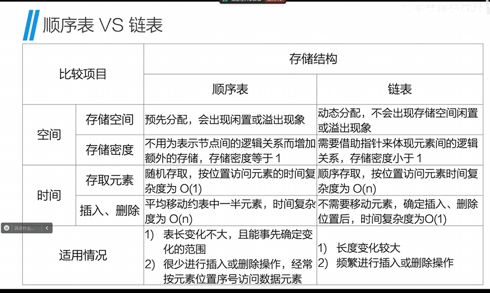

## 栈和队列

栈是限定仅在表尾进行插入和删除操作的线性表。对栈来说，表尾端有其特殊含义，称之为==栈顶（top）==，相应地表头称为==栈底（bottom）==。不含元素的空表称为空栈

队列是限定仅在表头进行删除操作，表尾进行插入操作的线性表。允许插入的一端叫==队尾（rear）==，允许删除的一端叫==队头（front）==。不含元素的空表称为空队列。

### 栈的初始化

```c
#define MAXSIZE 100
typedef int ElmeType;

typedef struct{
   ElemType data[MAXSIZE];
   int top;
}Stack;

void initStack(Stack *s)
{
   s->top = -1;
}
```

### 判断栈是否为空

```c
int isEmpty(Stack *s)
{
   if(s->top == -1)
   {
      printf("空的\n");
      return 1;
   }
   else{
      return 0;
   }
}
```

### 栈的进栈或压栈

```c
int push(Stack *s, ElmeType e)
{
  if(s->top >= MAXSIZE-1)
  {
   printf("满了\n");
   return 0;
  }
  s->top++;
  s->data[s->top] = e; 
  return 1;
}  
```

### 出栈

```c
ElemType pop(Stack *s, ElemType *e)
{
   if(s->top == -1)
   {
      printf("空的\n");
      return 0;
   }
   *e = s->data[s->top]; //把要出栈的元素数据传出去
   s->top--;
   return 1;
}
```

### 获取栈顶元素

```c
int getTop(Stack *s,ElemType *e)
{
   if(s->top == -1)
   {
      printf("空的\n");
      return 0;
   }
   *e = s->data[s->top];
   return 1;
}
```

### 栈的链式结构初始化

```c
//和链表一模一样
typedef int EledmType;
typedef struct stack{
   ElemType data;
    struct stack *next;
}Stack;
Stack *initStack()
{
   Stack *s = (Stack*)malloc(sizeof(Stack));
   s->data = 0;
   s->next = NULL;
   return s;

}

```

### 链式--判断栈是否为空

```c
int isEmpty(Stack *s)
{
   if(s->next == NULL)
   {
      printf("空的\n");
      return 1;
   }
   else{
      return 0;
   }
}
```

### 进栈--头插法

### 出栈--头删法

```c
int pop(Stack *s, ElemType *e)
{
   if(s->next == NULL)
   {
      printf("空的\n");
      return 0;
   }
   *e = s->next->data;
   Stack *q = s->next;
   s->next = q->next;
   free(q);
   return 1;
}
```

### 链式-获取栈顶元素

即获得头结点下一个结点的元素

## 队的顺序结构初始化

```c
#define MAXSIZE 100
typedef int ElemType;
typedef struct
{
   ElemType data[MAXSIZE];
   int front; //队头 -- 删除
   int rear;  //队尾 -- 插入
}Queue;
void initQueue(Queue *Q)
{
   Q->front = 0;
   Q->rear = 0;
}
```

### 判断队列是否为空

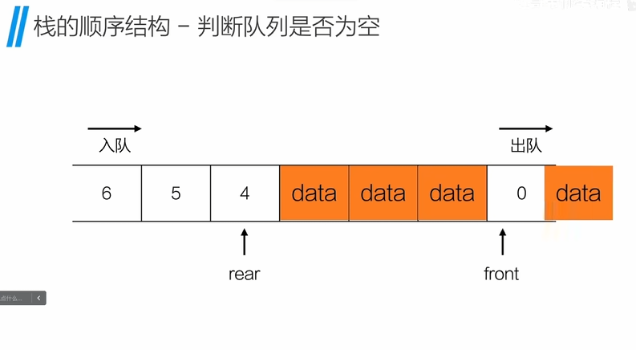
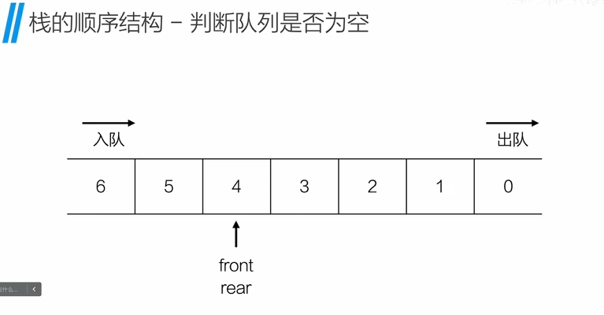

```c
int isEmpty(Queue *Q)
{
   if(Q->front == Q->rear)
      {
         printf("空的\n");
         return 1;
      }
   else
      return 0;

}
```

### 出队

```c
ElemType dequeue(Queue *Q)
{
   if(Q->front == Q->rear)
   {
      printf("空的\n")
      return 0;
   }
   ElemType e = Q->data[Q->front];
   Q->front++;
   return e;
}
```

### 入队

```c
int queueFull(Queue *Q) 
{  if(Q->front>0)
{
   int step = Q->front;
   for(int i = Q->front; i<= Q->rear; ++i)
   {
      Q->data[i-step] = Q->data[i]; //把队头的数据放到下标为0的位置
   }
   Q->front = 0;
   Q->rear = Q->rear - step;
   return 1;
}
else
{
   printf("真的满了\n")；
   return 0;
}
}
int enqueue(Queue *Q, ElemType e)
{
   if(Q->rear >= MAXSIZE) //先判断队尾有没有到最大
   {
      if(!queueFull(Q)) //感叹号(!)就是给数值取反,判断队列还有没有位置，如果有就把所有数据向队头移动
      return 0;
   }
   Q->data[Q->rear] = e;
   Q->rear++;
   return 1;
}
```

### 获取队尾数据

```c
int getHead(Queue *Q, ElemType *e)
{
   if(Q->front == Q->rear)
   {
      printf("空的\n");
      return 0;
   }
   *e = Q->data[Q->front];
   return 1;
}
```

### 队列动态内存分配

```c
typedef struct
{
   ElemType *data;
   int front;
   int rear;
}Queue;
Queue *initQueue()
{
   Queue *q = (Queue*)malloc(sizeof(Queue));
   q->data = (ElemType*)malloc(sizeof(ElemType)*MAXSIZE);
   q->front = 0;
   q->rear = 0;
   //另一种方法，让队尾指针始终指向队尾元素
   //q->rear = (q->rear + 1) % MAXSIZE;
   return q;
}
```

### 循环队列-入队

```c
int equeue(Queue *Q,ElemType e) {
   //对应上面的修改此处应该是
   //Q->rear = (Q->rear + 1) % MAXSIZE;那么下面的相同的语句就要删掉了
    if ((Q->rear + 1)%MAXSIZE == Q->front) {
        printf("满了\n");
        return 0;
    }
    Q->data[Q->rear] = e;
    Q->rear = (Q->rear + 1) % MAXSIZE; //这里没有直接+1，是因为下标是数组，直接+1最后会出现下标为8的情况，但实际上是0
    return 1;
}
```

### 循环队列-出队

```c
ElemType dequeue(Queue *Q,ElemType *e) {
   if (Q->front == Q->rear) {
       printf("空了\n");
       return 1;
   }
    *e = Q->data[Q->front];
    Q->front = (Q->front+1) % MAXSIZE;
    return 0;
}
```

### 循环队列的一个小问题

循环队列始终有一个位置是空的，代码逻辑上会判满，但是实际上有一个位置是没有数据的。

### 队列链式结构初始化

```c
typedef int ElemType;

//构成链表
typedef struct QueueNode {
    ElemType data;
    struct QueueNode *next;
}QueueNode;

//构成队列
typedef struct //动态内存分配初始化
{

    QueueNode * front;
    QueueNode * rear;
}Queue;

Queue* initQueue() {
    Queue *q = (Queue*)malloc(sizeof(Queue));
    QueueNode *node = (QueueNode*)malloc(sizeof(QueueNode));//创立头结点
    node->data = 0;
    node->next = NULL;
    q->front = node; //node 就是头结点
    q->rear = node;
    return q;
}


```

### 队列链式-入队和出队

```c
void equeue(Queue *q,ElemType e) {
    QueueNode *node = (QueueNode*)malloc(sizeof(QueueNode));
    node->data = e;
    node->next = NULL;
    q->rear->next = node;
    q->rear = node;
}

int dequeue(Queue *q,ElemType *e) {
    QueueNode *node = q->front->next;
    *e = node->data;
    q->front->next = node->next;
    if (q->rear == node) {
        q->rear = q->front;
    }
    free(node);
    return 1;
}
```

### 获取队头元素

```c
ElemType getFront(Queue *q) {
    if (isEmpty(q)) {
        printf("空了\n");
        return 0;
    }
    return q->front->next->data;
}
```

### 递归--斐波那契数列

```c
int fibonacci(int n)
{
   if(n == 1 || n == 2 )
   {
      return 1;
   }
   else
   {
      return fibonacci(n - 1) + fibonacci(n - 2);
   }
}
```

### 后缀表达式

利用栈让计算机认识的计算表达式，通常将表达式放入一个字符串当中，通过栈逐一识别计算。
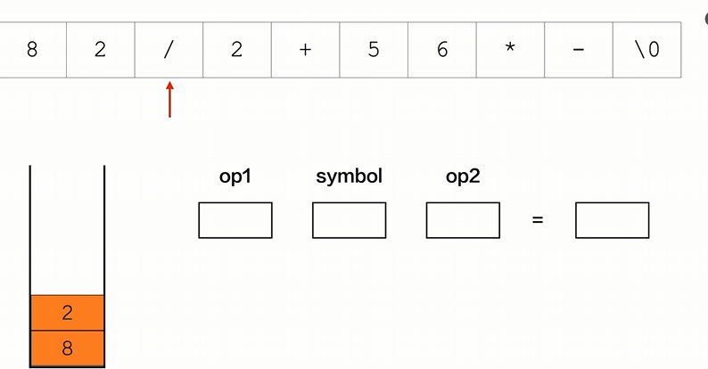
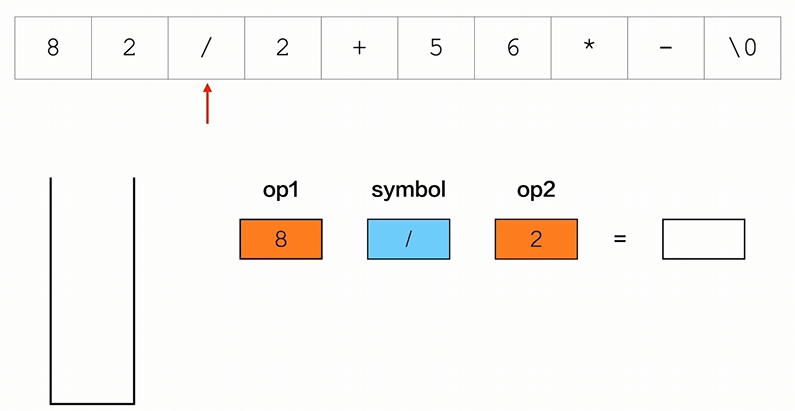
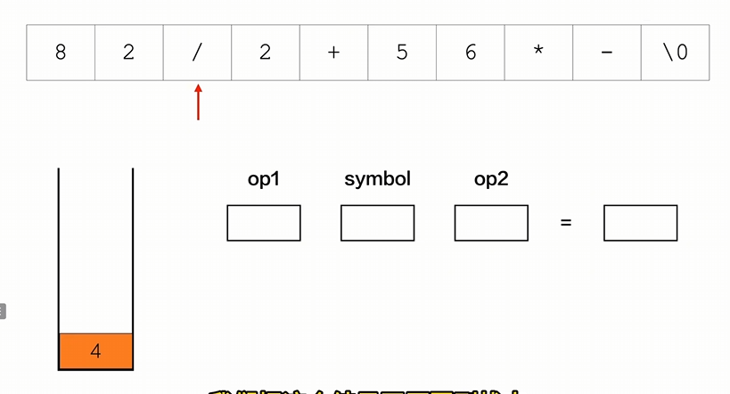

```c
#include <stdio.h>
#include <stdlib.h>

#define MAXSIZE 100

typedef int ElemType;

typedef struct {
    ElemType *data;
    int top;
}Stack; //创建栈

typedef enum {
    LEFT_PARE,RIGHT_PARE,ADD,SUB,MUL,DIV,EOS,NUM
}contentType;//左括号，右括号，加减乘除，\0,数字

char expr [] = "82/2+56*-"; //需要求值的表达式

//动态内存分配初始化栈
Stack* initStack() {
    Stack *s = (Stack*)malloc(sizeof(Stack));
    s->data = (ElemType*)malloc(sizeof(ElemType)*MAXSIZE);
    s->top = -1;
    return s;
}

//判断栈是否为空

int isEmpty(Stack *s) {
    if (s == NULL)
        return 2;
    else if (s->top == -1) {
        printf("空\n");
        return 1;
    }
    else
        return 0;
}

//进栈

int push(Stack *s,ElemType e) {
    if (s == NULL)
        return 2;
    else if (s->top == MAXSIZE-1) {
        printf("栈满\n");
        return 0;
    }
    else {
        s->top++;
        s->data[s->top] = e;
        return 1;
    }
}

//出栈
int pop(Stack *s,ElemType *e) {
    if (isEmpty(s)) {
        printf("栈空\n");
        return 0;
    }
    else {
        *e = s->data[s->top];
        s->top--;
        return 1;
    }
}

//获得栈顶元素

int getTop(Stack *s,ElemType *e) {
    if (isEmpty(s)) {
        printf("栈空\n");
        return 0;
    }
    else {
        *e = s->data[s->top];
        return 1;
    }
}

//用来获得表达式里的字符
contentType getToken(char *symbol,int *index) {
    *symbol = expr[*index]; //获取表达式里的字符
    *index = *index + 1;
    switch (*symbol) {
        case'(':
            return LEFT_PARE;
        case ')':
            return RIGHT_PARE;
        case '+' :
            return ADD;
        case '-' :
            return SUB;
        case '*' :
            return MUL;
        case '/' :
            return DIV;
        case '\0' :
            return EOS;
        default:
            return NUM;

    }
}
int eval(Stack *s) {
    char symbol; //用来记表达式里的符号
    int op1,op2;//用来记表达式的数值
    int index = 0;//表达式下标

    contentType token;//枚举变量
    token = getToken(&symbol,&index);
    ElemType result;
    while (token != EOS) {//开始扫描表达式
        if (token == NUM) {
            push(s,symbol - '0'); //这里利用ASCII表，将字符转换为了数值，并进行压栈
        }
        else {
            pop(s,&op2); //栈顶元素是op2
            pop(s,&op1);

            switch (token) {
                case ADD:
                    push(s,op1+op2);
                    break;
                case SUB:
                    push(s,op1-op2);
                    break;
                case MUL:
                    push(s,op1*op2);
                    break;
                case DIV:
                    push(s,op1/op2);
                    break;
                default:
                    break;
            }
        }
        token = getToken(&symbol,&index);
    }
    pop(s,&result);
    printf("%d\n",result);
    return 1;
}
int main() {
    Stack *s = initStack();

    eval(s);
    free(s);
    return 0;
}
```

### 中缀表达式转后缀表达式

中缀表达式就是平时我们写的表达式，比如1*2-1
转换逻辑：
1.如果是操作数，直接输出
2.如果是运算符，则判断优先级，如果优先级大于栈顶运算符，则入栈，否则将栈顶元素出栈输出，然后将当前运算符压入栈中。
3.当左括号在栈外时，属于最高优先级，当左括号在栈内时，属于最低优先级
4.如果是右括号，且栈顶不是左括号，持续出栈并输出，直到左括号为栈顶元素，最后左括号出栈
5.表达式扫描结束后，剩余元素依次出栈输出

```c
#include <math.h>
#include <stdio.h>
#include <stdlib.h>

#define MAXSIZE 100

typedef int ElemType;

typedef struct {
    ElemType *data;
    int top;
}Stack; //创建栈

typedef enum {
    LEFT_PARE,RIGHT_PARE,ADD,SUB,MUL,DIV,MOD,EOS,NUM
}contentType;//左括号，右括号，加减乘除，\0,数字

// char expr [] = "82/2+56*-"; //需要求值的后缀表达式
char expr [] = "x/(i-j)*y"; //需要转换的的中缀表达式

//动态内存分配初始化栈
Stack* initStack() {
    Stack *s = (Stack*)malloc(sizeof(Stack));
    s->data = (ElemType*)malloc(sizeof(ElemType)*MAXSIZE);
    s->top = -1;
    return s;
}

//判断栈是否为空

int isEmpty(Stack *s) {
    if (s == NULL)
        return 2;
    else if (s->top == -1) {
        // printf("空\n");
        return 1;
    }
    else
        return 0;
}

//进栈

int push(Stack *s,ElemType e) {
    if (s == NULL)
        return 2;
    else if (s->top == MAXSIZE-1) {
        printf("栈满\n");
        return 0;
    }
    else {
        s->top++;
        s->data[s->top] = e;
        return 1;
    }
}

//出栈
int pop(Stack *s,ElemType *e) {
    if (isEmpty(s)) {
        printf("栈空\n");
        return 0;
    }
    else {
        *e = s->data[s->top];
        s->top--;
        return 1;
    }
}

//获得栈顶元素

int getTop(Stack *s,ElemType *e) {
    if (isEmpty(s)) {
        printf("栈空\n");
        return 0;
    }
    else {
        *e = s->data[s->top];
        return 1;
    }
}

//用来获得表达式里的字符
contentType getToken(char *symbol,int *index) {
    *symbol = expr[*index]; //获取表达式里的字符
    *index = *index + 1;
    switch (*symbol) {
        case'(':
            return LEFT_PARE;
        case ')':
            return RIGHT_PARE;
        case '+' :
            return ADD;
        case '-' :
            return SUB;
        case '*' :
            return MUL;
        case '/' :
            return DIV;
        case '%' :
            return MOD;
        case '\0' :
            return EOS;
        default:
            return NUM;

    }
}

int print_token(contentType token) {
    switch (token) {
        case ADD:
            printf("+");
            break;
        case SUB:
            printf("-");
            break;
        case MUL:
            printf("*");
            break;
        case DIV:
            printf("/");
            break;
        case MOD:
            printf("%%");
            break;
        default:
            return 0;
    }
    return 1;
}

void postfix(Stack *s) { //用于判断运算符的优先级
    //下面的优先级与上面的枚举元素一一对应
    int in_stack[] = {0,19,12,12,13,13,13,0};// 符号在栈内的优先级
    int out_stack[] = {20,19,12,12,13,13,13,0};//符号在栈外的优先级
    contentType token;
    int index = 0;
    s->data[0] = EOS; //把EOS压入栈底，因为后缀表达式的最后一个符号是\0
    char  symbol;
    ElemType e;

    token = getToken(&symbol,&index); //逐一获取表达式的符号给token

    while (token != EOS) {
        if (token == NUM) {
            printf("%c",symbol);
        }
        else if (token == RIGHT_PARE) {
            while (s->data[s->top] != LEFT_PARE) {//如果栈顶元素不是左括号，则出栈
                pop(s,&e);
                print_token(e);
            }
            pop(s,&e);
        }
        else { //既不是数字也不是括号，那么就是运算符需要判断优先级

                while (!isEmpty(s) && in_stack[s->data[s->top]] >= out_stack[token]) {
                    pop(s,&e);  //若栈顶元素大于扫描的当前符号，则出栈
                    print_token(e);//并且打印出栈顶元素
                }
                push(s,token); //不管当前符号是否大于栈顶元素，都把当前符号压入栈中
            }
            token = getToken(&symbol,&index);
        }

}
int main() {
    Stack *s = initStack();
    printf("%s\n",expr);
    postfix(s);
    free(s);
    return 0;
}
```

### 栈和队列的比较

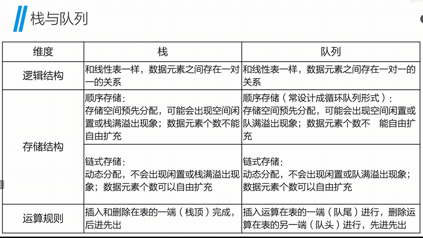

## 排序算法

### 冒泡排序

冒泡排序是一种简单的排序算法。它重复地走访过要排序的数列，一次比较两个相邻元素，如果它们的顺序错误就把它们交换过来。走访数列的工作是重复地进行直到没有再需要交换，也就是说该数列已经排序完成。这个算法的名字由来是因为越小的元素会经由交换慢慢“浮”到数列的顶端。

冒泡排序算法的运作如下：

1. 比较相邻的元素。如果第一个比第二个大，就交换它们两个；
2. 对每一对相邻元素作同样的工作，从开始第一对到结尾的最后一对，这样在最后的元素应该会是最大的数；
3. 针对所有的元素重复以上的步骤，除了最后一个；

例如，用C语言对数列[6, 5, 3, 1, 8, 7, 2, 4]进行冒泡排序：

```.
#include <stdio.h>

void bubble_sort(int arr[], int n) {
    int i, j, temp;
    for (i = 0; i < n - 1; i++) {
        for (j = 0; j < n - i - 1; j++) {
            if (arr[j] > arr[j + 1]) {
                temp = arr[j];
                arr[j] = arr[j + 1];
                arr[j + 1] = temp; 
            } 
        } 
    }

}
int main() {
    int arr[] = {6, 5, 3, 1, 8, 7, 2, 4};
    int n = sizeof(arr) / sizeof(arr[0]);
    bubble_sort(arr, n); 
    for (int i = 0; i < n; i++) {
        printf("%d ", arr[i]);
    }
    return 0;
}
```

### 选择排序

选择排序是一种简单直观的排序算法，无论什么数据进去都是 O(n²) 的时间复杂度。所以用到它的时候，数据规模越小越好。唯一的好处可能就是不占用额外的内存空间了吧。

选择排序(Selection-sort)是一种简单直观的排序算法。它的工作原理：首先在未排序序列中找到最小（大）元素，存放到排序序列的起始位置，然后，再从剩余未排序元素中继续寻找最小（大）元素，然后放到已排序序列的末尾。以此类推，直到所有元素均排序完毕。

例：

```.
#include <stdio.h>

void SelectSort(int k[], int n)
{
int i, j, min, temp;
for (i = 0; i < n - 1 ; i++)
{
min = i;
for (j = i + 1; j < n; j++)
{
if (k[j] < k[min])
{
min = j;
}
}

if (min != i) 
{
temp = k[min];
k[min] = k[i];
k[i] = temp;
}
}
}
int main() {
int i, a[10] = { 5,2,6,0,3,9,1,7,4,8 };

SelectSort(a, 10);
for (i = 0; i < 10; i++)
{
printf("%d", a[i]);
}
return 0;
}
```

### 插入排序

插入排序（Insertion Sort）的算法描述是一种简单直观的排序算法。它的工作原理是通过构建有序序列，对于未排序数据，在已排序序列中从后向前扫描，找到相应位置并插入。

插入排序算法的运作如下：

1. 从第一个元素开始，该元素可以认为已经被排序；
2. 取出下一个元素，在已经排序的元素序列中从后向前扫描；
3. 如果该元素（已排序）大于新元素，将该元素移到下一位置；
4. 重复步骤3，直到找到已排序的元素小于或者等于新元素的位置；
5. 将新元素插入到该位置后；

例：

```.
#include <stdio.h>

void InsertSort(int k[], int n)
{
int i, j, temp;
for (i = 1; i < n; i++)
{
if (k[i] < k[i - 1])
{
temp = k[i]; 
for (j = i - 1; j >= 0 && k[j] > temp; j--)
{
k[j + 1] = k[j];
}
k[j + 1] = temp;
}
}
}

int main() {
int i, a[10] = { 5,2,6,0,3,9,1,7,4,8 };
InsertSort(a, 10); 
for (i = 0; i < 10; i++)
{
printf("%d", a[i]); 
}

return 0;   
}
```

### 希尔排序

希尔排序是希尔（Donald Shell）于1959年提出的一种排序算法。希尔排序也是一种插入排序，它是简单插入排序经过改进之后的一个更高效的版本，也称为缩小增量排序，同时该算法是冲破O（n2）的第一批算法之一。
希尔排序是把记录按下标的一定增量分组，对每组使用直接插入排序算法排序；随着增量逐渐减少，每组包含的关键词越来越多，当增量减至1时，整个文件恰被分成一组，算法便终止。

例：

```.
#include <stdio.h>
void ShellSort(int k[], int n)
{
int i, j, gap;
int temp;
for (gap = n / 2; gap > 0; gap /= 2)
{
for (i = gap; i < n; i++)
{
temp = k[i];
for (j = i - gap; j >= 0 && k[j] > temp; j -= gap)
{
k[j + gap] = k[j];
}
k[j + gap] = temp;
}
}
}
int main() {
int i, a[10] = { 5,2,6,0,3,9,1,7,4,8 };
ShellSort(a, 10);
for (i = 0; i < 10; i++)
{
printf("%d", a[i]);
}
return 0;
}

```

### 堆排序

堆排序（Heapsort）是指利用堆这种数据结构所设计的一种排序算法。堆积是一个近似完全二叉树的结构，并同时满足堆积的性质：即子结点的键值或索引总是小于（或者大于）它的父节点。

例：

## 查找

### 折半查找

折半查找是一种效率较高的查找方法。但是，折半查找要求线性表必须采用顺序存储结构，而且表中元素按关键字有序排列。

例：

```.
#include <stdio.h>
int BinarySearch(int k[], int n, int key)
{
int low, high, mid;
low = 0;
high = n - 1;
while (low <= high)
{
mid = (low + high) / 2;
if (key < k[mid])
{
high = mid - 1;
}
else if (key > k[mid])
{
low = mid + 1;
}
else
{
return mid;  
}
}
}

int main() {
int i, a[10] = { 5,2,6,0,3,9,1,7,4,8 };
int key = 3;
printf("%d", BinarySearch(a, 10, key));
return 0; 
}
```

## 图

### 完全图

对于一个具有n个顶点的无向完全图，边数量的最大值为n(n-1)/2。
对于一个具有n个顶点的有向完全图，边数量的最大值为n(n-1)。

### Dijkstra算法

Dijkstra算法是一种用于寻找加权图中最短路径的算法。

```c
#include <stdio.h>

typedef int V;
typedef int E;

#define MAXSIZE 100
#define MAXEDGE 100
#define MAX 0x10000

typedef struct
{
   V vertex[MAXSIZE]; //定义点数
   E arc[MAXSIZE][MAXSIZE]; //定义邻接矩阵
   int vertex_num;
   int edge_num;
}Mat_Graph;

void createGraph(Mat_Graph* G)
{
   G->vertex_num = 9; //点的最大数
   G->edge_num = 16;  //边的最大数

    for (int i = 0;i < G->vertex_num; i++)
   {
     G->vertex[i] = "食堂"; //定义下角标
   }
    for(int i = 0;i < G->vertex_num; i++)
    {
       for(int j = 0; j < G->vertex_num; j++)
       {
          if(i == j)
          {
             G->arc[i][j] = 0;   //初始化二维矩阵
          }
          else
          {
             G->arc[i][j] = MAX;   //初始化邻接矩阵
          }
       }
    }
   G->arc[0][1] = 1;
   G->arc[0][2] = 5;

   G->arc[1][2] = 3;
   G->arc[1][3] = 7;
   G->arc[1][4] = 5;

   G->arc[2][4] = 1;
   G->arc[2][5] = 7;

   G->arc[3][4] = 2;
   G->arc[3][6] = 3;

   G->arc[4][5] = 3;
   G->arc[4][6] = 6;
   G->arc[4][7] = 9;

   G->arc[5][7] = 5;

   G->arc[6][7] = 2;
   G->arc[6][8] = 7;

   G->arc[7][8] = 4; //赋值

   for(int i = 0; i< G->vertex_num; i++)
   {
      for (int j = i; j< G->vertex_num;j++)
      {
         G->arc[j][i] = G->arc[i][j]; //使邻接矩阵对称
      }
   }
}

int choose(int distance[],int found[], int vertex_num)
{
   int min = MAX;
   int minPos = -1;
   for(int i = 0; i < vertex_num; i++)
   {
      if(distance[i] < min && found[i] == 0)  //distance
      {
         min = distance[i];
         minPos = i;
      }
   }
   return minPos;
}

void dijkstra(Mat_Graph G, int begin) // Dijkstra算法
{
   int found[MAXSIZE]; //顶点是否已走过
   int path[MAXSIZE]; //路径
   int distance[MAXSIZE]; // 顶点之间的距离
   for (int i = 0;i < G.vertex_num; i++)
   {
      found[i] = 0;
      path[i] = -1;
      distance[i] = G.arc[begin][i];
   }

   found[begin] = 1;
   distance[begin] = 0;

   int next; //下一个要观察的点
   for(int i = 1; i < G.vertex_num; i++)
   {
      next = choose(distance, found, G.vertex_num);

      found[next] = 1;
      for(int j = 0; j < G.vertex_num; j++)
      {
         if(found[j] == 0) //若改顶点没有访问过
         {
            if(distance[next] + G.arc[next][j] < distance[j])
            {
                  distance[j] = distance[next] + G.arc[next][j];
               path[j] = next;
            }
         }
      }
   }
   char const campus[9][100] = {
         "西大门",
         "chufang",
         "图书馆",
         "操场",
         "教学楼A",
         "教学楼B",
         "教学楼C",
         "宿舍7",
         "宿舍8",
   };

   for(int i = 1; i < G.vertex_num; i++)
   {
      printf("西大门 -> %s : %d\n",campus[i],distance[i]);

      int j = i;
      printf(" 路径是：%s <- ",campus[i]);
      while (path[j] != -1) {
         printf("%s <-", campus[j]);
         j = path[j];
      }
      printf("西大门\n");
   }
}

int main(void) {
   Mat_Graph G;
   createGraph(&G);
   int begin = 0;
   dijkstra(G,begin);
   return 0;
}
```

### Floyd算法

Floyd算法是一种用于寻找加权图中所有顶点之间最短路径的算法。

```c
#include <stdio.h>

typedef int V;
typedef int E;

#define MAXSIZE 100
#define MAXEDGE 100
#define MAX 0x10000

typedef struct
{
    V vertex[MAXSIZE]; //定义点数
    E arc[MAXSIZE][MAXSIZE]; //定义邻接矩阵
    int vertex_num;
    int edge_num;
}Mat_Graph;

void createGraph(Mat_Graph* G)
{
    G->vertex_num = 9; //点的最大数
    G->edge_num = 16;  //边的最大数

    for (int i = 0;i < G->vertex_num; i++)
    {
        G->vertex[i] = "食堂"; //定义下角标
    }
    for(int i = 0;i < G->vertex_num; i++)
    {
        for(int j = 0; j < G->vertex_num; j++)
        {
            if(i == j)
            {
                G->arc[i][j] = 0;   //初始化二维矩阵
            }
            else
            {
                G->arc[i][j] = MAX;   //初始化邻接矩阵
            }
        }
    }
    G->arc[0][1] = 1;
    G->arc[0][2] = 5;

    G->arc[1][2] = 3;
    G->arc[1][3] = 7;
    G->arc[1][4] = 5;

    G->arc[2][4] = 1;
    G->arc[2][5] = 7;

    G->arc[3][4] = 2;
    G->arc[3][6] = 3;

    G->arc[4][5] = 3;
    G->arc[4][6] = 6;
    G->arc[4][7] = 9;

    G->arc[5][7] = 5;

    G->arc[6][7] = 2;
    G->arc[6][8] = 7;

    G->arc[7][8] = 4; //赋值

    for(int i = 0; i< G->vertex_num; i++)
    {
        for (int j = i; j< G->vertex_num;j++)
        {
            G->arc[j][i] = G->arc[i][j]; //使邻接矩阵对称
        }
    }
}

void floyd(Mat_Graph G)
{
    int path [MAXSIZE][MAXSIZE];
    int distance[MAXSIZE][MAXSIZE];

    for(int i = 0 ;i < G.vertex_num; i++)
    {
       for(int j = 0; j < G.vertex_num; j++)
       {
          distance[i][j] = G.arc[i][j];
           path[i][j] = j;
       }
    }

    for(int i = 0; i < G.vertex_num; i++)
    {
       for(int j = 0; j < G.vertex_num; j++)
       {
           for(int k = 0; k < G.vertex_num; k++)
           {
              if (distance[j][k] > distance[j][i] + distance[i][k])
              {
                  distance[j][k] = distance[j][i] + distance[i][k];
                  path[j][k] = path[j][i];
              }
           }
       }
    }

    int k;
    for(int i = 0; i < G.vertex_num; i++)
    {
       for(int j = i + 1; j < G.vertex_num; j++)
       {
          printf("V%d -> V%d 权重: %d",i,j,distance[i][j]);
           k = path[i][j];
           printf(" path:V%d",k);
           while(k != j)
           {
             printf("->V%d",k);
               k = path[k][j];
           }
           printf("->V%d\n",j);
       }
        printf("\n");
    }
}

int main(void) {
    Mat_Graph G;
    createGraph(&G);
    floyd(G);

    return 0;
}
```

## 拓扑排序

持续寻找入度为0的顶点，然后入栈，出栈

```c
// #include <math.h>
#include <stdio.h>
#include <stdlib.h>

typedef int V;
typedef int E;
#define MAXSIZE 100

typedef struct {
    V vertex[MAXSIZE]; //点
    E arc[MAXSIZE][MAXSIZE]; //边
    int vertex_num; //
    int edge_num; //
}Mat_Graph; //定义邻接矩阵

typedef struct EdgeNode{
    int edge_vex; //顶点的下标
    struct EdgeNode *next;
}EdgeNode;

typedef struct VertexNode {
    int in; //入度
    V data; //顶点的下标V1 V2...
    EdgeNode* head; //下一个结点地址
}VertexNode; //将每个顶点设置为结点

typedef VertexNode Adj_List[MAXSIZE];//adjacency毗邻 邻接  为每个顶点创建数组

typedef struct {
    Adj_List adj_list; //邻接表
    int vertex_num;
    int edge_num;
}Adj_Graph;

typedef Adj_Graph* Adj_List_Graph;

int top = -1;
int stack[MAXSIZE]; //并非标准的栈

void push(int e) {
    if (top > MAXSIZE) {
        printf("满了\n");
        return;
    }

    top++;
    stack[top] = e;
}

int pop() {
    if (top == -1) {
        printf("空\n");
        return 0;
    }

    int elem = stack[top];
    top--;
    return elem;
}

int is_empty() {
    if (top == -1) {
        return 0;
    }
    else {
        return 1;
    }
}

//绘制邻接矩阵
void create_graph(Mat_Graph* G) {
   //定义边和顶点的数量
    G->vertex_num = 14;
    G->edge_num = 20;

    for (int i = 0; i < G->vertex_num; i++) {
        G->vertex[i] = i; //给顶点下标赋值
    }
    //每个边初始化为0
    for (int i = 0; i < G->vertex_num;i++) {
        for (int j = 0; j < G->vertex_num; j++)
        {
            G->arc[i][j] = 0;
        }
    }
//给
    G->arc[0][4] = 1;
    G->arc[0][5] = 1;
    G->arc[0][11] = 1;
    G->arc[1][2] = 1;
    G->arc[1][4] = 1;
    G->arc[1][8] = 1;
    G->arc[2][5] = 1;
    G->arc[2][6] = 1;
    G->arc[2][9] = 1;
    G->arc[3][2] = 1;
    G->arc[3][13] = 1;
    G->arc[4][7] = 1;
    G->arc[5][8] = 1;
    G->arc[5][12] = 1;
    G->arc[6][5] = 1;
    G->arc[8][7] = 1;
    G->arc[9][10] = 1;
    G->arc[9][11] = 1;
    G->arc[10][13] = 1;
    G->arc[12][9] = 1;

}

//将邻接矩阵转换为邻接表
void create_adj_graph(Mat_Graph G, Adj_List_Graph* ALG) {
    EdgeNode *e;

    *ALG = (Adj_List_Graph)malloc(sizeof(Adj_Graph));
    (*ALG)->vertex_num = G.vertex_num;
    (*ALG)->edge_num = G.edge_num;

    //初始化每个顶点
    for (int i = 0; i < G.vertex_num; i++) {
        (*ALG)->adj_list[i].in = 0;   //入度初始化为0
        (*ALG)->adj_list[i].data = G.vertex[i];//将每个结点的值对应顶点的下标
        (*ALG)->adj_list[i].head = NULL;
    }

    for (int i = 0; i<G.vertex_num; i++) {
        for (int j = 0; j < G.vertex_num; j++)
            {
            if (G.arc[i][j] == 1) //当两个点之间有连接时
                {
                e = (EdgeNode*)malloc(sizeof(EdgeNode));
                e->edge_vex = j;
                e->next = (*ALG)->adj_list[i].head;
                (*ALG)->adj_list[i].head = e;
                (*ALG)->adj_list[j].in++;
            }
        }
    }
}

//拓扑排序
void topological_sort(Adj_List_Graph ALG) {
    EdgeNode* e;
    int curr;
    int k;

    for(int i = 0; i < ALG->vertex_num; i++) {
        if (ALG->adj_list[i].in == 0) { //入度为0则入栈
            push(i);
        }
    }
    while (is_empty() != 0) {
        curr = pop();
        printf("V%d -> ",ALG->adj_list[curr].data);
        e = ALG->adj_list[curr].head;

        while (e != NULL) {
            k = e->edge_vex;
            ALG->adj_list[k].in--;
            if (ALG->adj_list[k].in == 0) {
                push(k);
            }
            e = e->next;
        }
    }
}

int main(void) {
    Mat_Graph G;
    Adj_List_Graph ALG;
    create_graph(&G);
    create_adj_graph(G,&ALG);
    topological_sort(ALG);
    return 0;
}
```

## 关键路径

在一个表示工程的带权有向图中，用顶点表示事件，用有向边表示活动，用边上的权值表示活动的持续时间，这种有向图的边表示活动的网，我们称为AOE

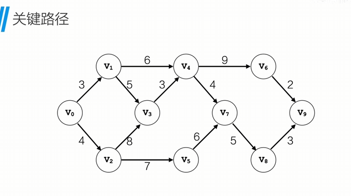

### etv事件最早发生的时间

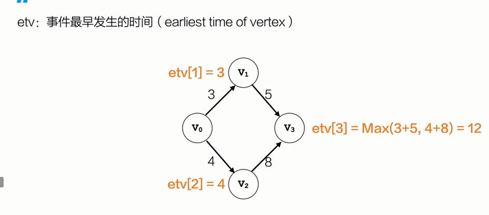
v1最早发生时间是3，v2最早发生时间是4，v3需要v1和v2都完成，所以v3最早发生时间是v1和v2的较大值，即12。

### lty事件最晚发生的时间

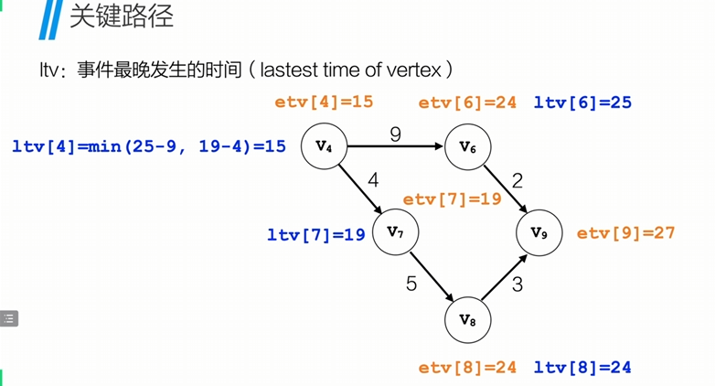
刚好与上面的概念相反

### 最早时间和最晚时间相同的点连接起来就是关键路径

## 树

### 性质

1.树中所有结点数等于所有结点的度数之和+1
2.度数为m的树的第i层最多有m^i个节点
3.对于高度为h，度为m的树，最多有(m^h - 1) / (m - 1)个节点

## 二叉树

1.二叉树的第i层最多有2^i（i>=1）个节点
2.深度为k的二叉树最多有2^k - 1个节点
3.对于任何非空的二叉树T，如果叶子结点的个数为n0，度为2的结点的个数为n2，则n0 = n2 + 1。

### 满二叉树和完全二叉树

满二叉树：。。。。

完全二叉树：没有左子树就不能有右子树，上一层没有铺满就不能有下一层

### 完全二叉树存储结构

```c
#include <math.h>
#include <stdio.h>
#include <stdlib.h>

typedef char ElemType;
typedef struct TreeNode {
    ElemType data;
    struct TreeNode *lchild;
    struct TreeNode *rchild;
}TreeNode;

typedef TreeNode *BiTree;

char str[] = "ABDH#K###E##CFI###G#J##";
int idx = 0;

//前序遍历
void preOrder(BiTree T) {
    if (T == NULL)
        return;
    printf("%c",T->data);
    preOrder(T->lchild);
    preOrder(T->rchild);
}

//中序遍历
// void midOrder(BiTree T) {
//     if (T == NULL)
//         return;
//     midOrder(T->lchild);
//     printf("%c",T->data);
//     midOrder(T->rchild);
// }

//后序遍历
// void posOrder(BiTree T) {
//     if (T == NULL)
//         return;
//     posOrder(T->lchild);
//     posOrder(T->rchild);
//     printf("%c",T->data);
// }

void createTree(BiTree *T) {
    ElemType ch;
    ch = str[idx++];
    if (ch == '#') {
        *T = NULL;
    }
    else {
        *T = (BiTree)malloc(sizeof(TreeNode));
        (*T)->data = ch;
        createTree(&(*T)->lchild);
        createTree(&(*T)->rchild);
    }
}
int main(void) {
    BiTree T;
    createTree(&T);
    preOrder(T);
    return 0;
}
```

### 二叉树遍历性质

已知前序遍历和中序遍历，可以确定唯一一棵二叉树
已知后序遍历和中序遍历，可以确定唯一一棵二叉树

==已知前序遍历和后序遍历，不能确定唯一的二叉树==

### 线索二叉树

利用叶节点的空余空间记录前驱和后继，将二叉树线索化可以像遍历链表一样去遍历二叉树，不需要递归，只用简单的循环进行遍历，可以节省空间，也可以降低时间复杂度

1.头结点的lchild指向二叉树的根
2.头结点的rchild指向遍历的最后一个结点
3.遍历的第一个的结点的lchild指向头结点
4.遍历的最后一个结点的rchild指向头结点
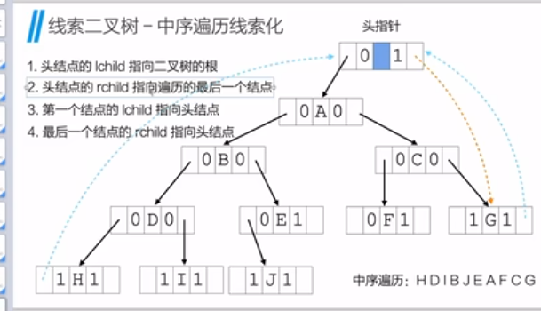

```c
#include <math.h>
#include <stdio.h>
#include <stdlib.h>

typedef char ElemType;

typedef struct ThreadNode {
    ElemType data;
    struct ThreadNode *lchild; //指向前驱或左孩子
    struct ThreadNode *rchild; //指向后继或右孩子
    int ltag;  // 为0时指向左孩子，为1时指向前驱
    int rtag;  // 为0时指向右孩子，为1时指向后继
}ThreadNode;

typedef ThreadNode *ThreadTree; //这里修改的话下面的函数就不用加*了，但是这是老祖宗的做法了

char str[] = "ABDH##I##EJ###CF##G##";
int idx = 0; //下标

ThreadTree prev;

//创建树
void createTree(ThreadTree *T) { //c语言特性，这里只有加*，c语言才知道你传入的是个指针，否则他只会认为你穿进来的只是一个赋有地址的值
    ElemType ch;
    ch = str[idx++];
    if(ch == '#') {
        *T = NULL;
    }
    else {
        *T = (ThreadTree)malloc(sizeof(ThreadNode));
        (*T)->data = ch;

        createTree(&(*T)->lchild);
        if ((*T)->lchild != NULL) {
            (*T)->ltag = 0;
        }

        createTree(&(*T)->rchild);
        if ((*T)->rchild != NULL) {
            (*T)->rtag = 0;
        }
    }
}

//针对每一个节点加线索
void threading(ThreadTree T) {
    if (T != NULL) {
        threading(T->lchild);
        if (T->lchild == NULL) {
            T->ltag = 1 ;
            T->lchild = prev;
        }
        if (prev->rchild == NULL) {
            prev->rtag = 1;
            prev->rchild = T;
        }
        prev = T;
        threading(T->rchild);
    }
}
//开始线索化
void inOrderThreading(ThreadTree *head, ThreadTree T) {
    //线索化需要创建一个头结点，类似于链表
    *head = (ThreadTree)malloc(sizeof(ThreadNode));
    (*head)->ltag = 0;
    (*head)->rtag = 1;
    (*head)->rchild = (*head);

    if (T==NULL) {
        (*head)->lchild = *head;
    }
    else {
        (*head)->lchild = T;
        prev = (*head);

        threading(T);

        //最后一个结点线索化
        prev->rchild = *head;
        prev->rtag = 1;

        //头结点右孩子指向最后一个结点
        (*head)->rchild = prev;
    }
}

void  inOrder(ThreadTree T) {
    ThreadTree curr;
    curr = T->lchild;
    while (curr != T) {
        while (curr -> ltag == 0) {
            curr = curr->lchild;
        }
        printf("%c",curr->data);

        while (curr->rtag == 1 && curr->rchild != T) {
            curr = curr->rchild;
            printf("%c",curr->data);
        }
        curr = curr->rchild;
    }
    printf("\n");
}
int main() {
    ThreadTree head;
    ThreadTree T;
    createTree(&T);
    inOrderThreading(&head, T); //x线索化
    inOrder(head);
    return 0;
}
```

### 哈夫曼树

结点的权: 在实际应用中，给树中的结点赋予代表某种含义的数值
结点的带权路径长度:从该节点到树根之间的路径长度与该节点权的乘积
树的带权路径长度(WPL):所有节点的带权路径长度之和

带权路径长度WPL最小的二叉树称为哈夫曼树

构造方法：

1.先把有权值的叶子结点按照从小到大的顺序排列成一个有序序列
2.取两个最小权值的结点作为一个新结点N1的子节点
3.将结点N1替换刚刚取出的两个结点，并加入到有序序列当中
4.重复步骤1-3，直到序列中只剩下一个结点，这个结点就是哈夫曼树的根节点

### 树与二叉树的转换

树转二叉树：

1.加线，在所有兄弟节点之间加一条线
2.去线，对树中的每一个结点，都只保留它与第一个孩子的结点的连线，删除它与其他孩子结点之间的连线。
3.层次调整，以树的根结点为轴心，将整棵树顺时针旋转一定角度，使之层次分明。
==第一个孩子是二叉树节点的左孩子，兄弟转过来的孩子是结点的右孩子==

二叉树转树：
1.加线，若某个结点的左孩子存在，则将这个左孩子的所有右孩子结点都作为=此结点的孩子，将该结点与这些右孩子结点连接起来
2.去线：删除二叉树所有结点与其右孩子的结点
3.调整旋转

### 森林与二叉树的转换

森林转二叉树：

1.将各个树改为二叉树
2.第一课二叉树不动，从第二棵树开始，依次把后一棵二叉树的根结点作为前一棵二叉树的根结点的右孩子，然后用线连起来

二叉树转森林：
1.从根结点开始，若右孩子存在，则把右孩子的节点连线删除
2.二叉树转树

### 遍历关系

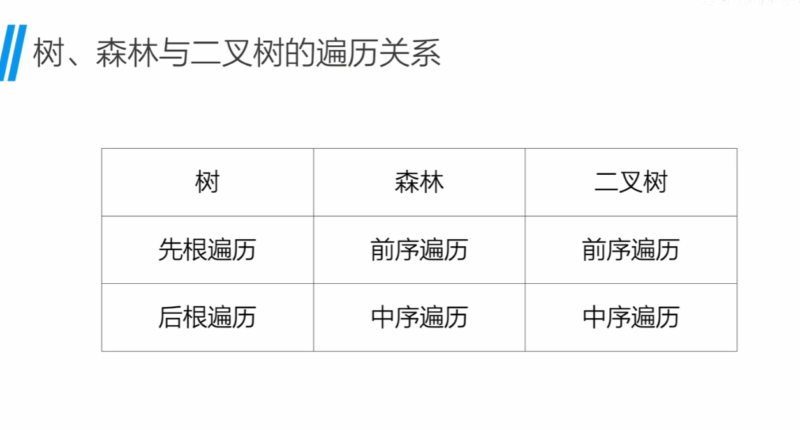

### 层序遍历

```c
#include <stdio.h>
#include <stdlib.h>
#define MAXSIZE 100

typedef char TreeType;
typedef struct TreeNode {
    TreeType data;
    struct TreeNode *lchild;
    struct TreeNode *rchild;
}TreeNode;

//构成链表
typedef struct QueueNode {
    TreeType data;
    struct QueueNode *next;
}QueueNode;

typedef TreeNode *ElemType;//构成队列

typedef struct //动态内存分配初始化
{
    ElemType *data;
    int front;
    int rear;
}Queue;

typedef TreeNode *BiTree;

char str[] = "ABDH#K###E##CFI###G#J##";
int idx = 0;

Queue* initQueue() {
    Queue *q = (Queue*)malloc(sizeof(Queue));
    q->data = (ElemType*)malloc(sizeof(ElemType)*MAXSIZE);
    q->front = 0;
    q->rear = 0;
    return q;
}

int equeue(Queue *Q,ElemType e) {
    if (Q == NULL)
        return 2;
    //对应上面的修改此处应该是
    //Q->rear = (Q->rear + 1) % MAXSIZE;那么下面的相同的语句就要删掉了
    if ((Q->rear + 1)%MAXSIZE == Q->front) {
        printf("满了\n");
        return 0;
    }
    Q->data[Q->rear] = e;
    Q->rear = (Q->rear + 1) % MAXSIZE; //这里没有直接+1，是因为下标是数组，直接+1最后会出现下标为8的情况，但实际上是0
    return 1;
}

int dequeue(Queue *Q,ElemType *e) {
    if (Q == NULL)
        return 2;
    if (Q->front == Q->rear) {
        printf("空了\n");
        return 1;
    }
    *e = Q->data[Q->front];
    Q->front = (Q->front+1) % MAXSIZE;
    return 0;
}

int isEmpty(Queue *Q)
{   if (Q == NULL)
       return 2;
    if(Q->front == Q->rear)
    {
        // printf("空的\n");
        return 1;
    }
    else
        return 0;

}

void createTree(BiTree *T) {
    TreeType ch;
    ch = str[idx++];
    if (ch == '#') {
        *T = NULL;
    }
    else {
        *T = (BiTree)malloc(sizeof(TreeNode));
        (*T)->data = ch;
        createTree(&(*T)->lchild);
        createTree(&(*T)->rchild);
    }
}

int queueSize(Queue *Q) {
    if (Q == NULL)
        return 2;

    if (!isEmpty(Q)) {
        return Q->rear - Q -> front;
    }
    else
        return 0;
}

int maxDepth(TreeNode* root) {
    if (root == NULL) {
        return 0;
    }

    int depth = 0;
    Queue *q = initQueue();
    equeue(q,root);

    while (!isEmpty(q)) {
        int count = queueSize(q); //判断队列当中有多少元素
        while (count > 0) {
            TreeNode *curr;
            dequeue(q,&curr);
            if (curr->lchild != NULL) {
                equeue(q,curr->lchild);
            }
            if (curr->rchild != NULL) {
                equeue(q,curr->rchild);
            }
            count--;
        }
        depth++;
    }
return depth;
}
int main(void) {
    BiTree T;
    createTree(&T);
    printf("%d\n",maxDepth(T));
    return 0;
}
```

## 哈希表

哈希表是一种使用哈希函数将键(key)映射到表中特定位置来存储数据的数据结构。这种映射可以快速定位数据，而不需要像数组那样顺序查找。

## 消除递归

## 算法设计策略

