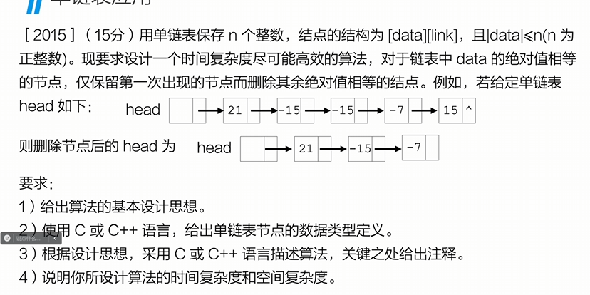
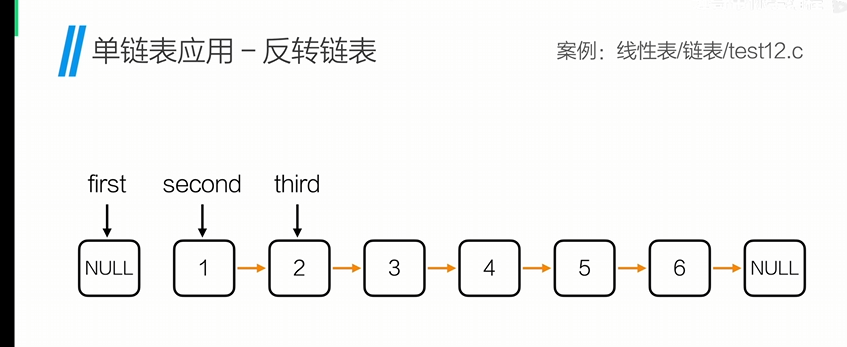
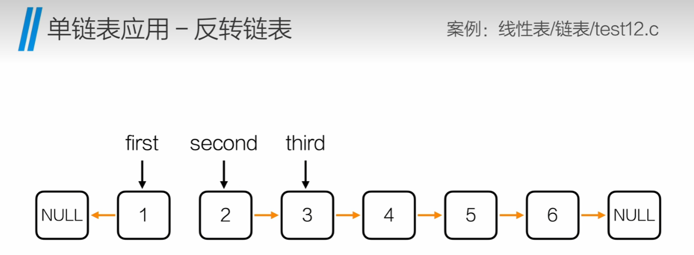
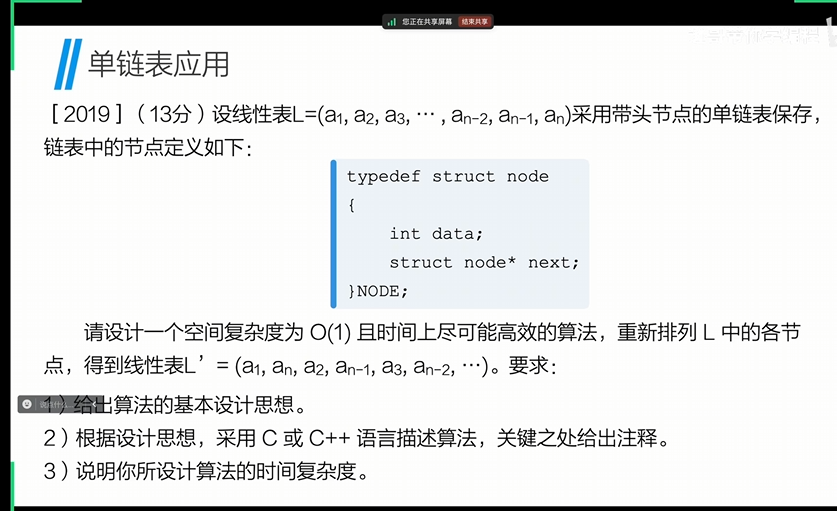
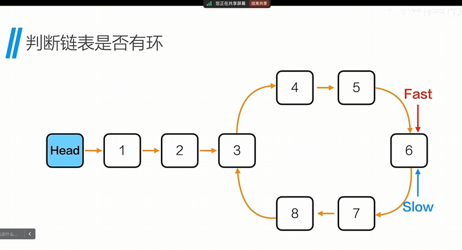
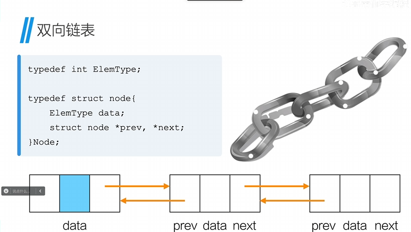

# Date Structures and Algorithms

## 算法时间复杂度

### 算法要满足的5个重要特性

有穷性
确定性
可行性
输入
输出

### 评价算法优劣的基本标准

正确性
可读性
健壮性
高效性

### 时间复杂度

也称作渐进时间复杂度，用来描述算法的运行时间与数据规模之间的增长关系。

T(n) = O(f(n))
随着问题规模n的增大，算法执行时间和增长率和f(n)增长率成正比.
若f(n)是一个m次多项式，则T(n) = O(n^m),这样忽略了所有的低次幂和最高次幂的系数，可以简化算法分析，也体现了增长率的含义

程序运行的总时间主要和两点有关：==执行每条语句的耗时，每条语句的执行频率==
示例:

```c
for(int i = 1;i<=n;i++) //频率为n+1,执行循环内的语句为n次，但是还有一次是判断i是否<=n，所以是n+1次
{
 for(int j = 1;j<=n;j++) //频率为n*(n+1)
 {
  c[i][j] = 0; //执行语句为n*n次
  for(int k = 1;k<=n;k++) //执行语句为n*n*n次
  {
   c[i][j] += a[i][k]*b[k][j]; //执行语句为n*n*n次
  }
 }  
}
```

所以总执行次数为：
f(n) = 2n^3 + 3n^2 + 2n + 1
T(n) = O(n^3)

最好时间复杂度: 算法在最好情况下的时间复杂度
最坏时间复杂度: 算法在最坏情况下的时间复杂度
平均时间复杂度: 算法在所有情况下，按照输入实例以等概率出现时，算法计量的加权平均值

==对算法复杂度的度量，通常只讨论算法在最坏情况下的时间复杂度==


## 线性表

线性表是具有相同数据类型的n个数据元素的有限序列，其中n为表长，当n=0时，线性表是一个空表。

### 顺序表

顺序表是在计算机内存中以数组的形式保存的线性表，线性表的顺序存储是指用一组地址连续的存储单元依次存储线性表中的各个元素、使得线性表中在逻辑结构上相邻的数据元素存储在相邻的物理存储单元中，即通过数据元素物理存储的相邻关系来反映数据元素之间逻辑上的相邻关系。

#### 顺序表初始化

```c
#include <stdio.h>

#define MAXSIZE 100
typedef int ElemType; 
typedef struct
{
   ElemType data[MAXSIZE]; //定义顺序表中的数组
   int length; //定义顺序表中的长度
}SeqList; //定义顺序表的类型

void init(SeqList *L) //初始化顺讯表
{
   L->length = 0; //初始化长度为0
}

int main()
{
   SeqList List;
   init(&List);
   printf("初始化成功，目前长度为%d\n",List.length);
   printf("目前占用内存为%zu\n",sizeof(List.data));
   return 0;
}
```

#### 顺序表尾部添加

```c
#include <stdio.h>

#define MAXSIZE 100
typedef int ElemType; 
typedef struct
{
   ElemType data[MAXSIZE]; //定义顺序表中的数组
   int length; //定义顺序表中的长度
}SeqList; //定义顺序表的类型

void init(SeqList *L) //初始化顺讯表
{
   L->length = 0; //初始化长度为0
}

int append(SeqList *L, ElemType e)
{
   if(L->length == MAXSIZE) //判断顺序表是否已满
   {
      printf("顺序表已满，无法添加\n");
      return 0;
   }
   L->data[L->length] = e;
   L->length++; //长度加1
   return 1;
}

int main()
{
   SeqList List;
   init(&List);
   append(&List,1);
   printf("初始化成功，目前长度为%d\n",List.length);
   printf("目前占用内存为%zu\n",sizeof(List.data));
   return 0;
}
```

#### 顺序表的遍历

```c
#include <stdio.h>

#define MAXSIZE 100
typedef int ElemType; 
typedef struct
{
   ElemType data[MAXSIZE]; //定义顺序表中的数组
   int length; //定义顺序表中的长度
}SeqList; //定义顺序表的类型

void init(SeqList *L) //初始化顺讯表
{
   L->length = 0; //初始化长度为0
}

int append(SeqList *L, ElemType e)
{
   if(L->length == MAXSIZE) //判断顺序表是否已满
   {
      printf("顺序表已满，无法添加\n");
      return 0;
   }
   L->data[L->length] = e;
   L->length++; //长度加1
   return 1;
}

void listElem(SeqList *L) //遍历
{
   for(int i = 0; i<L->length; i++)
   {
      printf("%d ",L->data[i]);
   }
   printf("\n");
}
int main()
{
   SeqList List;
   init(&List);
   append(&List,1);
   append(&List,2);
   append(&List,3);
   listElem(&List);
   printf("初始化成功，目前长度为%d\n",List.length);
   printf("目前占用内存为%zu\n",sizeof(List.data));
   return 0;
}
```

##### ==以下只写新添函数==

#### 顺序表的插入

```c
int insert(SeqList *L, int pos,ElemType e) //pos是插入位置，所以pos-1就是插入位置的下标
{
   if(pos<= L-> length-1 && pos>=1) //判断插入位置是否合法
   {
      for(int i = L->length - 1 ; i>=pos-1; i--) //从后往前遍历，将pos-1位置后面的元素都往后移一位
      {
         L->data[i+1] = L->data[i];
      }
      L->data[pos - 1] = e;
      L->length++; //长度加1
      return 1;
   }
}
```

顺序表插入的最好时间复杂度为O(1),最坏时间复杂度为O(n),平均时间复杂度为O(n)

#### 顺序表的删除

```c
int delete(SeqList *L,int pos, ElemType *e) // e用来存储删除的元素
{  *e = L->data[pos - 1] ;
   if(pos < L->length && pos >= 1) //判断删除位置是否合法
   {
      for (int i = pos; i< L->length; i++)
      {
         L->data[i-1] = L->data[i]; //[i-1]就是pos的位置
      }
   }
   L->length--;
   return 1;
}
```

#### 顺序表的查找

```c
int findElem(SeqList *L, ElemType e)
{
   for(int i = 0 ; i < L->length; i++)
   {
      if(L->data[i] == e)
      return i+1;
   }
   return 0;
}
```

#### 顺序表动态分配内存地址初始化

```c
typedef struct
{
   ElemType *data;
   int length;
}SeqList;

SeqList *initList()
{
   SeqList *L = (SeqLisst*)malloc(sizeof(SeqList));//申请内存空间，用来存储顺序表的地址
   L->data = (ElemType*)malloc(sizeof(ElemType) *MAXSIZE);//申请内存空间，用来存储顺序表中的数组，sizeof(ElemType)只是单个ElemType的大小，乘以MAXSIZE才是整个数组的大小
   L->length = 0; //初始化长度为0
   return L;
}
```

## 链表

线性链表式存储结构的特点是: 用一组任意的存储单元存储线性表的数据元素，这组存储单元可以是连续的，也可以是不连续的。

为了表示每个数据元素ai与其直接后继数据元素ai+1之间的逻辑关系，对数据元素ai来说，除了存储其本身的信息之外，还需要存储一个指示其直接后继的信息(即直接后继的存储位置)。这两部分信息组成数据元素ai的存储映像，称为结点(Node)。

结点包括两个域：
数据域: 存储数据元素信息的域
指针域: 存储直接后继位置的域。

### 单链表

单链表是一种链式存取的数据结构，用一组地址任意的存储单元存放线性表中的数据元素。

#### 单链表的初始化和存储结构

```c
#include <stdio.h>
#include <malloc.h>

typedef int ElemType;

typedef struct node 
{  ElemType data;
   struct node* next; //next存储了下一个node数据的地址
}Node;

Node* initList()
{
   Node* head = (Node*)malloc(sizeof(Node)); //申请内存空间，用来存储顺序表的地址
   head->next = NULL; //初始化头结点的指针域为null
   head->data = 0; //初始化头结点的数据域为0
   return head;
}

int main()
{
   Node* list = initList();

   return 0;
}
```

#### 头插法

```c

int insertHead(Node* L,ElemType e) //L是头结点，e是要插入的数据
{
 Node* p = (Node*)malloc(sizeof(Node)); //申请内存空间，用来存储新结点
 p->data = e; //将新结点的数据域赋值为e
 p->next = L->next; //将新结点的指针域赋值为头结点的指针域，也就是原来的第一个结点
 L->next = p; //将头结点的指针域赋值为新结点的地址，也就是新结点成为了第一个结点
}
int main()
{
   Node* list = initList();
   insertHead(list,10);
   insertHead(list,20);
   insertHead(list,30);
   return 0;
}

```

#### 遍历

```c
void listNode(Node* L)
{
   Node* p = L->next;
   while(p!=null)
   {
      printf("%d\n",p->data);
      p = p->next;
   }
   printf("\n");
}
```

### 尾插法

```c
Node* get_tail(Node* L) //获取尾结点
{
  Node* p = L;
  while(p->next != NULL)
  {
   p = p->next;
  }
  return p;
} 
Node* insertTail(Node *tail, ElemType e) //插入
{
   Node* p = (Node*)malloc(sizeof(Node));
   p->data = e;
   tail ->next = p;
   p->next = NULL;
   return p; 
}
int main()
{
   Node* list = initList();
   Node* tail = get_tail(list);
   tail = insertHead(tail,10);
   tail = insertHead(tail,20);
   tail = insertHead(tail,30);
   listNode(list);
   return 0;
}
```

### 指定位置插入

```c
int insertNode(Node* L, int pos, ElemType e)
{  //用p存储头结点的地址
   Node* p = L;
   int i = 0;
   //找到要插入位置的前一个结点
   while(i < pos-1)
   {
      p = p->next;
      i++;
      if(p == NULL)
      {
         return 0;
      }
   }
   //初始化要插入的新节点
   Node* q = (Node*)malloc(sizeof(Node));
   q->data = e;
   q->next = p->next; // 将前一个结点的指针域 赋值给 新结点的指针域
   p->next = q; // 再将 新结点的地址 赋值给 前一个结点的指针域
   return 1;
}

```

==切记不要搞错指针域的赋值顺序，否则会丢失后面的结点==

### 指定位置删除

```c
int deleteNode(Node* L,int pos)
{
   //要删除节点的前驱
   Node* p = L;
   int i = 0 ;
   //遍历链表，找到要删除节点的前驱
   while(i < pos -1 )
   {
      p = p -> next;
      i++;
      if(p == NULL)
      {
         return 0;
      }
   }

   if(p -> next == NULL)
   {
      printf("要删除的位置错误\n");
      return 0;
   }

   Node* q = p -> next;
   p -> next = q->next;
   free(q);
   return 1;

}
```

### 获取链表长度

```c
int getLength(Node *L)
{
   Node *p = L;
   int len = 0;
   while(p != NULL)
   {
      p = p->next;
      len++;
   }
   return len;
}
```

### 释放链表

```c
void freeList(Node* L)
{
   Node *p = L->next;
   Node *q;

   while(p != NULL)
   {
      q = p->next;
      free(p);
      p=q;
   }
   L->next = NULL;
}

```

### 如何查找出链表中倒数第K个位置上的结点？

答: 双指针（一快一慢）

```c
int findNodeFS(Node* L, int k) 
{
Node* fast = L->next;
Node* slow = L->next;

for (int i = 0; i < k; i++)
{
fast = fast->next;
}
while (fast != NULL)
{
fast = fast->next;
slow = slow->next;
}

printf("倒数第%d个节点值为：%d \n", k, slow->data);
return 1;
}
```

### 2015考研真题



```c
//删除绝对值相同的节点
void removeNode(Node *L,int n)
{
   Node *p = L;
   int index; //下角标
   int *q = (int*)malloc(sizeof(int)*(n+1)); //为数组开辟内存空间
   
   for(int i = 0; i<n+1;i++)
   {
      *(q+i) = 0; //用指针来控制数组，初始化所有值为0
   }

   while(p->next != NULL) //遍历链表
   {
      index = abs(p->next->data); //abs() 获取绝对值的函数
      if(*(q+index) == 0)
      {
         *(q + index) = 1; 
         p = p->next;
      }
      else // 释放内存，删除节点
      {
         Node *temp = p->next;
         p->next = temp->next;
         free(temp);
      }
   }
   free(q); //释放数组内存空间
}

```

### 反转链表




```c
Node* reverseList(Node* head)
{
   Node *first = NULL;
   Node *second = head->next; 
   Node *third ;

   while(second != NULL)
   {
      third = second->next;
      second->next = first;
      first = second;
      second = third;
   }

   Node *hd = initList()
   hd->next = first; //翻转以后再创立一个头文件

   return hd; //返回头结点地址
}
```

### 删除链表中间节点

偶数个数据，中间节点为靠后的那个数据
利用快慢指针，快的走两步，慢的走一步

```c
int  delMidNode(Node *head)
{
   Node *fast = head->next; //注意快指针起始位置要比慢指针多1
   Node *slow = head;

   while(fast != NULL && fast->next != NULL)
   {
      fast = fast->next->next;
      slow = slow->next;
   }
   Node *q = slow->next; //此时slow的下一个节点才是中间节点
   slow->next = q->next;
   free(q);
   return 1;
}
```

### 反转交叉链表



先从中间断开，再将后半部分反转，然后插入

```c
void reOrderList(Node *head)
{
   Node *fast = head->next;
   Node *slow = head;

   while(fast != NULL && fast->next != NULL)//中间断开
   {
      fast = fast->next->next;
      slow = slow->next;
   }

   Node *first = NULL;
   Node *second = slow->next;
   slow->second = NULL;
   Node *third = NULL;

   while(second != NULL) //后半部分反转
   {
      third = second->next;
      second->next = first;
      first = second;
      second = third;
   }
   
   Node *p1 = head->next;
   Node *q1 = first; 
   Node *p2,*q2;

   while(p1 != NULL && q1 != NULL) //插入
   {
      p2 = p1->next;
      q2 = q1->next;

      p1->next = q1;
      q1->next = p2;

      p1 = p2;
      q1 = q2;
   }
}
```

### 单向循环链表

当链表遍历时，判别当前指针p是否指向表尾结点的终止条件不同，在单链表中，判别条件为 `p!=NULL`或`p->next != NULL`，而循环链表的判别条件为 `p!=L`或`p->next!=L`

#### 854哈工大2023独立命题-判断链表是否有环


==快慢指针==

```c
int isCycle(Node *head)
{
   Node *fast = head;
   Node *slow = head; //这里快慢指针起始位置相同

   while(fast != NULL && fast->next != NULL)
   {
      fast = fast->next->next;
      slow = slow->next;
      if(fast == slow);
      {return 1;} //位置重合说明有环

   }
   return 0;
}
```

#### 寻找循环入口

在判断链表是否有环的基础上，加一个计数器，计数器的数值就是环中的节点个数
接着从头开始快慢指针走计数步，刚好在入口处相遇

```c
Node* findBegin(Node *head)
{  Node *fast = head;
   Node *slow = head; //这里快慢指针起始位置相同

   while(fast != NULL && fast->next != NULL)
   {
      fast = fast->next->next;
      slow = slow->next;
      if(fast == slow);
      {
         Node *p = fast;
         int count = 1; //添加计数器
         while(p->next!=slow) //fast的地址给p让p绕一圈
         {
            count++;
            p = p->next; 
         }
         fast = head;
         slow = head; //从头开始跑

         for(int i = 0; i < count ;i++)
         {
            fast = fast->next; //fast先走count步
         }
         while(fast != slow)
         {
            fast = fast->next;
            slow = slow->next;
         }
         return slow; //返回的是入口地址
      }
   }
   return NULL;
}
```

### 双向链表



初始化：

```c
typedef int ElemType;

typedef struct node
{
   ElemType data;
   struct node *next;
   struct node *prev; //前驱
}Node;
```

#### 双向链表-头插法

1

## 排序算法

### 冒泡排序

冒泡排序是一种简单的排序算法。它重复地走访过要排序的数列，一次比较两个相邻元素，如果它们的顺序错误就把它们交换过来。走访数列的工作是重复地进行直到没有再需要交换，也就是说该数列已经排序完成。这个算法的名字由来是因为越小的元素会经由交换慢慢“浮”到数列的顶端。

冒泡排序算法的运作如下：

1. 比较相邻的元素。如果第一个比第二个大，就交换它们两个；
2. 对每一对相邻元素作同样的工作，从开始第一对到结尾的最后一对，这样在最后的元素应该会是最大的数；
3. 针对所有的元素重复以上的步骤，除了最后一个；

例如，用C语言对数列[6, 5, 3, 1, 8, 7, 2, 4]进行冒泡排序：

```.
#include <stdio.h>

void bubble_sort(int arr[], int n) {
    int i, j, temp;
    for (i = 0; i < n - 1; i++) {
        for (j = 0; j < n - i - 1; j++) {
            if (arr[j] > arr[j + 1]) {
                temp = arr[j];
                arr[j] = arr[j + 1];
                arr[j + 1] = temp; 
            } 
        } 
    }

}
int main() {
    int arr[] = {6, 5, 3, 1, 8, 7, 2, 4};
    int n = sizeof(arr) / sizeof(arr[0]);
    bubble_sort(arr, n); 
    for (int i = 0; i < n; i++) {
        printf("%d ", arr[i]);
    }
    return 0;
}
```

### 选择排序

选择排序是一种简单直观的排序算法，无论什么数据进去都是 O(n²) 的时间复杂度。所以用到它的时候，数据规模越小越好。唯一的好处可能就是不占用额外的内存空间了吧。

选择排序(Selection-sort)是一种简单直观的排序算法。它的工作原理：首先在未排序序列中找到最小（大）元素，存放到排序序列的起始位置，然后，再从剩余未排序元素中继续寻找最小（大）元素，然后放到已排序序列的末尾。以此类推，直到所有元素均排序完毕。

例：

```.
#include <stdio.h>

void SelectSort(int k[], int n)
{
int i, j, min, temp;
for (i = 0; i < n - 1 ; i++)
{
min = i;
for (j = i + 1; j < n; j++)
{
if (k[j] < k[min])
{
min = j;
}
}

if (min != i) 
{
temp = k[min];
k[min] = k[i];
k[i] = temp;
}
}
}
int main() {
int i, a[10] = { 5,2,6,0,3,9,1,7,4,8 };

SelectSort(a, 10);
for (i = 0; i < 10; i++)
{
printf("%d", a[i]);
}
return 0;
}
```

### 插入排序

插入排序（Insertion Sort）的算法描述是一种简单直观的排序算法。它的工作原理是通过构建有序序列，对于未排序数据，在已排序序列中从后向前扫描，找到相应位置并插入。

插入排序算法的运作如下：

1. 从第一个元素开始，该元素可以认为已经被排序；
2. 取出下一个元素，在已经排序的元素序列中从后向前扫描；
3. 如果该元素（已排序）大于新元素，将该元素移到下一位置；
4. 重复步骤3，直到找到已排序的元素小于或者等于新元素的位置；
5. 将新元素插入到该位置后；

例：

```.
#include <stdio.h>

void InsertSort(int k[], int n)
{
int i, j, temp;
for (i = 1; i < n; i++)
{
if (k[i] < k[i - 1])
{
temp = k[i]; 
for (j = i - 1; j >= 0 && k[j] > temp; j--)
{
k[j + 1] = k[j];
}
k[j + 1] = temp;
}
}
}

int main() {
int i, a[10] = { 5,2,6,0,3,9,1,7,4,8 };
InsertSort(a, 10); 
for (i = 0; i < 10; i++)
{
printf("%d", a[i]); 
}

return 0;   
}
```

### 希尔排序

希尔排序是希尔（Donald Shell）于1959年提出的一种排序算法。希尔排序也是一种插入排序，它是简单插入排序经过改进之后的一个更高效的版本，也称为缩小增量排序，同时该算法是冲破O（n2）的第一批算法之一。
希尔排序是把记录按下标的一定增量分组，对每组使用直接插入排序算法排序；随着增量逐渐减少，每组包含的关键词越来越多，当增量减至1时，整个文件恰被分成一组，算法便终止。

例：

```.
#include <stdio.h>
void ShellSort(int k[], int n)
{
int i, j, gap;
int temp;
for (gap = n / 2; gap > 0; gap /= 2)
{
for (i = gap; i < n; i++)
{
temp = k[i];
for (j = i - gap; j >= 0 && k[j] > temp; j -= gap)
{
k[j + gap] = k[j];
}
k[j + gap] = temp;
}
}
}
int main() {
int i, a[10] = { 5,2,6,0,3,9,1,7,4,8 };
ShellSort(a, 10);
for (i = 0; i < 10; i++)
{
printf("%d", a[i]);
}
return 0;
}

```

### 堆排序

堆排序（Heapsort）是指利用堆这种数据结构所设计的一种排序算法。堆积是一个近似完全二叉树的结构，并同时满足堆积的性质：即子结点的键值或索引总是小于（或者大于）它的父节点。

例：

## 查找

### 折半查找

折半查找是一种效率较高的查找方法。但是，折半查找要求线性表必须采用顺序存储结构，而且表中元素按关键字有序排列。

例：

```.
#include <stdio.h>
int BinarySearch(int k[], int n, int key)
{
int low, high, mid;
low = 0;
high = n - 1;
while (low <= high)
{
mid = (low + high) / 2;
if (key < k[mid])
{
high = mid - 1;
}
else if (key > k[mid])
{
low = mid + 1;
}
else
{
return mid;  
}
}
}

int main() {
int i, a[10] = { 5,2,6,0,3,9,1,7,4,8 };
int key = 3;
printf("%d", BinarySearch(a, 10, key));
return 0; 
}
```

## 图

### 完全图

对于一个具有n个顶点的无向完全图，边数量的最大值为n(n-1)/2。
对于一个具有n个顶点的有向完全图，边数量的最大值为n(n-1)。

### Dijkstra算法

Dijkstra算法是一种用于寻找加权图中最短路径的算法。

```c
#include <stdio.h>

typedef int V;
typedef int E;

#define MAXSIZE 100
#define MAXEDGE 100
#define MAX 0x10000

typedef struct
{
   V vertex[MAXSIZE]; //定义点数
   E arc[MAXSIZE][MAXSIZE]; //定义邻接矩阵
   int vertex_num;
   int edge_num;
}Mat_Graph;

void createGraph(Mat_Graph* G)
{
   G->vertex_num = 9; //点的最大数
   G->edge_num = 16;  //边的最大数

    for (int i = 0;i < G->vertex_num; i++)
   {
     G->vertex[i] = "食堂"; //定义下角标
   }
    for(int i = 0;i < G->vertex_num; i++)
    {
       for(int j = 0; j < G->vertex_num; j++)
       {
          if(i == j)
          {
             G->arc[i][j] = 0;   //初始化二维矩阵
          }
          else
          {
             G->arc[i][j] = MAX;   //初始化邻接矩阵
          }
       }
    }
   G->arc[0][1] = 1;
   G->arc[0][2] = 5;

   G->arc[1][2] = 3;
   G->arc[1][3] = 7;
   G->arc[1][4] = 5;

   G->arc[2][4] = 1;
   G->arc[2][5] = 7;

   G->arc[3][4] = 2;
   G->arc[3][6] = 3;

   G->arc[4][5] = 3;
   G->arc[4][6] = 6;
   G->arc[4][7] = 9;

   G->arc[5][7] = 5;

   G->arc[6][7] = 2;
   G->arc[6][8] = 7;

   G->arc[7][8] = 4; //赋值

   for(int i = 0; i< G->vertex_num; i++)
   {
      for (int j = i; j< G->vertex_num;j++)
      {
         G->arc[j][i] = G->arc[i][j]; //使邻接矩阵对称
      }
   }
}

int choose(int distance[],int found[], int vertex_num)
{
   int min = MAX;
   int minPos = -1;
   for(int i = 0; i < vertex_num; i++)
   {
      if(distance[i] < min && found[i] == 0)  //distance
      {
         min = distance[i];
         minPos = i;
      }
   }
   return minPos;
}

void dijkstra(Mat_Graph G, int begin) // Dijkstra算法
{
   int found[MAXSIZE]; //顶点是否已走过
   int path[MAXSIZE]; //路径
   int distance[MAXSIZE]; // 顶点之间的距离
   for (int i = 0;i < G.vertex_num; i++)
   {
      found[i] = 0;
      path[i] = -1;
      distance[i] = G.arc[begin][i];
   }

   found[begin] = 1;
   distance[begin] = 0;

   int next; //下一个要观察的点
   for(int i = 1; i < G.vertex_num; i++)
   {
      next = choose(distance, found, G.vertex_num);

      found[next] = 1;
      for(int j = 0; j < G.vertex_num; j++)
      {
         if(found[j] == 0) //若改顶点没有访问过
         {
            if(distance[next] + G.arc[next][j] < distance[j])
            {
                  distance[j] = distance[next] + G.arc[next][j];
               path[j] = next;
            }
         }
      }
   }
   char const campus[9][100] = {
         "西大门",
         "chufang",
         "图书馆",
         "操场",
         "教学楼A",
         "教学楼B",
         "教学楼C",
         "宿舍7",
         "宿舍8",
   };

   for(int i = 1; i < G.vertex_num; i++)
   {
      printf("西大门 -> %s : %d\n",campus[i],distance[i]);

      int j = i;
      printf(" 路径是：%s <- ",campus[i]);
      while (path[j] != -1) {
         printf("%s <-", campus[j]);
         j = path[j];
      }
      printf("西大门\n");
   }
}

int main(void) {
   Mat_Graph G;
   createGraph(&G);
   int begin = 0;
   dijkstra(G,begin);
   return 0;
}
```

### Floyd算法

Floyd算法是一种用于寻找加权图中所有顶点之间最短路径的算法。

```c
#include <stdio.h>

typedef int V;
typedef int E;

#define MAXSIZE 100
#define MAXEDGE 100
#define MAX 0x10000

typedef struct
{
    V vertex[MAXSIZE]; //定义点数
    E arc[MAXSIZE][MAXSIZE]; //定义邻接矩阵
    int vertex_num;
    int edge_num;
}Mat_Graph;

void createGraph(Mat_Graph* G)
{
    G->vertex_num = 9; //点的最大数
    G->edge_num = 16;  //边的最大数

    for (int i = 0;i < G->vertex_num; i++)
    {
        G->vertex[i] = "食堂"; //定义下角标
    }
    for(int i = 0;i < G->vertex_num; i++)
    {
        for(int j = 0; j < G->vertex_num; j++)
        {
            if(i == j)
            {
                G->arc[i][j] = 0;   //初始化二维矩阵
            }
            else
            {
                G->arc[i][j] = MAX;   //初始化邻接矩阵
            }
        }
    }
    G->arc[0][1] = 1;
    G->arc[0][2] = 5;

    G->arc[1][2] = 3;
    G->arc[1][3] = 7;
    G->arc[1][4] = 5;

    G->arc[2][4] = 1;
    G->arc[2][5] = 7;

    G->arc[3][4] = 2;
    G->arc[3][6] = 3;

    G->arc[4][5] = 3;
    G->arc[4][6] = 6;
    G->arc[4][7] = 9;

    G->arc[5][7] = 5;

    G->arc[6][7] = 2;
    G->arc[6][8] = 7;

    G->arc[7][8] = 4; //赋值

    for(int i = 0; i< G->vertex_num; i++)
    {
        for (int j = i; j< G->vertex_num;j++)
        {
            G->arc[j][i] = G->arc[i][j]; //使邻接矩阵对称
        }
    }
}

void floyd(Mat_Graph G)
{
    int path [MAXSIZE][MAXSIZE];
    int distance[MAXSIZE][MAXSIZE];

    for(int i = 0 ;i < G.vertex_num; i++)
    {
       for(int j = 0; j < G.vertex_num; j++)
       {
          distance[i][j] = G.arc[i][j];
           path[i][j] = j;
       }
    }

    for(int i = 0; i < G.vertex_num; i++)
    {
       for(int j = 0; j < G.vertex_num; j++)
       {
           for(int k = 0; k < G.vertex_num; k++)
           {
              if (distance[j][k] > distance[j][i] + distance[i][k])
              {
                  distance[j][k] = distance[j][i] + distance[i][k];
                  path[j][k] = path[j][i];
              }
           }
       }
    }

    int k;
    for(int i = 0; i < G.vertex_num; i++)
    {
       for(int j = i + 1; j < G.vertex_num; j++)
       {
          printf("V%d -> V%d 权重: %d",i,j,distance[i][j]);
           k = path[i][j];
           printf(" path:V%d",k);
           while(k != j)
           {
             printf("->V%d",k);
               k = path[k][j];
           }
           printf("->V%d\n",j);
       }
        printf("\n");
    }
}

int main(void) {
    Mat_Graph G;
    createGraph(&G);
    floyd(G);

    return 0;
}
```
