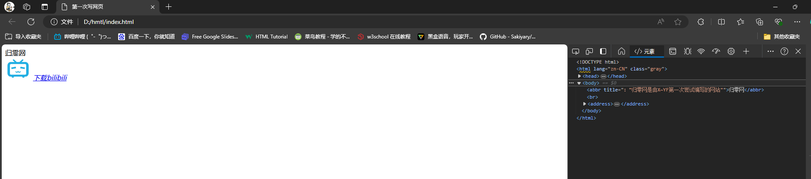
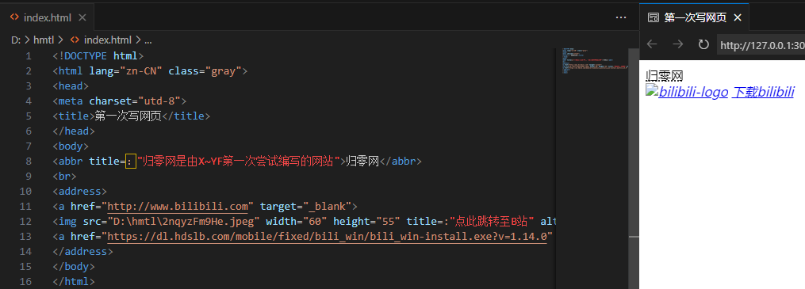
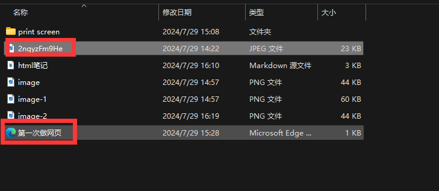
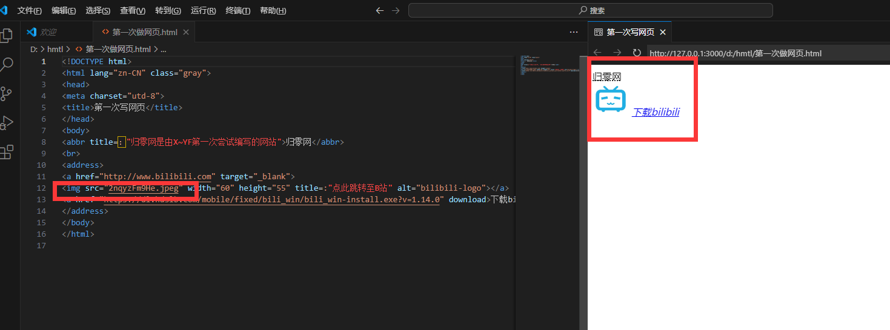
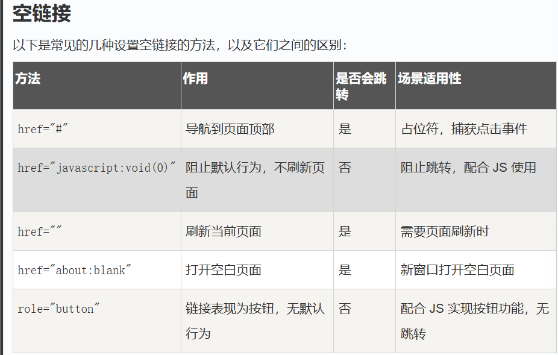
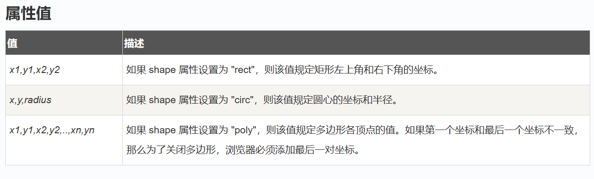

# 关于HTML初学者可能有的一些偏门问题与答复

## HTML

### 1. 什么是根元素？

起始点，缺少会出现错误，会不符合xml语法规则，无法被解析器正常解析。

### 2. 可扩展标记语言 (Extensible Markup Language, XML)

标准通用标记语言的子集，可以用来标记数据、定义数据类型，是一种允许用户对自己的标记语言进行定义的源语言。 XML是标准通用标记语言可扩展性良好,内容与形式分离,遵循严格的语法要求,保值性良好等优点

人话：未知

### 3. 什么是标准通用标记语言？

标准通用标记语言（以下简称“通用标言”），是一种定义电子文档结构和描述其内容的国际标准语言；通用标言为语法置标提供了异常强大的工具，同时具有极好的扩展性，因此在

数据分类和索引中非常有用；是所有电子文档标记语言的起源，早在万维网发明之前“通用标言”就已存在。

人话：未知

### 4. 什么是标记标签？

HTML是一种标记语言，而这种语言使用类似于的标签来标记网页的，HTML标记标签通常成对出现，第一个是起始标签，第二个是结束标签。HTML标记标签包括文档标记，头部标记，标题标记和主题标记。

### 5. 什么是元数据（metadate）

元数据是用来描述数据属性的信息。可以抽象的理解为，一所饭店是由 厨师，服务员，菜单，煤气灶等等“数据”协调配合组成的，而厨师的生涯履历，身高体重，菜单的内容封面，煤气灶的品牌等等相当于这些数据的“元数据”

### 6. 什么是HTML元素？

例如
` <p>......</p> `
为一个HTML元素，`<p>`是该元素的起始标签（或开始标签），`<p>`是该元素的闭合标签（或结束标签），中间的`......`为元素的内容，也可以嵌套其他元素

### 7. 什么是HTML属性？

HTML元素可以设置属性，属性可以在元素中添加附加信息，一般描述于开始标签，属性总以名称或者值对的形式出现。如 `<a herf="https\://www.bilibili.com">B站<a/>`,的作用就是告诉解析器（或者后台，或者浏览器后台管它什么东西我也说不明白），“B站”这是一个网址链接（也就相当于给某个商品挂上“链接”标签，让顾客（就是上面说的解析器神马的）知道这个商品是链接），而herf为“B站”添加了信息，使“B站”有了`“https://www.bilibili.com”`的信息。于是当我们点击“B站”的时候就会跳转的对应网页。

### 8.为什么在VS CODE预览界面图片加载不出来，而点开网页可以



==存疑==</br>
但是有解决方法：将图片和自己做的html文件放在同一个目录里!!
</br>接着直接复制图片的==名称+类型==就好了 !

### 9.如何理解base标签

base标签是用来定义所有链接默认的URL的，也就是链接目标地址，base中所定义的属性也会一同适用

```html
<!DOCTYPE html>
<html>
<head>
<meta charset="utf-8"> 
<title>菜鸟教程(runoob.com)</title> 
<base href="地址1号/images/" target="_blank">
</head>

<body>
 - 注意这里我们设置了图片的相对地址。能正常显示是因为我们在 head 部分设置了 base 标签，该标签指定了页面上所有链接的默认 URL，所以该图片的访问地址为 "地址1号/images/logo.png"
<br><br>
<a href="地址1号">网址</a> - 注意这个链接会在新窗口打开，即便它没有 target="_blank" 属性。因为在 base 标签里我们已经设置了 target 属性的值为 "_blank"。

</body>
</html>
```

### 10.CSS中“text align：”和“float:”的区别是什么？

这两个在`<div>`或者`<tb>`排列布局中经常一块儿使用，`<text align>`是用来布局表格中或者版块儿中内容相对于这个版块儿的位置，而`<float>`是用来布局该小表格或版块儿相对于整个大板块或大表格的位置。建议多自己尝试，体会其中区别。
==实例：==

``` <!DOCTYPE html>
    <!DOCTYPE html>
    <html>
    <head>    
    <meta charset="utd-8">
    <style type="text/css">
    h1 {font-size:xx-large;text-align: center;}
    </style>
    </head>
    <div id="container" style="width:1860px;height:200px;"><h1><abbr title="哔哩哔哩-仿">BiliBli</abbr></h1>
        <div id="web and download" style="width:930px;height: 150px;float: left;text-align: right;">
        <a href="http://www.bilibili.com" target="_blank">
        </a> 
        <br>
        <a href="https://dl.hdslb.com/mobile/fixed/bili_win/bili_win-install.exe?v=1.14.0" download style="font-size: xx-large;color:cornflowerblue;">下载bilibili</a>    
        </div>
    </div>
```

可以改动float：left和text align，还有各个块的尺寸大小，感受和把握这几者的关系。

### 11.如何理解id属性和class属性？

id 属性指定 HTML 元素的唯一 ID。 id 属性的值在 HTML 文档中必须是唯一的。

id 属性用于指向样式表中的特定样式声明。JavaScript 也可使用它来访问和操作拥有特定 ID 的元素。

id 的语法是：写一个井号 (#)，后跟一个 id 名称。然后，在花括号 {} 中定义 CSS 属性。
详情请跳转至<https://www.w3school.com.cn/html/html_id.asp> 该网页可以解释的更加清楚。

### HTML链接

`<a href="https://www.bilibili.com" target = "_blank">B站</a>`
`target`属性可以定义链接的打开方式
`_blank`：在新窗口打开链接
`_self`：在当前窗口打开链接(默认)
`_parent`：在父窗口打开链接
`_top`：在顶部窗口打开链接

#### rel：定义链接与目标页面的关系

nofollow: 表示搜索引擎不应跟踪该链接，常用于外部链接。

noopener 和 noreferrer: 防止在新标签中打开链接时的安全问题，尤其是使用 target="_blank" 时。

noopener: 防止新的浏览上下文（页面）访问window.opener属性和open方法。
noreferrer: 不发送referer header（即不告诉目标网站你从哪里来的）。
noopener noreferrer: 同时使用noopener和noreferrer。例子: `<a href="https://www.example.com" rel="noopener noreferrer">安全链接</a>`

#### download：下载链接并且可以指定文件名称

`<a herf="下载网址" download="文件名称">下载文件</a>`

#### title：定义链接的额外信息，当鼠标悬停在链接上时显示的工具提示

`<a href="https://www.example.com" title="访问 Example 网站">访问 Example</a>`

#### id:用于链接锚点，通常在同一页面中跳转到某个特定位置

```html
<!-- 链接到页面中的某个部分 -->
<a href="#section1">跳转到第1部分</a>
<div id="section1">这是第1部分</div>
```

#### 空链接



### HTML图像

``

`src`属性的值就是图像的URL地址
`alt`属性：当图片加载失败时显示的替代文本。

#### `<map>`创建图像地图--使图像中的各个区域都有链接

`<area>`定义图像地图中的可点击区域和链接

```html
<!DOCTYPE html>
<html>
<head>
<meta charset="utf-8">
<title>菜鸟教程(runoob.com)</title>
</head>
<body>

<p>点击太阳或其他行星，注意变化：</p>


<map name="planetmap">
  <area shape="rect" coords="0,0,82,126" alt="Sun" href="sun.htm">
  <area shape="circle" coords="90,58,3" alt="Mercury" href="mercur.htm">
  <area shape="circle" coords="124,58,8" alt="Venus" href="venus.htm">
</map>

</body>
</html>
```

注意上面map标签的使用方法

`coords`属性值:



### HTML水平线

`<hr>`标签在HTML页面中创建水平线，hr元素可用于分割内容。
`<hr>`可用于分隔内容

### HTML注释

`<!-- 注释内容 -->`
md中也可以实现,详情看代码
<!-- 这是一个注释 -->

### HTML折行标签

`<br>`标签在HTML页面中创建换行符。实现文本换行的效果

### 文本格式化

```html
<b>加粗</b>
<br/>
<strong>加粗</strong>
<br/>
<big>放大文本字体</big>
<br/>
<i>倾斜文本字体</i>
<br/>
<small>缩小文本字体</small>
<br/>
这个文本包含<sub>下标</sub>
<br/>
这个文本包含<sup>上标</sup>
```

还有很多形式......

### `<meta>`标签

meta标签描述了一些基本的元数据。

`<meta>` 标签提供了元数据.元数据也不显示在页面上，但会被浏览器解析。

META 元素通常用于指定网页的描述，关键词，文件的最后修改时间，作者，和其他元数据。

元数据可以使用于浏览器（如何显示内容或重新加载页面），搜索引擎（关键词），或其他Web服务。

`<meta>` 一般放置于 `<head>` 区域

```html
<meta name="description" content="免费 Web & 编程 教程"> <!-- 描述网页内容 -->
<meta name="author" content="Runoob"><!-- 描述网页作者 -->

```

### 表格和列表

由`table`标签来定义表格

### 区块

块级元素和内联元素：
块级元素如`<div>`,块级元素的内容会在新一行开始显示。而
内联元素如`<span>`，内联元素的内容不会在新一行开始显示。

### `<div>`元素

该元素没有特定的含义，与css使用时，可对`<div>`区块里面的内容进行样式设置

### `<span>`元素

该元素可作为文本容器，可以与css一起对文本进行样式设置
