# 数字电路

## 常用电器元件

1.继电器

继电器是一种电控制器件，由一个小的开关和一个大的开关组成。当输入信号为低电平时，小开关闭合，大开关打开，输出端电压为高电平；当输入信号为高电平时，小开关断开，大开关闭合，输出端电压为低电平。继电器的作用是将输入信号转换为输出信号，并且可以控制输出信号的开关时间。

## 基础逻辑电路

### 非门

当输入为1时，输出为0；
当输入为0时，输出为1。
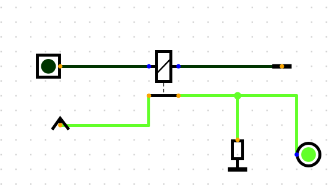
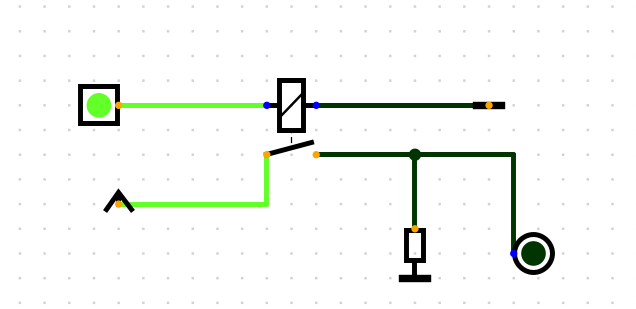

### 与门

当输入都为1，输出才为1。
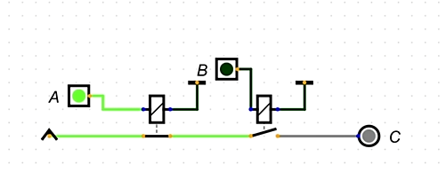

### 或门

任意一个输入为1，输出就为1。
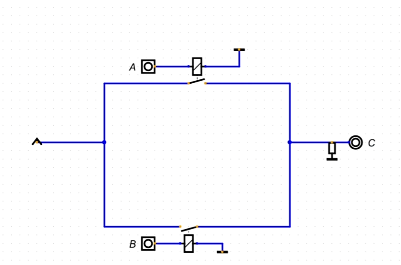

### 异或门

两个输入相同时，输出为0；
两个输入不同时，输出为1。
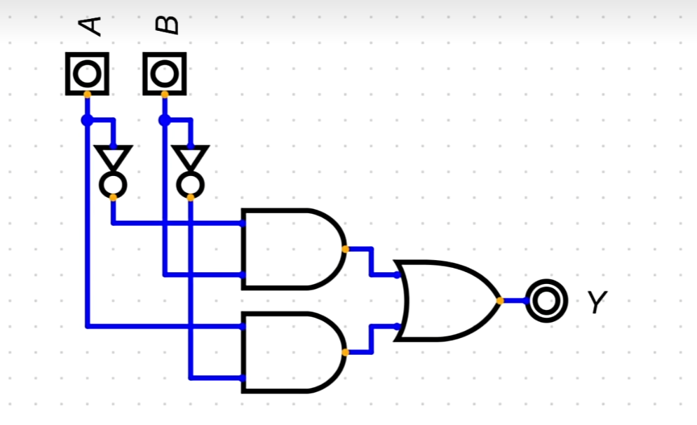

### 与非门

两个输入都为0，输出才为1。
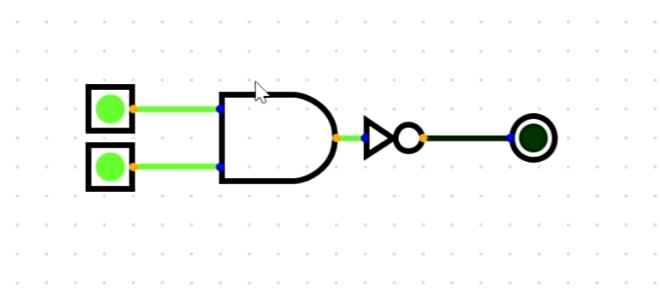

### 或非门

任意一个输入为0，输出就为1。
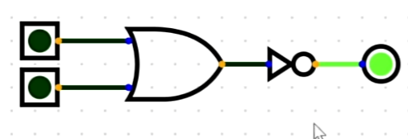

### 总结

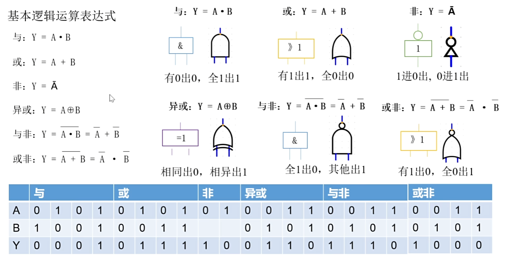

## 加法计算器

### 半加器

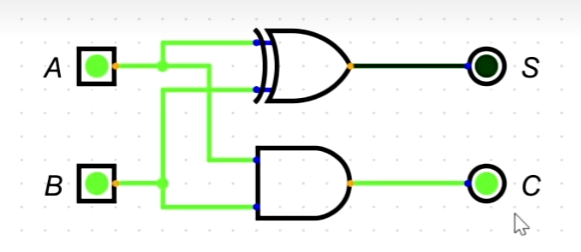

A和B二进制相加，C表示向前进一位

### 全加器（1bit加法器）

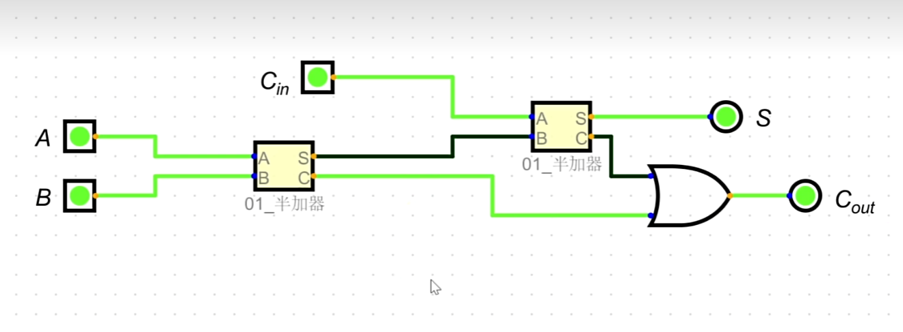

Cin表示是上一位加法是否有进位
Cout表示是当前位加法是否有进位
S表示当前位的输出结果

### 四位加法器

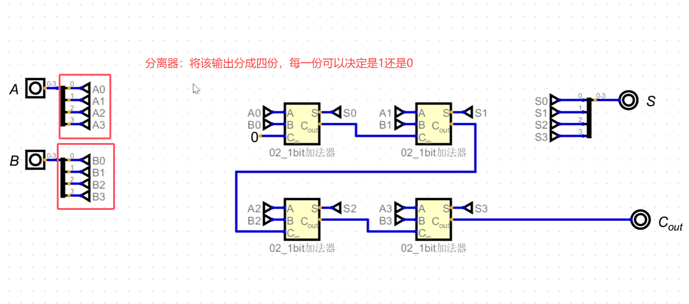