# c语言错题集

## 1.C语言中如果没有显式声明函数返回值类型，函数默认返回int类型

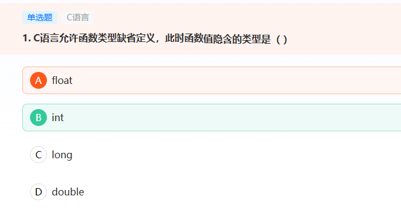

## 2.`--b`和`b--`运算

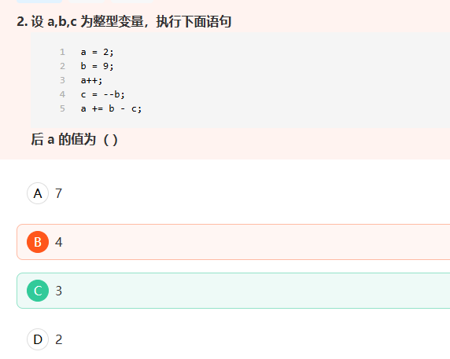

让我们逐步执行代码来分析最终结果:

1. a = 2 (此时 a=2)
2. b = 9 (此时 b=9)
3. a++ (此时 a=3)
4. c = --b (先将b减1变为8,然后把8赋值给c,此时b=8,c=8)
5. a += b - c (即a = a + (b-c))
此时b=8,c=8,所以b-c=0
因此a = 3 + 0 = 3

## 3.数组和指针运算

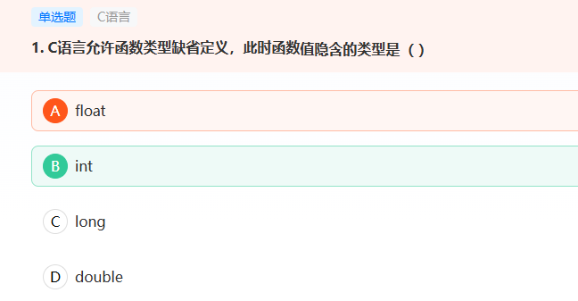

1. 程序中有一个整型数组 a[5] = {1, 2, 3, 4, 5}

2. 表达式分析：

- *(a + 1) 等价于 a[1]，值为2
- &a 是整个数组的地址
- (&a + 1) 会跳过整个数组，指向数组末尾后的位置
- ptr = (int *)(&a + 1) 将这个地址转换为 int 指针
- ptr - 1 会回退一个 int 大小，正好指向数组的最后一个元素
- *(ptr - 1) 就是获取数组的最后一个元素，值为5所以最终输出：
- 第一个值 *(a + 1) = 2
- 第二个值 *(ptr - 1) = 5
输出结果为：2,5

## 4.`while`和`do-while`循环次数

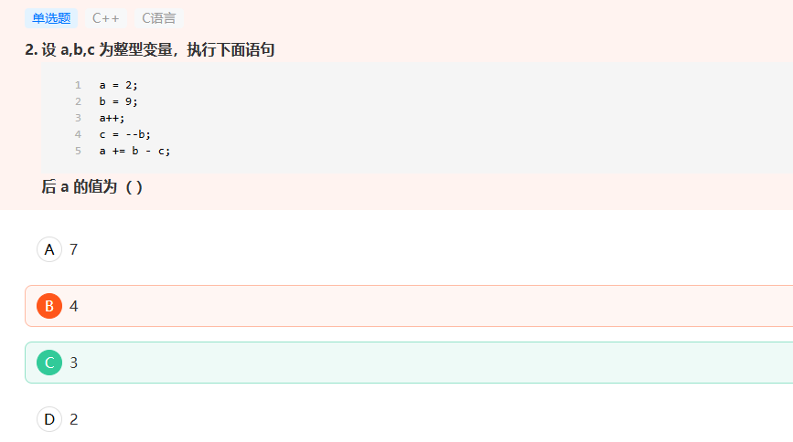

## 4.指针数组的计算

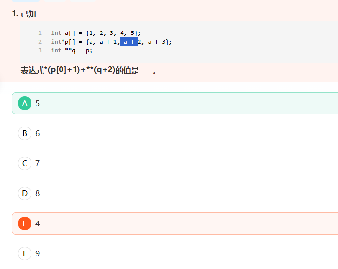

1. 首先明确数组和指针的初始状态：

- a[] 是整型数组，值为{1,2,3,4,5}
- p[] 是指针数组，存储了指向a数组的不同位置的指针：{&a[0], &a[1], &a[2], &a[3]}
- q是指向p数组的指针

1. 分解表达式 *(p[0]+1)+**(q+2)：

- p[0] 指向 a[0]，即值1的位置
- p[0]+1 向后移动一个位置，指向a[1]，即值2的位置
- *(p[0]+1) 取得该位置的值，为2

- q+2 是p数组的第三个元素的地址，即p[2]
- *(q+2) 得到p[2]，也就是a+2(指向a[2])
- **(q+2) 就是取a[2]的值，为3

## 5. 宏替换不占用程序运行时间

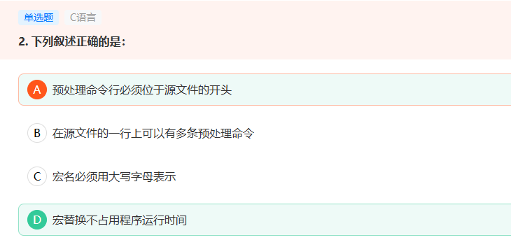
宏替换确实不占用程序运行时间,因为宏替换发生在程序预处理阶段。预处理器会在编译之前将所有的宏定义展开,用实际的代码替换宏名。当程序开始运行时,所有的宏都已经被替换完成,因此不会消耗运行时间。

分析其他选项:

A错误:预处理命令行不必须位于源文件的开头。虽然通常将它们放在开头是一种好的编程习惯,但这并不是强制要求。预处理命令可以出现在源文件的任何位置。

B错误:在源文件的一行上不能有多条预处理命令。每条预处理命令都必须独占一行,这是C语言语法规则的要求。

C错误:宏名不必须用大写字母表示。使用大写字母来命名宏是一种常见的编程规范,有助于提高代码的可读性,但这只是编程习惯,而不是语言规则的强制要求。可以使用小写字母定义宏名。

## 6.条件运算符和`--`运算符

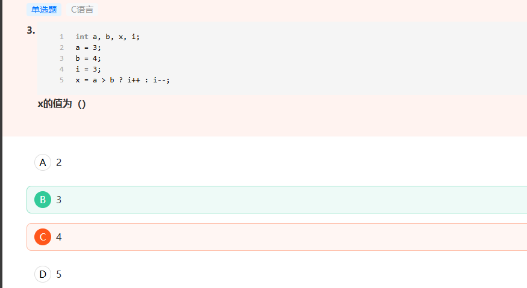

1. 首先，a=3, b=4, i=3被赋值
2. 条件表达式 x=a>b?i++:i-- 可以拆解为：

- 判断条件: a>b (3>4 为false)
- 由于条件为false，执行冒号后的表达式 i--
- i-- 是后缀自减，先返回i的值(3)，再将i减1
- 所以x被赋值为3

## 7.结构体内存对齐（新知识点！！）

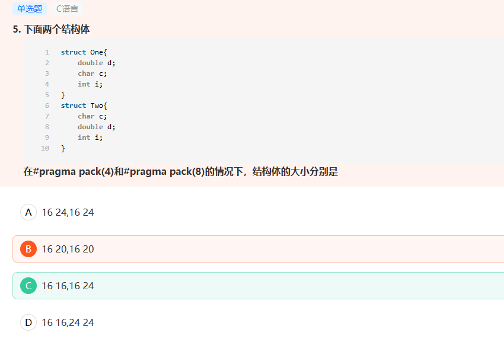
这道题目考察的是结构体内存对齐的相关知识。让我们逐个分析两种情况：

```.
#pragma pack(4)情况下
One结构体
- double(8字节)需要4字节对齐，从0开始占8字节
- char(1字节)从第8字节开始，占1字节
- int(4字节)需要4字节对齐，从第12字节开始，占4字节
- 总大小为16字节

Two结构体
- char(1字节)从0开始占1字节
- double(8字节)需要4字节对齐，从第4字节开始，占8字节
- int(4字节)需要4字节对齐，从第12字节开始，占4字节
- 总大小为16字节

#pragma pack(8)情况下：
One结构体：
- double(8字节)需要8字节对齐，从0开始占8字节
- char(1字节)从第8字节开始，占1字节
- int(4字节)需要4字节对齐，从第12字节开始，占4字节
- 总大小为16字节

Two结构体：
- char(1字节)从0开始占1字节
- double(8字节)需要8字节对齐，从第8字节开始，占8字节
- int(4字节)需要4字节对齐，从第16字节开始，占4字节
- 总大小为24字节

因此，在pack(4)时两个结构体都是16字节，在pack(8)时One是16字节而Two是24字节，所以C选项(16 16,16 24)是正确的
```

## %运算符

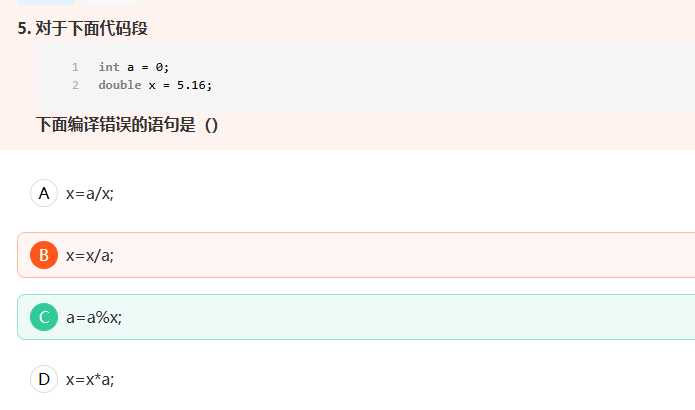

官方解析：
这道题目考察了C++中的运算符和数据类型兼容性。C选项是正确答案,因为取模运算符%只能用于整数类型,不能用于浮点数。当尝试对浮点数x进行取模运算时,会导致编译错误。

B选项 x=x/a 也是合法的。当a为0时会导致运行时错误(除零异常),但在编译阶段是合法的。double类型除以int类型会得到double类型结果。

## 8.do-while循环

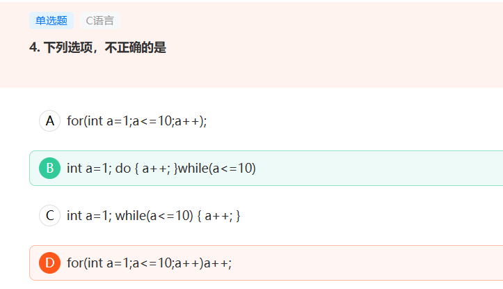

B选项的do-while循环有问题。因为先执行再判断条件,当a=1时,先执行a++使a=2,然后判断2<=10为true继续循环,最终a会增加到11,超出了预期的范围。

## 9.系统int数据类型和指针的大小

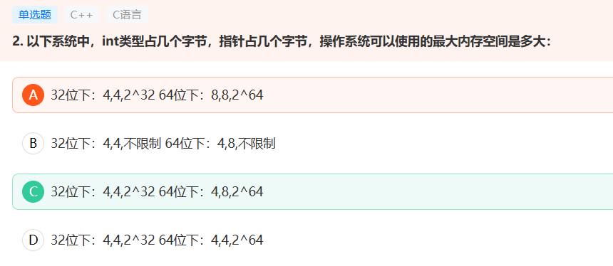

32位系统下：

- int类型占4字节
- 指针占4字节（与系统位数相同）
- 最大寻址空间为2^32字节（约4GB）

64位系统下：

- int类型仍然占4字节（这是固定的）
- 指针占8字节（与系统位数相同）
- 最大寻址空间为2^64字节

## 10.字符数组和指针

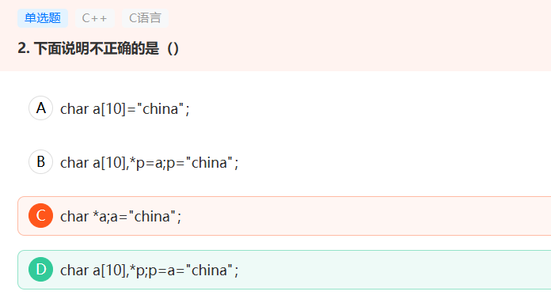
官方解析：
这道题目考察了C语言中字符数组和指针的基础知识。D选项是错误的，因为表达式p=a="china"不合法。"="操作符是从右向左结合的，首先执行a="china"，这是非法的，因为数组名a是常量，不能作为赋值操作的左值。

分析其他选项：
A正确：char a[10]="china"是合法的字符数组初始化方式，编译器会自动在字符串末尾添加''。

B正确：声明了字符数组a和指向它的指针p，然后将字符串"china"的地址赋给指针p是合法的。

C正确：声明了字符指针a，然后将字符串常量"china"的地址赋给指针a是合法的。需要注意的是，这种情况下不能通过指针修改字符串内容，因为字符串常量存储在只读数据段

## 11.二维数组与指针

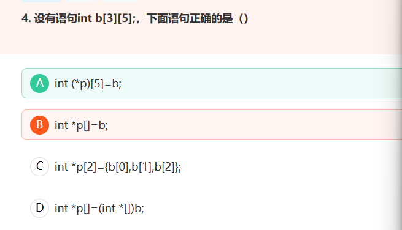
官方解析：
二维数组名b本质上是指向包含5个整型元素的数组的指针,即`int (*)[5]`类型。这个指针指向一维数组的首地址,每个一维数组包含5个int元素。

A选项正确:`int (*p)[5]=b` 声明了一个指向包含5个int元素的数组的指针p,并将b赋值给它,类型完全匹配。

分析其他错误选项:

B错误:int *p[]=b 声明了一个指针数组,而不是数组指针。这里的类型不匹配,不能将二维数组直接赋值给指针数组。

C错误:int *p[2]={b[0],b[1],b[2]} 有两个问题:

1. 数组大小声明为2但初始化了3个元素
2. 初始化列表超出了数组边界

D错误:`int *p[]=(int *[])`b 试图将二维数组强制转换为指针数组是不合法的。这种类型转换在C语言中不被允许。

## 12.共用体地址问题

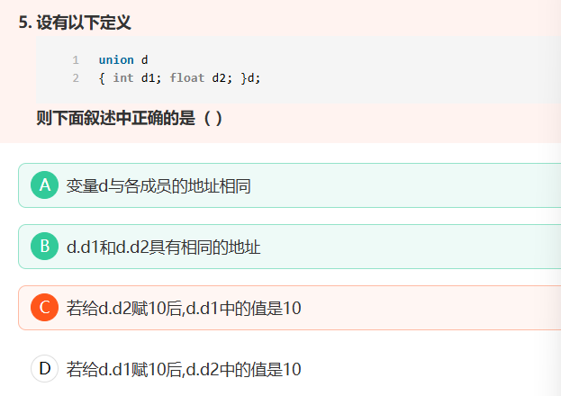
官方解析：
共用体是占同一片空间，因此A、B选项是正确的；
C、D选项，float和int在内存中储存的二进制是不同的，因此会导致值不一样；
答案应选则A，B

## 13.二维数组大小计算

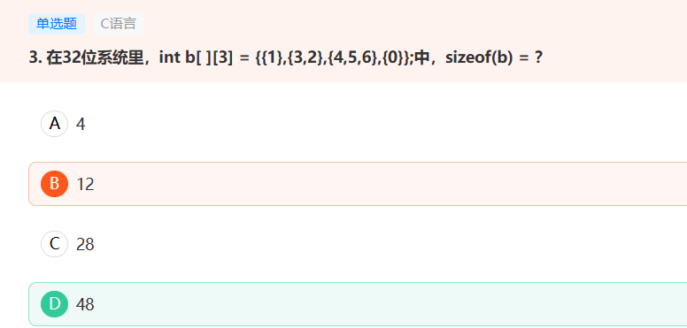

在这道题目中,需要计算二维数组b的总大小。让我们逐步分析:

1. 数组b是一个二维数组,第二维明确指定为3,第一维由初始化的数据决定。

2. 根据初始化数据 {{1},{3,2},{4,5,6},{0}},可以看出第一维的大小为4。

3. 因此数组b实际上是一个4×3的二维数组。即使某些元素没有显式初始化,编译器也会自动填充0。

4. 在大多数系统中,int类型占用4个字节。

5. 所以sizeof(b) = 4(行数) × 3(列数) × 4(每个int的字节数) = 48字节

## 14.指针运算和字符串基础

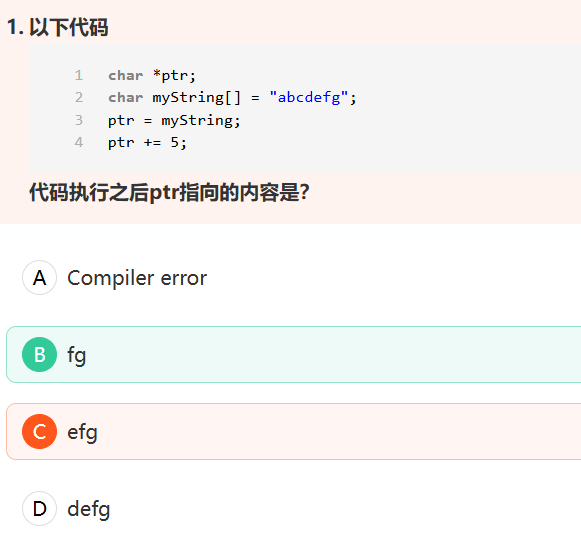
让我们逐步分析代码执行过程：

1. char myString[] = "abcdefg" 定义了一个字符数组,包含字符串"abcdefg"
2. ptr = myString 让ptr指向myString数组的起始位置
3. ptr += 5 使指针向后移动5个位置

最初ptr指向'a',移动5个位置后,ptr就指向了字符'f',因此从这个位置开始的字符串就是"fg"。所以B选项"fg"是正确答案。

## 15.#include语法尖括号和双引号的区别

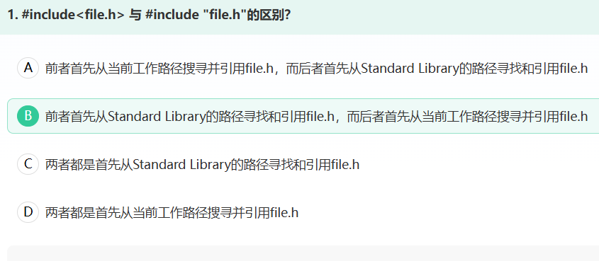

`#include`语法中尖括号和双引号的区别主要体现在头文件的搜索路径优先级上。

使用尖括号<>形式时：

1. 编译器会优先在标准库的路径下搜索头文件
2. 如果标准库路径下未找到,才会在当前工作目录中查找

使用双引号""形式时：

1. 编译器会优先在当前工作目录下搜索头文件
2. 如果当前目录未找到,才会到标准库路径下查找

## 16.字符串结尾特性和字符数组内存分配

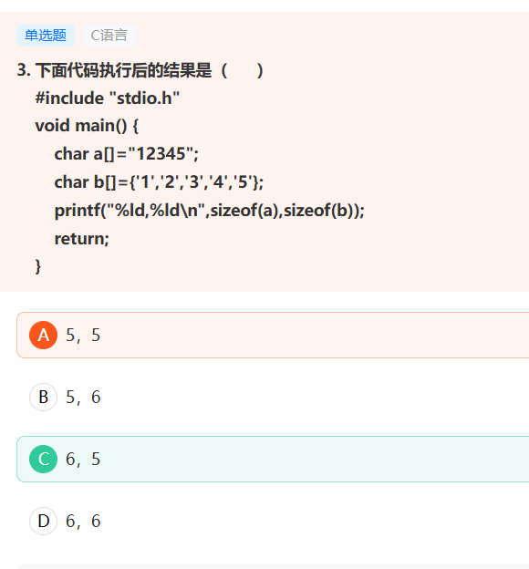

在C语言中，这两种字符数组的声明方式会导致不同的内存分配结果：

1. char a[]="12345" 这种方式声明的是一个字符串，编译器会自动在末尾添加''作为字符串结束符，因此实际占用6个字节：5个字符+''。

2. char b[]={'1','2','3','4','5'} 这种方式声明的是一个字符数组，不会自动添加''，因此就是实际字符的个数，占用5个字节。

所以sizeof(a)的结果是6，sizeof(b)的结果是5。

## 17.#import和#include

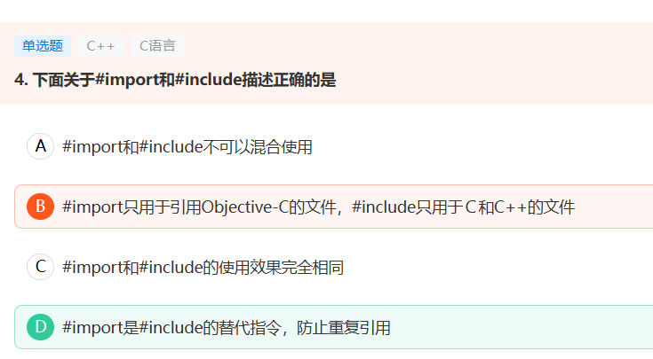

`#import`和`#include`是C/C++/Objective-C中常用的预处理指令。D选项正确,因为#import确实是#include的替代指令,它的主要优势在于可以防止头文件的重复引用。当使用#import时,即使同一个头文件被引用多次,编译器也只会包含一次,这样可以避免由重复包含导致的编译错误。

## 18.数组作为函数参数传递


在C语言中，当数组作为函数参数传递时，形参数组必须指明除第一维以外所有维的长度。这是因为：

1. 数组作为函数参数时，实际上传递的是数组的首地址，这确实是地址结合
2. 但编译器需要知道除第一维以外的其他维度大小，才能正确计算数组元素的偏移量

具体来说：

- 一维数组：形参可以不指定长度，如 int arr[] 或 int *arr
- 二维数组：必须指定第二维的长度，如 int arr[][3]
- 多维数组：必须指定除第一维外的所有维度大小

## 19.不同操作位系统的函数传参，数组传参

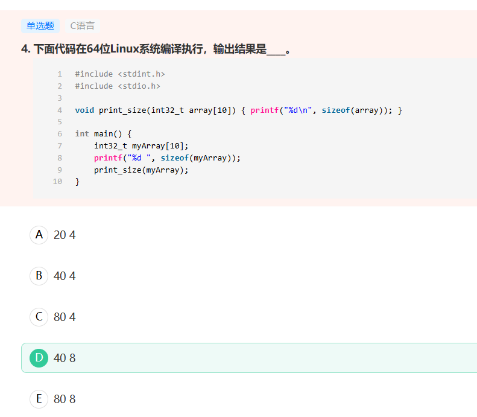

在64位Linux系统中：

1. 第一个输出sizeof(myArray)的结果是40，因为int32_t类型占4字节，数组有10个元素，所以4*10=40字节。

2. 第二个输出sizeof(array)的结果是8，这是因为当数组作为函数参数传递时，实际上传递的是指针。在64位系统中，指针的大小是8字节。

所以完整输出是"40 8"，答案D是正确的。

## 20.`scanf`函数格式化输入的使用

这道题目考察了scanf函数格式化输入的使用。选项A是正确的,因为程序中scanf函数的格式控制字符串是"m=%dn=%dp=%d",要按照这个完全相同的格式输入数据才能被正确读取。

具体分析：

代码中的scanf("m=%dn=%dp=%d", &m, &n, &p)要求输入格式必须严格匹配"m=数字n=数字p=数字"这种模式。

## 21.结构体内存对齐规则

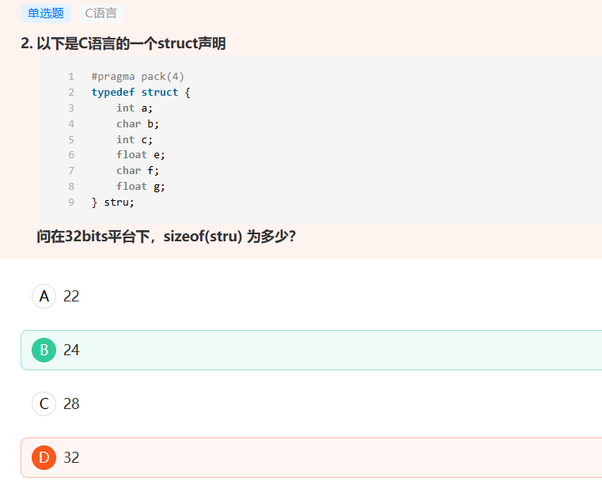
要解答这道题目，我们需要理解结构体内存对齐的规则：

1. #pragma pack(4)表示按4字节对齐
2. 每个成员相对于结构体起始位置的偏移量必须是成员大小与对齐参数中较小值的整数倍
3. 整个结构体的总大小必须是对齐参数的整数倍

让我们分析每个成员的内存布局：

- int a: 占4字节，从0开始
- char b: 占1字节，从4开始
- int c: 占4字节，从8开始（第5位需要填充3字节才能对齐）
- float e: 占4字节，从12开始
- char f: 占1字节，从16开始
- float g: 占4字节，从20开始（第17位需要填充3字节才能对齐）

因此：
4(a) + 1(b) + 3(填充) + 4(c) + 4(e) + 1(f) + 3(填充) + 4(g) = 24字节

## 22.指针数组的声明方式

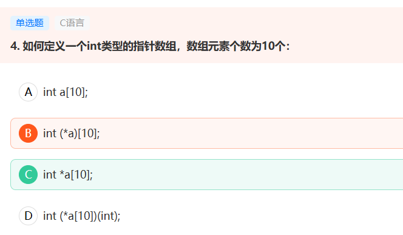
这道题目考察了C语言中指针数组的声明方式。C选项 int *a[10] 是正确答案，它定义了一个包含10个int类型指针的数组。这里的每个数组元素都是一个指向int类型的指针。

## 23.swich语句执行流程

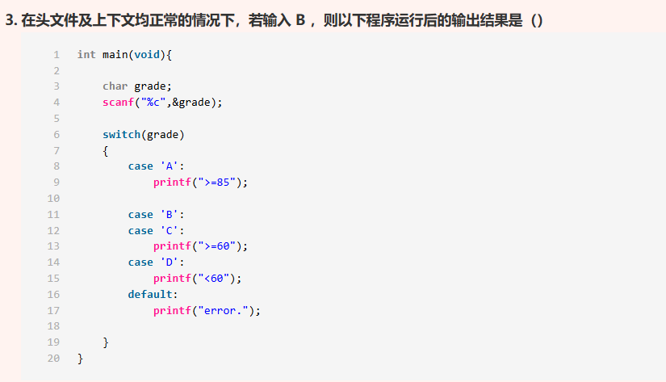

当输入字符'B'时,程序会从case 'B'开始执行,由于没有break语句,会发生case穿透(fall through)现象,继续向下执行所有后续case中的语句,直到switch语句结束。

执行过程如下:

1. 进入case 'B'分支
2. 执行printf(">=60")
3. 由于没有break,继续执行case 'D'的printf("<60")
4. 继续执行default分支的printf("error.")

所以最终输出为: ">=60<60error."

## 24.fseek函数

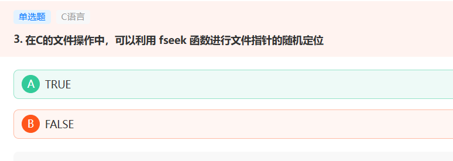

fseek函数是C语言文件操作中的一个重要函数,它可以让文件指针在文件中任意移动位置,实现随机访问的功能。这个说法是完全正确的。

fseek函数提供了三种定位方式:

1. SEEK_SET: 从文件开头计算偏移量
2. SEEK_CUR: 从当前位置计算偏移量
3. SEEK_END: 从文件末尾计算偏移量

## 25. unsigned取值范围和整数运算

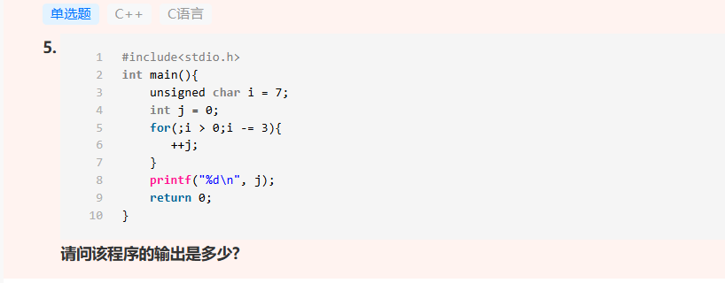

这道题目考察了无符号字符类型(unsigned char)的取值范围和整数运算的基本概念。

关键点在于unsigned char的取值范围是0-255。当i为无符号数时,即使i减到小于0,也会发生溢出,变成一个较大的正数继续循环。

具体执行过程:

1. i初始值为7
2. 每次循环i减3,同时j增1
3. i的变化过程:7→4→1→254→251→248→...→3→0
4. 当i最终等于0时循环结束
5. 计算过程:从7开始每次减3直到0,需要经过(7+256)/3 = 173次循环(包含了溢出后的循环次数)

所以j最终等于173,C选项正确。

## 26. 表达数学关系陷阱

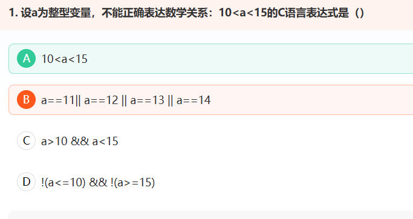

在C语言中，这种表达式并不会按数学中的区间判断来执行。C语言中的关系运算符（如 <, >, == 等）是左结合的，并且每个运算符都会返回一个布尔值（真或假）。因此，`10<a<15` 会被解析为 `(10<a)<15`。首先 `10<a` 会被计算，如果 a 大于10，则结果为真（在C语言中通常表示为1），否则为假（0）。然后，这个结果（1或0）再与15进行比较，这显然不是原意的表达。因此，这个选项不能正确表达数学关系。

## 27. 数学关系陷阱二

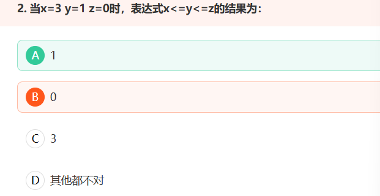

<=为关系运算符且它的结合性是从左到右，故上式等价于 (x<=y)<=z。

又因为x=3  y=1，所以x<=y的结果为0（代表假），然后0<=z的结果为1（代表真）。

## 28.逻辑表达式的短路特性

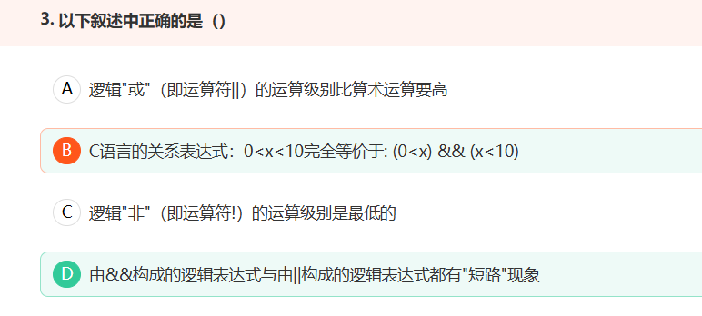

D选项正确。在C语言中,由&&和||构成的逻辑表达式都具有"短路"特性。"短路"是指当通过前面的运算已经能确定整个表达式的值时,后面的运算就不再执行。具体来说:

- 对于&&运算,如果第一个表达式为假,则不会计算第二个表达式
- 对于||运算,如果第一个表达式为真,则不会计算第二个表达式

## 29.不合法浮点数

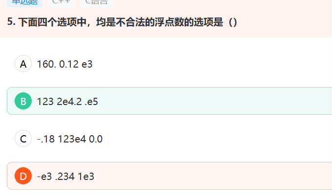

本题考察对浮点数格式的理解。需要分析每个选项中的数字是否符合浮点数的表示规范。B选项"123 2e4.2 .e5"中的三个数字都不是合法的浮点数表示。

让我们逐一分析B选项中的数字：

1. "123" - 这是一个整数，缺少小数部分
2. "2e4.2" - 科学计数法的指数部分必须是整数，不能有小数点
3. ".e5" - 小数点前后必须至少有一个数字，单独的小数点加e是非法的

## 30.函数传参--传数组

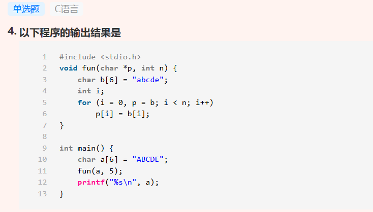

很容易搞错的一道题，函数传递数组时，不是用的数组的副本，而是原数组本身，在本题中，调用函数时，p指向数组a的第一个元素，但在for循环中，有p=b，又把b的地址赋予了p，使p指向b的第一个元素，此时p与a已无关了。。。。。答题时一定要注意题中的陷阱。。

## 31.指针和内存管理操作

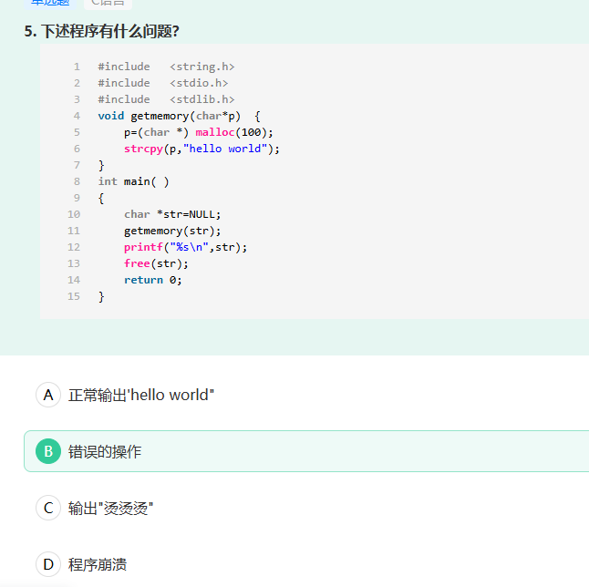

主要问题在于getmemory函数中的参数传递方式。在C语言中，函数参数是值传递，getmemory函数中的p是str的一个副本，而不是str本身。虽然在getmemory函数内部为p分配了内存并赋值，但这些操作都是在p的副本上进行的，函数返回后这些改变不会影响到main函数中的str。因此str仍然是NULL。

## 32.算法的五个特性

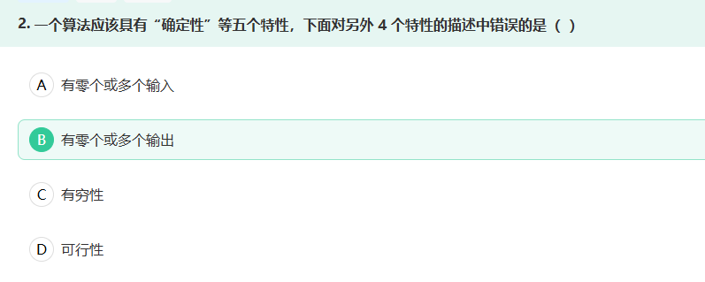

算法的五个基本特性是:确定性、有穷性、可行性、有零个或多个输入、有一个或多个输出。其中B选项"有零个或多个输出"的说法是错误的。

正确说法应该是:算法必须至少有一个输出。因为算法是为了解决特定问题而设计的,必须产生某种形式的结果或输出。如果没有输出,就无法体现算法的计算结果,也就失去了算法的意义。

## 33.#undef的使用

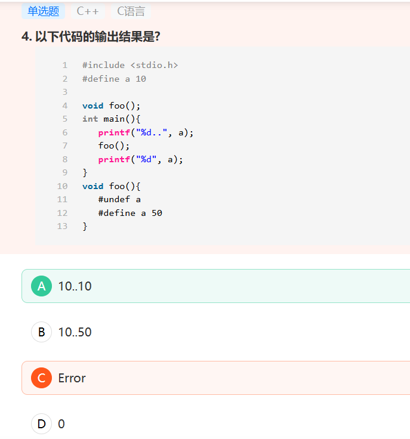

原因分析:

1. 宏定义#define a 10开始时将a定义为10。

2. 虽然在foo()函数中通过#undef取消了a的定义,并重新定义a为50,但这个改变并不会影响已经完成的宏替换。

3. 程序执行过程:

- 在编译预处理阶段,第一个printf中的a被替换为10
- foo()函数中的宏定义操作发生在运行时
- 第二个printf中的a在预处理阶段也已经被替换为10

1. 宏定义是在预处理阶段进行文本替换,一旦完成替换,后续的#undef和重新#define不会改变已经替换的值。

## 34.printf函数的返回值

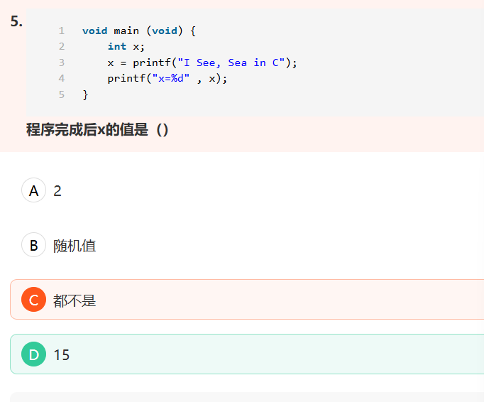

printf() 函数的返回值是打印的字符个数。在这个程序中,第一个 printf() 语句打印字符串 "I See, Sea in C",总共包含15个字符(包括空格)。所以第一个 printf() 函数执行后,其返回值15被赋给变量 x。因此第二个 printf() 语句会输出 "x=15"。

## 35.字符常量的定义

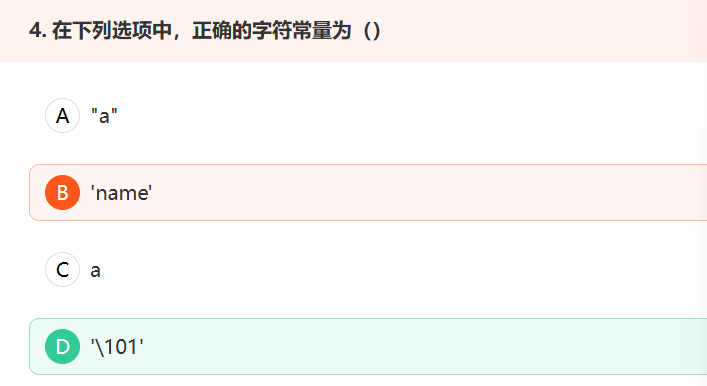

字符常量是用单引号括起来的单个字符,包括普通字符和转义字符序列。'101'是一个合法的字符常量,表示八进制ASCII码101所对应的字符,因此D是正确答案。

分析其他选项的错误原因:

A选项 "a" 使用了双引号,这是字符串常量的表示方法,而不是字符常量。字符常量必须使用单引号。

B选项 'name' 在单引号内包含了多个字符,这违反了字符常量只能包含单个字符的规则。

C选项 a 没有使用任何引号,这表示的是标识符或变量名,而不是字符常量。

字符常量的正确表示方法包括:

- 普通字符,如 'a', 'b', '1' 等
- 转义字符序列,如 ' ', ' ', '101'(八进制), 'u0041'(Unicode) 等

需要注意的是:

1. 字符常量必须用单引号
2. 只能包含单个字符
3. 可以使用转义序列表示特殊字符

## 36.指针运算，short类型，数组基础知识

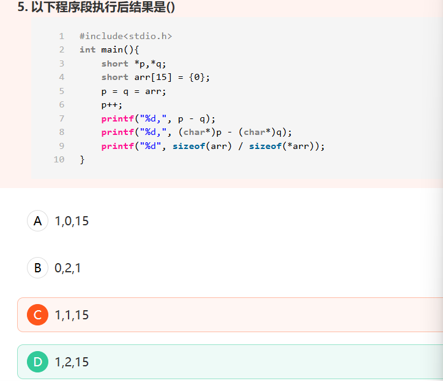

这道题目考察了指针运算、数组基础知识和数据类型大小的理解。让我们逐个分析输出的三个值:

第一个输出 p - q = 1

- p和q都是short类型指针，指向同一个数组起始位置
- p++使p向后移动一个short单位
- 指针相减得到的是元素个数差值，所以是1

第二个输出 (char*)p - (char*)q = 2

- 将p、q强制转换为char*类型后再相减
- 由于short占2个字节，p比q向后移动了一个short单位
- 所以字节差值为2

第三个输出 sizeof(arr) / sizeof(*arr) = 15

- sizeof(arr)得到整个数组的字节数：15 × 2 = 30字节
- sizeof(*arr)得到一个元素的字节数：2字节
- 30/2 = 15，即数组的元素个数

因此输出为"1,2,15"，D选项正确。

## 37.二维数组声明

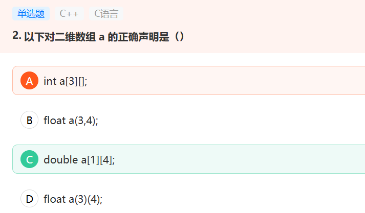

二维数组的声明需要严格遵循编程语言的语法规则。C选项 `double a[1][4]` 是正确的二维数组声明方式,它明确指定了数组的两个维度:第一维度为1,第二维度为4。

分析其他选项:

A选项 `int a[3][]` 错误:虽然Java允许这种写法,但在大多数编程语言中,声明二维数组时必须指定第二维的大小。这种不完整的声明是不合法的。

B选项 float a(3,4) 错误:使用小括号()来声明数组是错误的语法。数组声明应使用方括号[]。这种写法可能与函数声明混淆。

D选项 float a(3)(4) 错误:同样使用了错误的小括号语法,而且用了两对小括号,这完全不符合数组声明的语法规范。

正确的二维数组声明应该使用方括号[],并且通常需要明确指定两个维度的大小。C选项符合这个标准,是最规范的二维数组声明方式。

## 38.64位系统int指针大小8字节

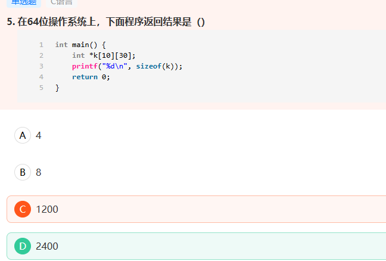

在64位系统中:

1. k是一个二维数组，维度为`[10][30]`
2. 数组的每个元素都是int类型的指针
3. 在64位系统中,指针的大小是8字节
4. 所以总大小 = 10 × 30 × 8 = 2400字节

## 39.二维数组和指针的运算

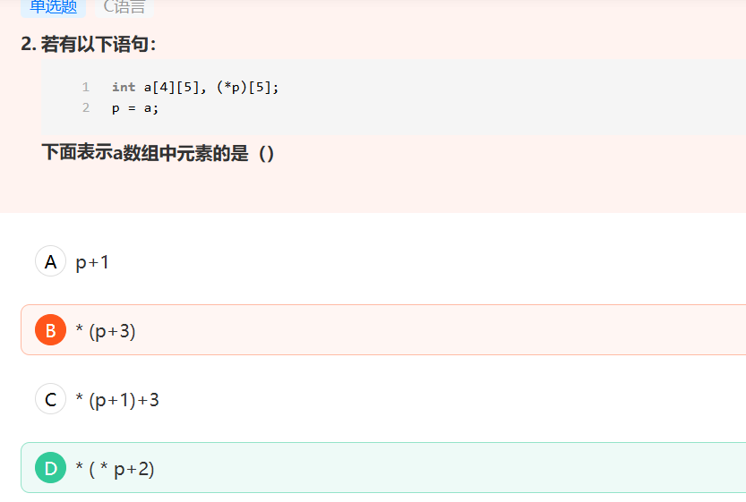
官方解析：

a是一个二维数组，p是一个指向有5个元素的数组指针。
A：表达式是一个指针，不是对数组元素的引用。*(p+1)等于&a[1]，即*(p+1)指向a的第二行的首元素。
B：*（p+3）是一个指针，指向第4行的首元素。
C：*(p+1)指向a的第二行的首元素；*（p+1）+3则指向第二行的第3个元素。
D：* ( *p+2)是对数组元素的正确引用，它等价于`a[0][2]`。
所以对a数组元素的正确引用的选项是D。

## 40.#include<>和“”的区别

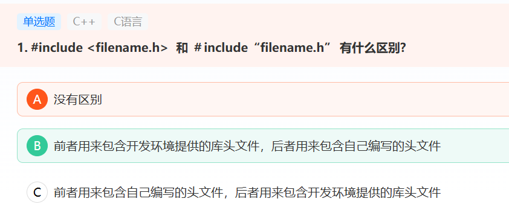
`#include <>` 和 #include "" 的差异主要体现在头文件的搜索路径上。B选项正确地指出了它们的使用场景:

<> 形式用于包含系统标准库或开发环境提供的头文件。编译器会在系统的标准库目录中搜索头文件,比如stdio.h、stdlib.h等系统头文件。搜索路径通常是预定义的系统目录。

"" 形式用于包含用户自定义的头文件。编译器会首先在当前源文件所在目录搜索,如果没找到才会去系统目录搜索。这种方式更适合包含我们自己编写的本地头文件。

## 41. 注释不会被转为二进制文件

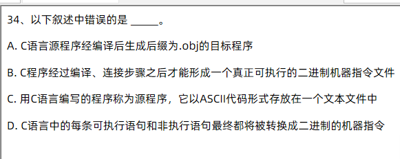

## 42.八进制开头是数字0

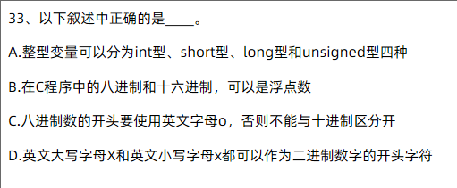
正确答案是A

## 43.函数调用指针后的赋值运算

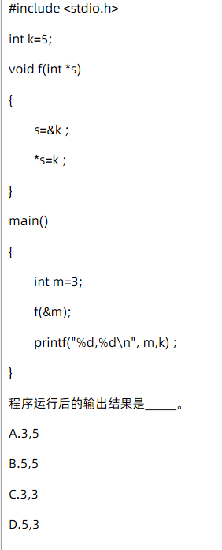
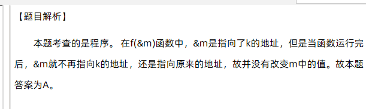

## 44.软件设计工具

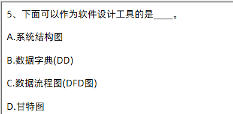
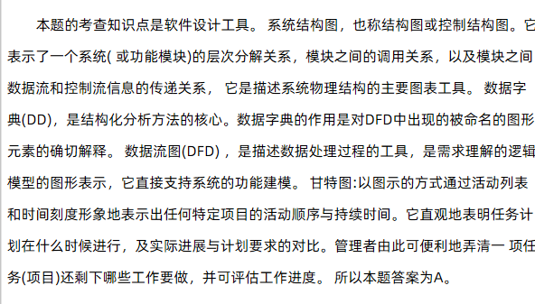

## 45.软件工程三要素是 方法、工具、过程

## 46.软件设计工具

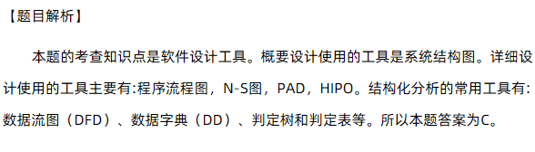

## 47.概念设计

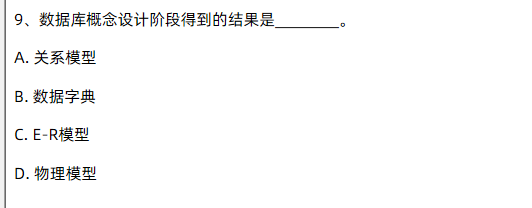
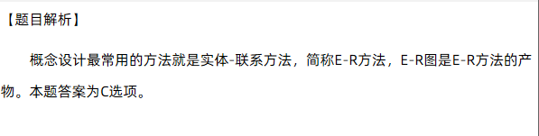

## 48.赋值表达式

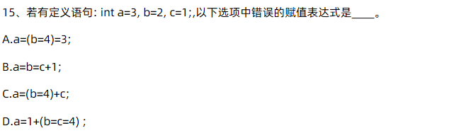
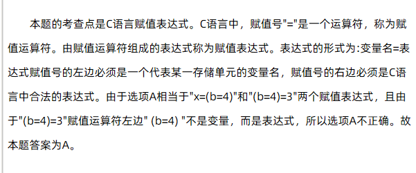

## 49.字符数组赋值

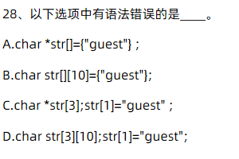
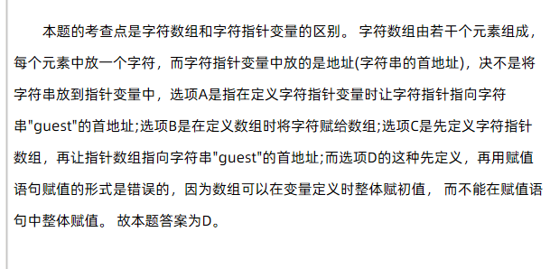

## 50. '0' 的ASCII码是48

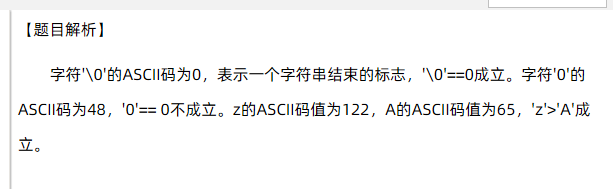

## 51.程序测试的目的是尽可能发现程序中的错误

## 52. 用户标识符scanf合法，而auto不合法

## 53.赋值表达式

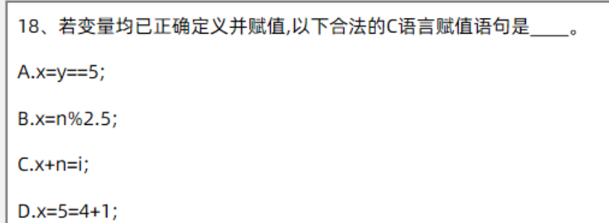
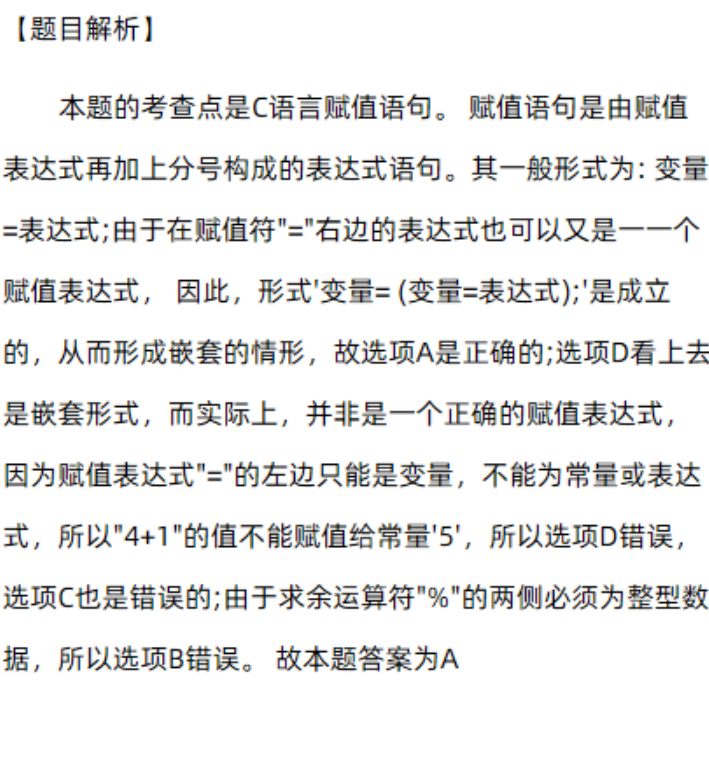

## 54.计算机虚拟内存最大容量取决于计算机地址位数

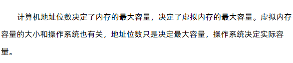

## 55.`.obj`文件为目标文件无法直接运行

## 56.栈的存储格式

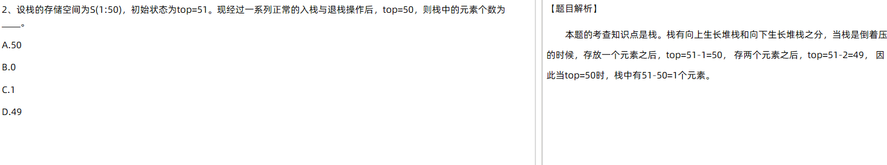

## 57.请求页式存储管理

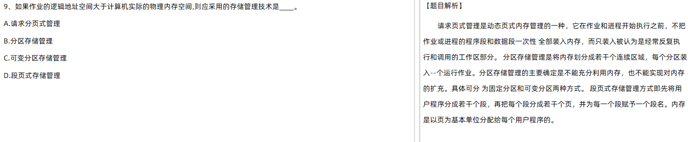
