# 错题集

## 1.列表运算

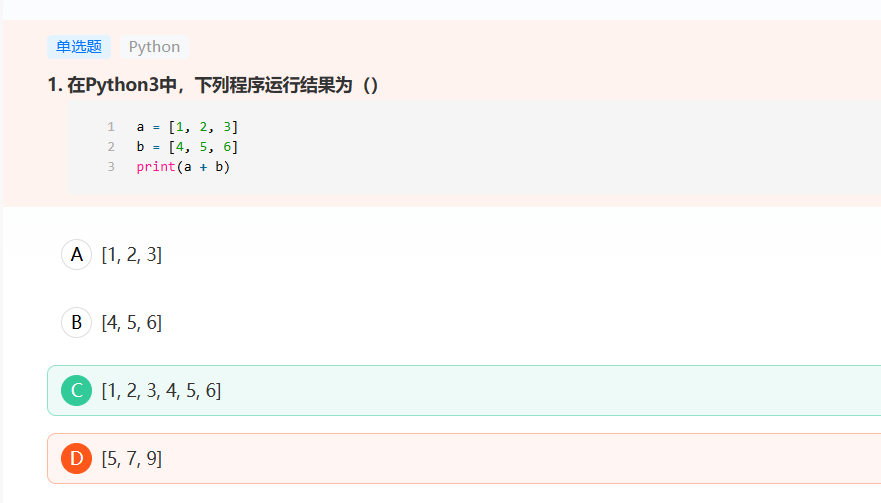
在Python3中，两个列表的加法表示两个列表进行拼接，所以结果为：[1, 2, 3, 4, 5, 6]。

## 2.函数参数传递-收集参数

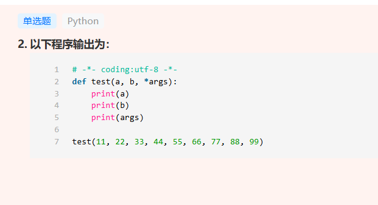

这道题目考察了Python中的参数传递,特别是可变参数*args的使用。

函数test(a,b,*args)中:

- a和b是位置参数,会分别接收前两个参数值11和22
- *args会将剩余的所有参数打包成一个元组(tuple)
- 当执行test(11,22,33,44,55,66,77,88,99)时,前两个参数11和22分别赋值给a和b,剩余的参数33-99会被打包到args元组中

## 3.python2.x运算返回值

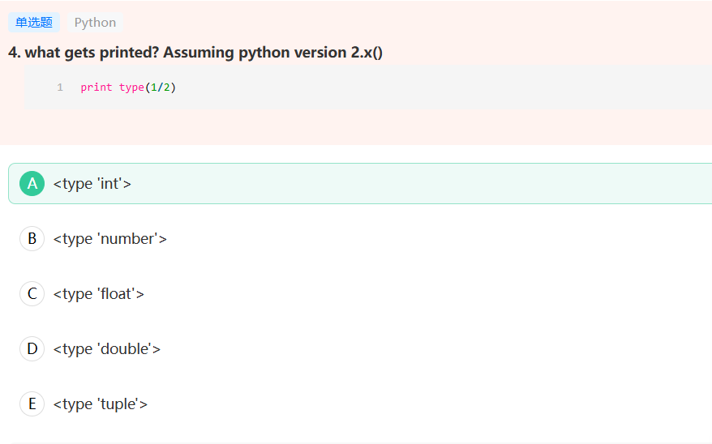

在 Python 2.x 版本中，当执行 print type(1/2) 时，会输出 。这是因为在 Python 2.x 中，对两个整数进行除法运算时默认执行的是整数除法（地板除法），结果会自动向下取整。所以 1/2 的结果是 0，而 type(0) 返回的是整数类型 int。

分析其他选项：
B错误：Python 中没有 'number' 这个内置类型
C错误：在 Python 2.x 中，只有当除法运算中至少有一个操作数是浮点数时，结果才会是浮点类型
D错误：Python 中没有 'double' 类型，浮点数统一使用 float 类型
E错误：tuple 是元组类型，与除法运算无关

补充说明：这个行为在 Python 3.x 中有所不同。在 Python 3.x 中，/ 运算符执行的是真除法，返回浮点数结果，所以同样的代码在 Python 3.x 中会返回 。如果在 Python 2.x 中想要得到浮点数结果，可以使用 1.0/2 或 float(1)/2。

## 4.字典创建

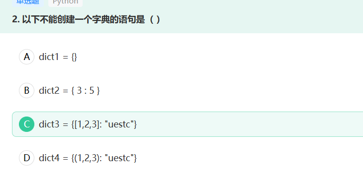
Python字典是一种键值对的数据结构,其中键(key)必须是不可变的(immutable)数据类型。这道题目主要考察Python字典键的类型限制。

C选项是错误的,因为它试图使用列表[1,2,3]作为字典的键。在Python中,列表是可变的数据类型,不能作为字典的键,这会导致TypeError错误。

Python中可以作为字典键的数据类型包括:

- 数字(整数、浮点数)
- 字符串
- 元组
- 布尔值

## 5.字典查找-get调用方法

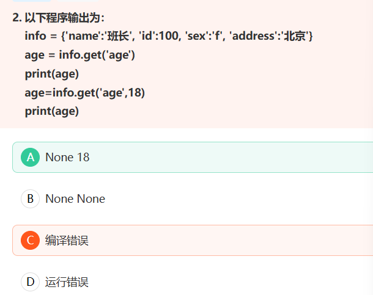

get()方法有两种调用形式:

- dict.get(key): 如果key存在则返回对应值,不存在则返回None
- dict.get(key, default): 如果key存在则返回对应值,不存在则返回指定的default值

## 6.python文本文件调用解释器

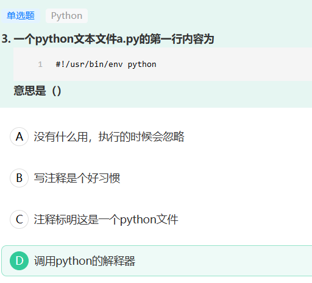
`#！`代表指定解释器文件，当只想 ./a.py 的时候脚本会自动调用python的解释器

## 7.python小整数对象池机制

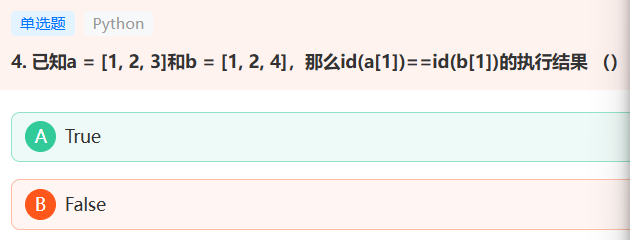
这道题考察了Python中的小整数对象池机制和对象引用的概念。答案为True是正确的。

在Python中存在小整数对象池机制(small integers pool)，对于范围在[-5, 256]之间的整数，Python会提前创建好这些整数对象并缓存起来。当我们使用这个范围内的整数时，实际上是引用了相同的对象。

## 8.特殊变量__name__

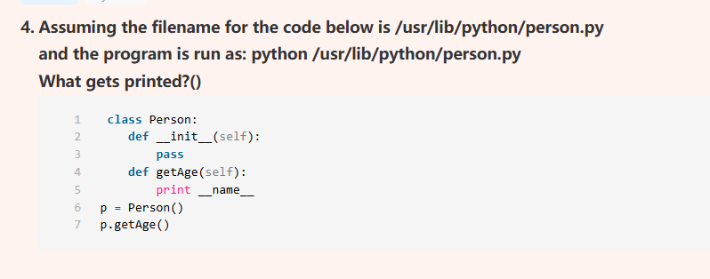
当我们直接运行一个Python文件时，Python会将该文件视为主程序，此时特殊变量__name__的值会被自动设置为"__main__"。而当文件被当作模块导入时，__name__的值则会是模块的名称。

在这个例子中，代码是通过命令行直接运行(python /usr/lib/python/person.py)，而不是作为模块被导入，所以p.getAge()调用时会打印出"__main__"。

分析其他选项：
A错误：Person是类名，但__name__变量与类名无关
B错误：getAge是方法名，但__name__变量与方法名无关
C错误：虽然文件路径是/usr/lib/python/person.py，但直接运行文件时__name__不会显示为模块路径

补充说明：如果这段代码是被其他文件以import方式导入使用，那么此时打印的__name__的值将会是"person"（即模块名）。这是Python用于区分当前文件是被直接运行还是被导入的重要机制，常用于编写既可以导入又可以独立运行的模块。

## 9.魔法方法__len__()的调用

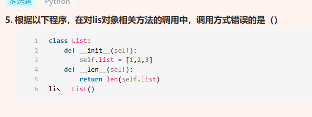

对魔术方法的调用，一是可以直接使用对象.魔术方法名（）来调用，即lis.__len__()，故A选项的调用方式正确；二是魔术方法都有自己特殊的调用方式，本题中，对于__len__()方法而言，其特殊的调用方式为len(对象)，C选项调用方式正确。BD选项属于错误的调用方式。

## 10.函数传参

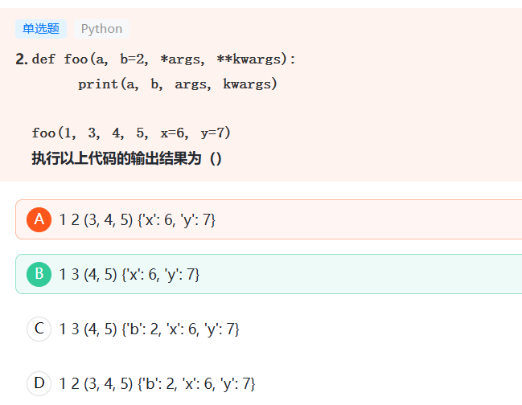

以上代码定义了一个函数 foo，它有三个参数 a、b 和 *args，以及一个关键字参数 **kwargs。其中，参数 b 有默认值 2，*args 接收不定个数的非关键字参数，**kwargs 接收不定个数的关键字参数。

在本题中，函数调用时传入了 1、3 以及不定个数的非关键字参数和关键字参数。因此，在函数体中，参数 a 的值为 1，参数 b 的值为 3（函数调用时指定了 b 的值），*args 的值为 (4, 5)，**kwargs 的值为 {'x': 6, 'y': 7}。

## 11.列表遍历同时删除元素问题

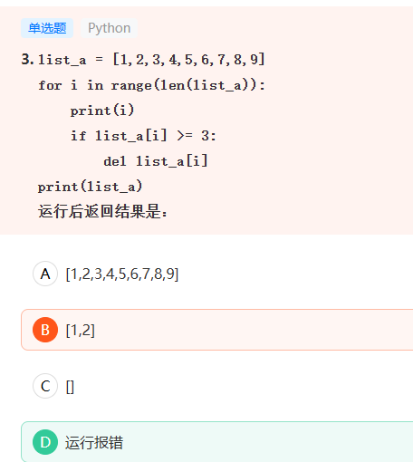
这道题目考察了在Python中对列表进行遍历同时删除元素的问题。程序会运行报错，因此D是正确答案。

错误原因分析：
当使用for循环遍历列表的同时删除元素时，会导致列表的长度发生变化，而索引i却继续增加，最终会导致索引越界错误(IndexError)。具体执行过程：

1. 第一次循环(i=0): list_a[0]=1 < 3，不删除
2. 第二次循环(i=1): list_a[1]=2 < 3，不删除
3. 第三次循环(i=2): list_a[2]=3 >= 3，删除3，列表变为[1,2,4,5,6,7,8,9]
4. 第四次循环(i=3): list_a[3]=5 >= 3，删除5，列表变为[1,2,4,6,7,8,9]
5. 继续循环时，由于列表长度在不断缩短，而i依然按原来的索引增加，最终会超出列表范围导致IndexError。

## 12.sort()和sorted()区别

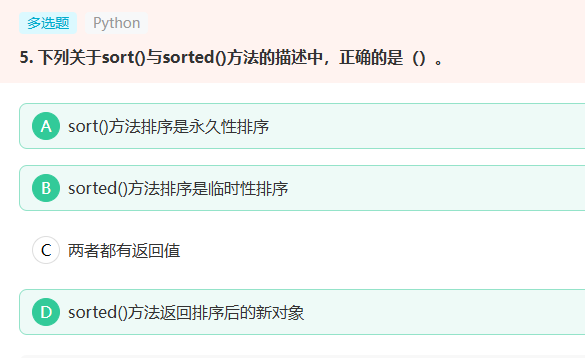
sort()是列表内置的方法，没有返回值，是将列表排序，原列表发生变化，A正确，C错误。sorted()是全局内置的方法，有返回值，返回对可迭代序列排序后的新对象，但是原来的序列不变，B正确，D正确。

## 13.元组定义方式

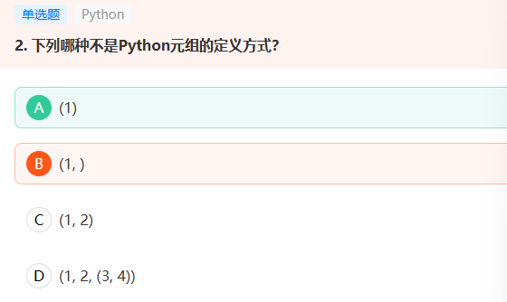
在Python中,(1)这种写法表示的是一个整数,而不是元组。虽然使用了圆括号,但要定义一个只包含单个元素的元组,必须在元素后面加上逗号,即(1,)的形式。

## 14.open方法打开文件追加访问模式

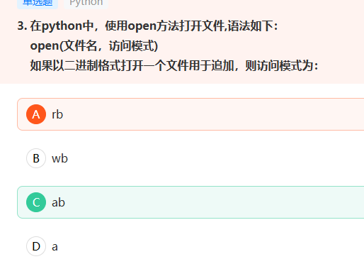
在Python文件操作中，访问模式 'ab' 表示以二进制格式打开文件用于追加内容，这正是题目所要求的，所以 C 是正确答案。

让我们详细分析每个选项：

C选项 'ab'：

- a 表示追加模式(append)
- b 表示二进制模式(binary)
- 二者结合就能实现以二进制格式追加内容到文件末尾
- 不会覆盖原有内容，新内容会添加到文件的末尾

其他选项分析：
A选项 'rb'：

- r 表示只读模式(read)
- 虽然是二进制格式，但不能用于追加内容

B选项 'wb'：

- w 表示写入模式(write)
- 会覆盖原有内容，不是追加模式
- 虽然是二进制格式，但不满足追加的要求

D选项 'a'：

- 虽然是追加模式
- 但不是二进制格式，而是文本格式
- 不满足题目要求的二进制格式

所以从文件打开的访问模式组合来看，只有 'ab' 模式同时满足"二进制格式"和"追加"这两个要求。

## 15.Patsy库对数据进行标准化和中心化处理

- standardize()是Patsy中用于标准化的正确函数名
- center()是用于中心化的正确函数名
- 语法格式完全正确，使用加号连接两个转换操作

## 16.序列的生成和一些切片操作

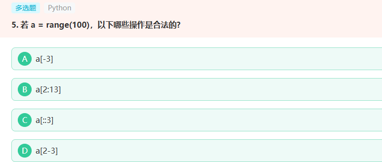
在Python中,range(100)会创建一个包含0到99的序列对象,该对象支持多种索引和切片操作。让我们分析每个选项的合法性:

A. a[-3] 合法
这是使用负索引来访问倒数第3个元素,相当于访问97这个元素,在range(100)的范围内。

B. a[2:13] 合法
这是切片操作,提取索引从2到12(不包含13)的元素,形成新的序列。范围都在100以内,所以是合法的。

C. a[::3] 合法
这是带步长的切片操作,从头到尾每隔3个元素取一个,可以得到[0,3,6,...,99]这样的序列。

D. a[2-3] 合法
这等价于a[-1],即2-3=-1,表示访问最后一个元素(99),这是合法的负索引操作。
